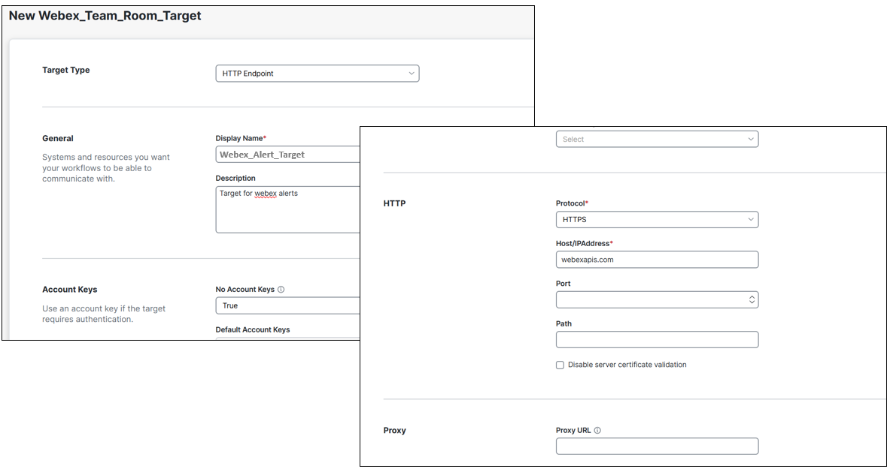
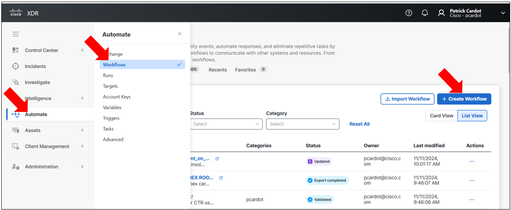

# Introduction

This article explains you how to create an XDR Target from scratch for Webex.

XDR already has a target and workflow activities for interacting with Webex. 

But just for understanding the principle of XDR Targets and how we create them, it is interesting to create a duplicate one from scratch.

For XDR, Webex appears just as an HTTPS target. And generally speaking it is the case for 90 %  of the security solutions XDR will have to interact with. That means that everything you are going to learn here can be used for creating XDR targets for anyother security solutions.

As pre requisit for this lab, it is mandatory to already have created a Webex Bot and an Alert Webex Room.

More generally Webex is a perfect alerting system for XDR. So you will not waste your time by going thru this lab. You will probably keep it for any XDR alerting purposes.

If you don't already have a Webex Bot and a Alert Webex Room, then create them now.

[Create_a_Webex_Team_Bot ](https://github.com/pcardotatgit/Create_a_Webex_Team_Bot)

If you already did it, then you are ready to go to next steps.

# What is a target ?

For XDR, a target is any end points from which XDR is able to collect data, or to which XDR is able to send instructions. 

Anything that exist in the IT is a target for XDR and XDR is able to interact with it.

# Create a New Target

Because of the fact that as human we interact with Webex thanks to https connections then create an HTTP endpoint. Name id **Webex_Alert_Target** for example.

- Target type : **HTTP Endpoint**
- NO ACCOUNT KEY : **TRUE**
- PROTOCOL : **HTTPS**
- HOST/IP ADDRESS : **webexapis.com** ( old host which still work : api.ciscospark.com )


According to the Webex API documentation ( https://developer.webex.com/docs/api/v1/messages/create-a-message ), the authentication will be passed to the API call as a **bearer token** within the **header**. This is the reason why we set **NO ACCOUNT KEY** to **TRUE**. 

We won't manage authentication at the Target definition Level. We will do it in the REST call into the HTTP Request XDR Activity



Let's decide to store the Webex Bot token into the XDR Tenant ( another choice would be to store it locally later into the XDR workflow ).

Global variables can be accessed by every workflows into the tenant.  Local variables are only available within the workflow.

Create a global ( possible into environnement ) secured string variable named **XDR_webex_bot_token** for example. And assign to it as the value the Webex Bearer Token of your Webex Team Bot. It is a good practice to put a description into the description field. Consider this as a best practice for every descriptions you come accross into XDR.

Go to the left menu and select **variable**.


Then create a new variable. Select the **Data Tye**.   Select **Data Type : Secure String** 

As you probably understand, **Secure String** means that no one will be able to see the value.  It makes sense to use this Data Type for every variable we don't want to share publicly with others.

The value of this variable must be the Token of the Bot you created into Webex prior.


Create another global string variable named **webex_alert_room_id** for example and configure as it's value, the Webex Room ID attached to your Webex Team Bot.

OK done, you are good to go to next steps.

# Interact with your Webex Team Bot

Let's see how to send messages to our room thanks to XDR workflows.

Create a new workflow.



Select the option : **Blank Custom Workflow** which is first option.


Give a meaningful name to your workflow. 

And better than that decide now about a naming convention for every workflows you will create into the tenant.  After a few month it will be very difficult to find your workflows amon all the workflows created by you and other administrators.  Workflow Naming conventing is a key topic !!.

For now name your workflow : **Send Text Message to Webex**

Click on **continue**.


Go to the variable section of the properties panel and add to it an **input** variable named **message_to_send_to_webex_room** for example. Make it **required**, meaning that the workflow cannot run if no message are given to it.


Now configure a terget for the this workflow

- Go to the target Section : Execute on this target ==> HTTP ENdpoint ==> **Webex_Alert_Target**


Then go to the activity menu on the left side of the workflow editor and drag an drop in the canvas the **HTTP Request** activity.

Our XDR workflow activity need the **HTTP Request** activity to send messages to Webex. Actually this activity manage Web connection from XDR to any Web destination which can be either a web site, or a REST API Endpoint.  In Our case the API endpoint is a Webex REST API Endpoint.


And we have to customize it according to the following details :

- Display Name : POST Message to Webex
- Description : Send a POST Message that contain the message to send into the alert Webex Room
- target : don't select any target ( it had been done at the workflow level )
- Credentials => Account Keys : Use target's default account keys
- Relative URL : **v1/messages** ( Webex API Endpoint for managing messages )
- Method : **POST** ( for sending a message to a room )
- CONTENT TYPE : **JSON**


Now go to the body textarea box and create the JSON data to send to Webex Backend.

The **Request Body** must contain the Destination Webex Room ID and the message to send.

It must be defined in the following JSON payload :

```
{
    "roomId":" *Select from XDR Variable browser tree, the : webex_bot_room variable, which is a Global Variable* ",
    "text":" *Select from XDR Variable browser tree, the : message_to_send_to_webex_room variable, which is a Global Variable* "   
}
```

or if you use markdown formatting :

```
{
    "roomId":" *Select from XDR Variable browser tree, the : webex_bot_room variable, which is a Global Variable* ",
    "markdown":" *Select from XDR Variable browser tree, the : message_to_send_to_webex_team_room variable, which is a Global Variable* "    
}
```

First create the following JSON data into the Body textarea :

or if you use markdown formatting :

```
{
    "roomId":"",
    "markdown":""    
}
```

Then on the roomId line click absolutely between the 2 double quotes. The mouse cursor must absolutely be between these 2 double quotes.

And the click on the variable icon located on the top right of the textarea box. This opens the variable browser windows and from here select in the global variable the **XDR_ALERT_BOT_ROOM_ID** variable.


**Remark** : the **text** and **markdown** keys are not mandatory together, you need to give one, or the other.

**markdown** allows you to send nice formatted messages to the Webex Team Room.


In **CUSTOM HEADER** add a variable that you must mandatory call **Authorization** and give to it the following value :

**Bearer <value_of_webex_token>**  

( Important : there is a space between **Bearer** and the **value_of_webex_token** value )

Pictures of what you are supposed to see :


## Why did we configured the HTTP request XDR activity this way ?

The above values into the previous paragraph come directly from the Webex API documentation.

What ever the target is, we understand what to configure in the XDR target definition from the product API documentation.

This API documentation give us several information which are :

- The API endpoint
- The FQDN
- The HTTP method to use ( POST, GET, DELETE, PATCH,...)
- How to authenticate
- How to pass variable to the API Endpoint ( in the header, in the body, As raw text , XML or JSON )

The API target in XDR has every required field needed to configure the target what ever this destination solution is. We just need to understand from the product API documentation how to send a valid API REST Call.

In the case of Webex, the API documentation is very clear and it is easy to understand how to configure the XDR target.

https://developer.webex.com/docs/api/v1/messages/create-a-message

If we have a look to how to create a message all information are there.


We understand that :

- The Webex FQDN is : webexapis.com
- The relative URL ( API path ) is **/v1/messages**. Notice, we could have configure **/v1** in the target definition, And then configure **/messages** in the relative URL of the HTTP Request activity. 
- The method is the **POST** verb. 
- The authentication token is a **bearer** token we must pass into the header of the call, as a variable named **Authorization**
- Parameters to pass to the API must be in the Body in the JSON format, and the variable names to pass are **roomId** , **text** and **markdown**.

So let's follow the rules and let's configure the HTTP Request activity as needed.

## Test your workflow

Once everything done, then we can test our workflow.

Run Your Workflow.

You should be prompted to enter a message to send.  And then you should receive it into your Webex Team Bot Room.


## Make it Atomic

Make this workflow atomic will allow you to use it as a single ready to use activity in other of your workflows.  And you will be able to share it with others.

You can do that just by click on the **is atomic workflow**.


# You are Ready to go !

