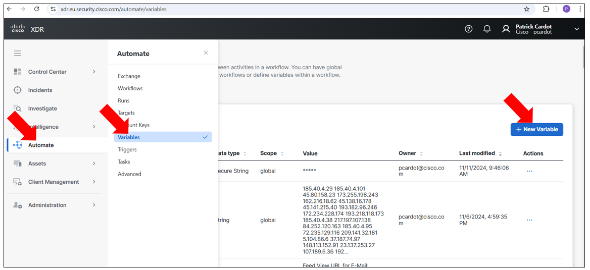
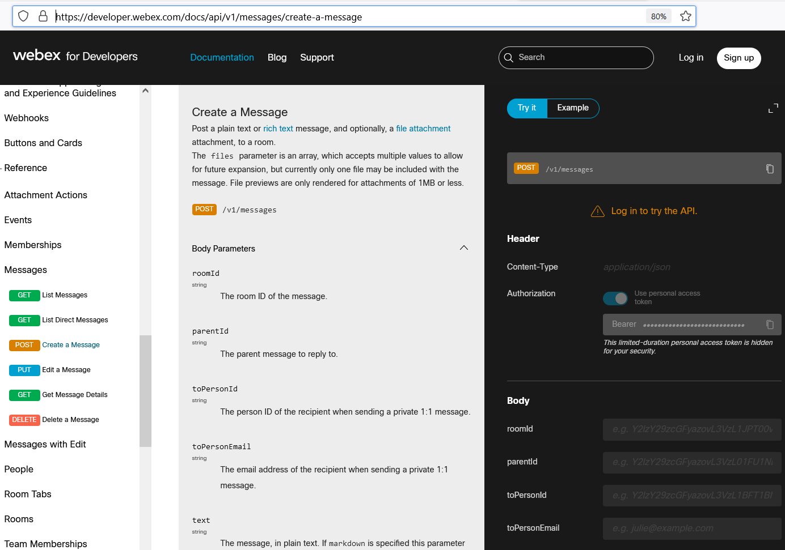

# Introduction

This article explains you how to create a SecureX Webex Team Target form scratch.

SecureX already has Webex Team activities for interacting with Webex. But just for understanding how they were created we are going to create a new one from scratch.


For SecureX, Webex Team appears just like an HTTPS target. That means that you can quickly create it as a new target.

A mandatory prerequist is to already have created a Webex Team Bot and an Alert Webex Team Room 

[Create_a_Webex_Team_Bot ](https://github.com/pcardotatgit/Create_a_Webex_Team_Bot)

If you already did it, then you are ready to go to next steps.

# Create a New Target

Create an HTTP endpoint. Name id **Webex_Team_Room_Target** for example.

- Target type : **HTTP Endpoint**
- NO ACCOUNT KEY : **TRUE**
- PROTOCOL : **HTTPS**
- HOST/IP ADDRESS : **webexapis.com** ( old host : api.ciscospark.com )

According to the Webex API documentation ( https://developer.webex.com/docs/api/v1/messages/create-a-message ), the authentication will be passed to the API call as a bearer token within the header. This is the reason why we set **NO ACCOUNT KEY** to **TRUE**. We won't manage authentication at the Target Level. We will do it in the REST call.


Create a global ( or environnement ) secured string variable named **SecureX_webex_bot_token** for example. And assign to it the Webex Bearer Token of your Webex Team Bot.

Go to the left menu and select **variable**.



Then create a new variable.


Create another global string variable named **webex_alert_room_id** for example and configure as it's value, the Webex Room ID attached to your Webex Team Bot.

OK done, you are good to go.

# Interact with your Webex Team Bot

Let's see how to send messages to our room thanks to a SecureX activity.

Create a new workflow.


Give it a name and add to it an **input** variable named **message_to_send_to_webex_team_room** for example. Make it **required**.

Then go to the activity menu on the left side of the workflow editor and drag an drop in the canvas the **HTTP Request**.

The SecureX workflow activity to use is the **HTTP Request** activity.

And we have to configure it the following way.

- target : **Webex_Team_Room_Target**
- Relative URL : the Requested Webex API **v1/messages** for example.
- Method : **POST** if we want to send a message.
- CONTENT TYPE : **JSON**

In **CUSTOM HEADER** add a variable that you must mandatory call **Authorization** and give to it the following value :

**Bearer <webex_token>**  

( Important : there is a space between **Bearer** and the **webex_token** value )

Pictures of what you are supposed to see :


The **Request Body** must contain the Destination Webex Room ID and the message to send.

It must be defined in the following JSON payload :

```
{
    "roomId":"Select from SecureX Variable browser tree, the : webex_bot_room variable, which is a Global Variable ",
    "text":"Select from SecureX Variable browser tree, the : message_to_send_to_webex_team_room variable, which is a Global Variable "   
}
```

or if you use markdown formatting :

```
{
    "roomId":"Select from SecureX Variable browser tree, the : webex_bot_room variable, which is a Global Variable ",
    "markdown":"Select from SecureX Variable browser tree, the : message_to_send_to_webex_team_room variable, which is a Global Variable "    
}
```

**Remark** : the **text** and **markdown** keys are not mandatory together, you need to give one, or the other.

**markdown** allows you to send nice formatted messages to the Webex Team Room.

## why did we configured the HTTP request this way ?

The above values come from the Webex API documentation.

https://developer.webex.com/docs/api/v1/messages/create-a-message

If we have a look to how to create a message all information are there.



We understand that we have to use the **/v1/messages** api . We must use the **POST** verb. The authentication token is a **bearer** token. Parameters to pass to the API must be in the Body and the variable we are interested in to pass are **roomId** , **text** and **markdown**

## Test your workflow

Run Your Workflow.

You should be prompted to enter a message to send.  And then you should receive it into your Webex Team Bot Room.


## Make it Atomic

Make this workflow atomic will allow you to use it as a single ready to use activity in other of your workflows.  And you will be able to share it with others.

You can do that just by click on the **is atomic workflow**.


# You are Ready to go !

