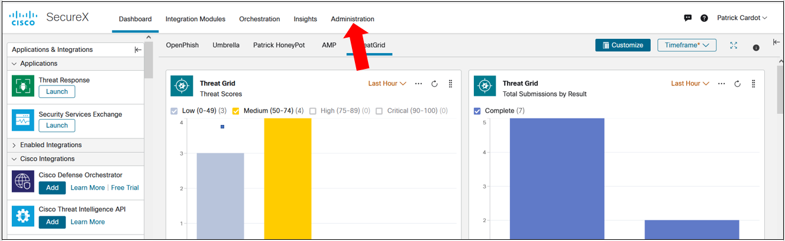
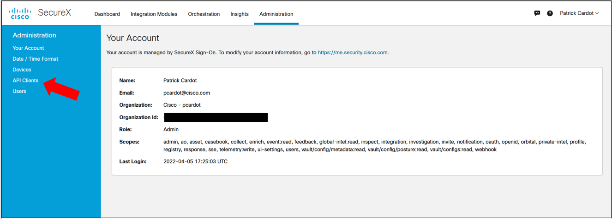
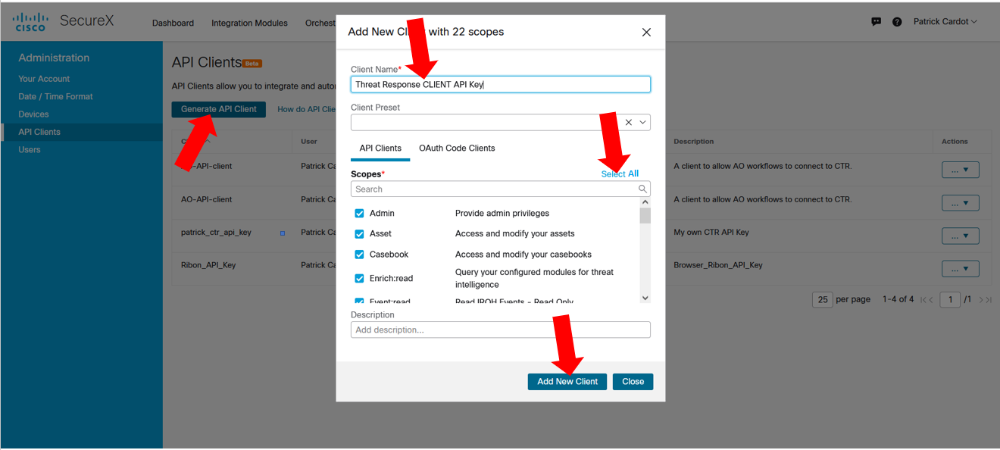
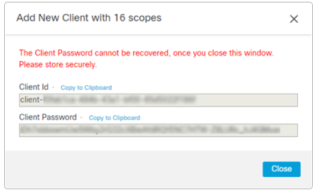

#Create a Threat Response API client

## Create a Threat Response API client

Step 1 : from the SecureX main page, click on the question **Administration** link on the top menu.

Step 2 : Click on **API Client** on the left menu 

Step 3 : Give a name to your API client, **Select All** scopes and click on the **Add New Client**  button.

Step 4 - Copy and save somewhere the **client-ID** and **client-Password**. This is the only opportunity to see the client-password in clear text !

**close** the popup windows.

That's it !!