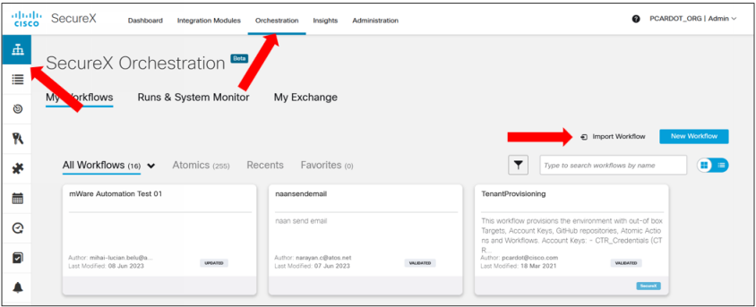
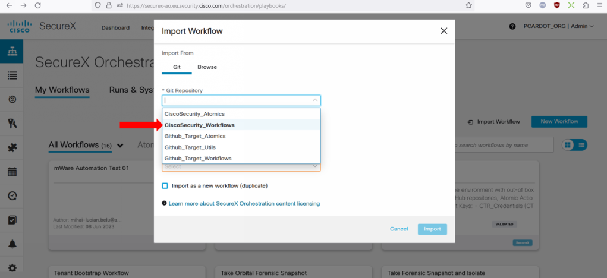
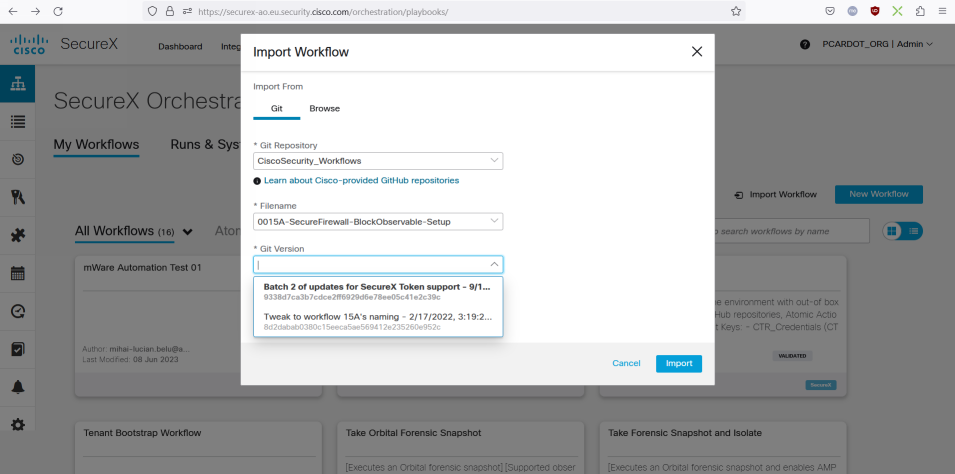
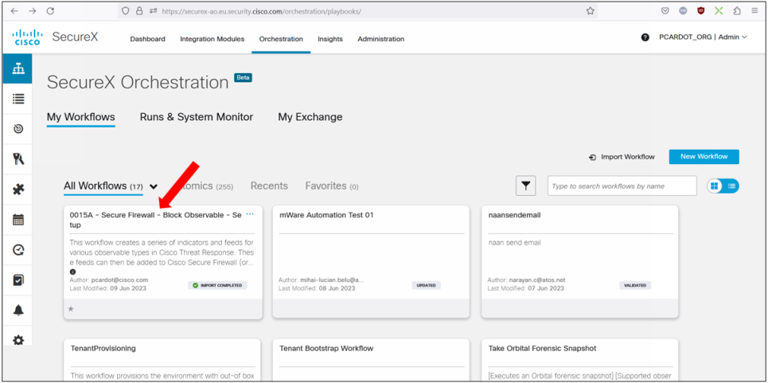

# Importing Workflows into your tenant

This section shows you how to import workflows from **Cisco Security Github repository**.

**Notice !!** of you don't see the Cisco Github into the **git repository** list box, then you have to install them.
Then go to the following instructions ( [ See Instructions ](https://ciscosecurity.github.io/sxo-05-security-workflows/configuration/))

Then you will be able to select Workflows available in the selected Github.

