# Introduction

The goal of this lab is to share with participants every details about how to build an automated threat detection and mitigation SecureX Demo.

This scenario is a complete **SecureX XDR demonstration**

## Automated Threat Detection and Mitigation scenario

This automated threat hunting scenario is the following :

Imagine vulnerable a Web server that exposes the log4J vulnerability. This vulnerability open the door to RCE ( remote code execution ) attacks.  

Meaning that an hacker connected to web page of this vulnerable web server, that present a formular,  can use one of the edit field of the formular in order to trigger execution of shell code on server's operating system.

Even if the web server is equiped by an Endpoint Protection solution, this RCE vulnerability can't be detected by it as it is due to unsecured coding of the web page which allow this attack.

### Here is the scenario

We start with the situation where an hacker have a potential remote administration acces to a victim machine.

This victim machine is a web server is a windows machine that run apache web server and very vulnerable php scripts and which exposes the log4j vulnerability. But the web server is protected by Secure Endpoint.

- **Step 1** : the hacker send a XSS log4j Attack into a web server formular. This attack makes the Web server to download  a malicious piece of code that will be executed as shell commands by the windows operating system. This code is actually a powershell code that runs into memory a version of a "mimikatz" attack. This is actuallly a fileless attack.
- **Step 2** : Secure Endpoint will detect this attack and will block it. At the same time, Secure Endpoint will create a SecureX Incident.
- **Step 3** : Within SecureX a workflow which runs every 5 minutes reads SecureX incidents. For every new incidents since last poll, the worklow will analyses their details and will extract from them targets and malicious observable information. 
- **Step 4** : For every incidents with high severity, the workflow will send a formatted alert to a an alert Webex team room. The goal is to alert the security operators about this new threat. And call them to instantly react.
- **Step 5** : Thanks to clickable links into the webex team Alert message, the security operators will be able to trigger SecureX workflows which will add malicious observables into SecureX blocking feeds.
- **Step 6** - Final step will be to deploy the blocking feeds into all company firewalls. This process is a completely automated process for Cisco Secure Firewall.  Once malicious observables exist into the SecureX blocking feeds, then they are automatically deployed a few minutes later as blocking rules into Cisco Secure Firewalls.  **Security Intelligence** or the **Threat Intelligence Director** FirePOWER features automatically manage this.

So here the scenario this demonstration aims to showcase.

## What will you learn in this lab ?

In this lab you will learn 

- How to create Incidents and Sightings into SecureX
- How to create feeds
- How to create judgments for observables and how to add them into SecureX Feeds
- How to read Incidents and Sigthings
- How to parse Incidents and Sigthings into SecureX workflow
- How to send markdown formatted message to webex team room and how to use Webex Team as a User Interface for SecureX
- How to trigger a webhook and how to send data to a workflow from a script
 
## Lab components

In this lab you need the following components :

- A laptop with a python ( 3.7 + ) interperter installed into it
- The Lab simulator
- A SecureX tenant  ( You can use DCLOUD )
- SecureX Threat Response API credentials
- A Webex Team Room that will be used a an Alert Webex Room
- A Webex Team bot that will be used to send alert into the Webex Team Room

## Demo Part 1 - Threat Detection & Create Incident 

1. Check your SecureX tenant. If you don't have a SecureX tenant you can use DCLOUD **Cisco SecureX Orchestration v1 - Instant Demo** [Cisco DCLOUD labs](https://dcloud.cisco.com/) -- [See Instructions here](https://github.com/pcardotatgit/SecureX_Workflows_and_Stuffs/blob/master/100-SecureX_automation_lab/dcloud_lab.md)
2. Once logged into your SecureX tenant, create a Threat Response API client with all scopes. For this, go the **Administration** then Select **API Clients** in the left panel and click on the **Generate API Client** button. Click on the **Select All** link in the **Scopes** Section and click on the **Add New Client** button.  Copy Threat Response **client ID** and **Client Password** and save them somewhere.
3. Install the Lab Simulator into your laptop . [see Instructions here](https://github.com/pcardotatgit/lab_simulator-001). And **Start the lab Simulator**. The lab Portal web page should open.
4. Open the **config.py** script located into the simulator root directory. Update the **ctr_client_id** and **ctr_client_password** variables with  CTR client ID and Client Password you got in step 2. Save your changes. **( Notice : you can use the GUI in the lab simulator for doing this )** 
5. In the **config.py** script, depending on your region, uncomment the related **host=xxx** and **host_for_token=xxx** variables. **Notice** DCLOUD demos are located in the US.  Save your changes.**( Notice :  you can use the GUI in the lab simulator for doing this )**
5.**Important Notice ! :** If you used the simulator Web GUI to edit the **config.py** file, then you will have to stop and restart the simulator in order to make changes to be taken into account.
6. Now go to the your SecureX tenant Web GUI, and go to Orchestration. Then Create a SecureX Token named **CTR_SecureX_Token** [ See Instructions here ](https://ciscosecurity.github.io/sxo-05-security-workflows/account-keys/securex-token). Or you can use the one you may have already created into your SecureX Tenant. In a few words, for creating it, open the **Orchestration** table then on the left panel go to **Account Keys** . Click on the **New Account Key** button and create a new account key named **CTR_SecureX_Token** with the **SecureX_Token** Account key type.  OR check that a SecureX token already exist and use this one in the next steps.
7. Start the simulator if not done. Your browser should automatically start on **http://localhost:4000**
8. Check that communication between the Lab Simulator and your SecureX tenant is Ok. For doing this, on the lab portal web page click on the **Config and Checks** button on the top left and then on  **check SecureX**. 

    The expected result is the following :

    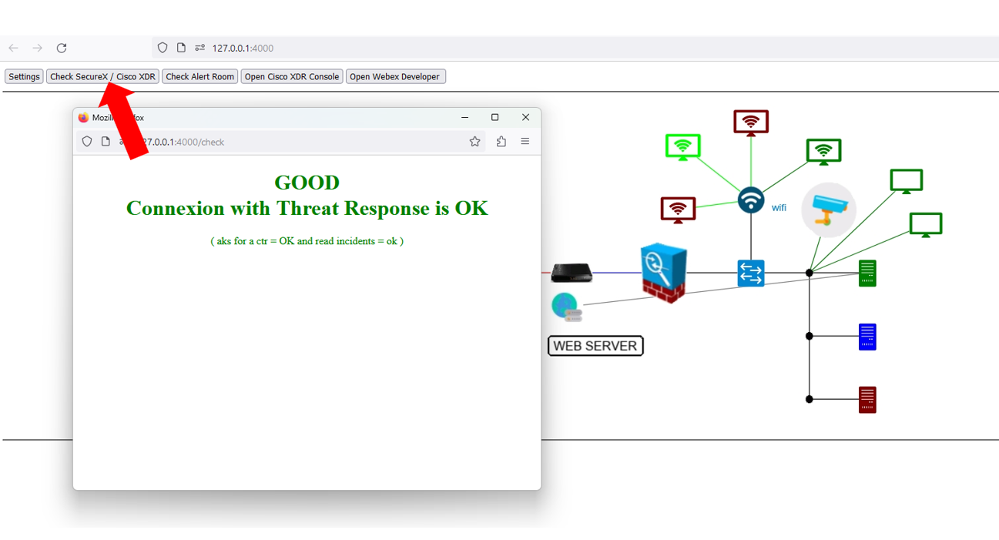

    In case of failure, check your configuration file ( host, host_for_token, ctr_client_ID, ctr_client_password )

    FYI : this part is managed by the **@app.route('/check')** route in the **app.py** script. It asks for a toke to SecureX and reads Incidents.

9. At this point you are ready to run the half of the full demo ( the Detection and Alert part )

First log into you SecureX tenant and open the **incident manager** into the **SecureX Ribbon**... Have a look to the existing incidents.

You are supposed to have no incidents named **PVT Endpoint Infection Demo**.

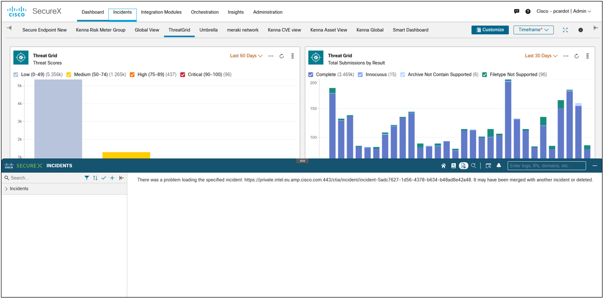

Okay...  now attack the Victim machine.

Open your browser to  **http://localhost:4000** and click on the hacker icon.  This opens an hacker console that is supposed to be used to send some shell commands to the victim. And type **hackthis** into the console.

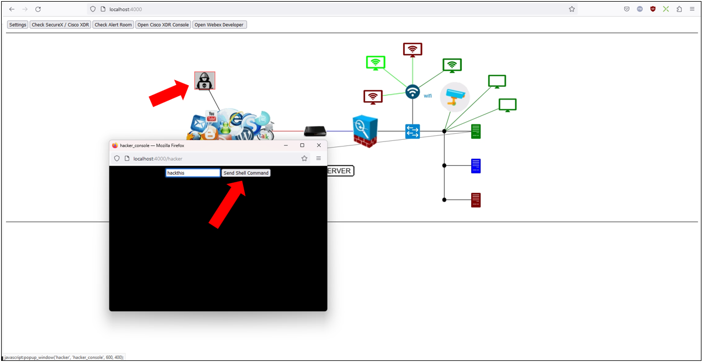

After a few seconds you will see the attack process running into the victim machine.

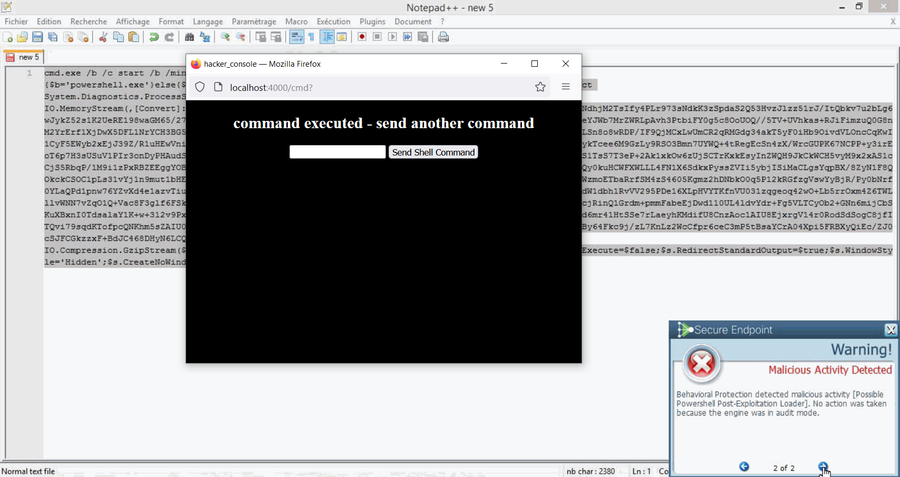

Now come back to the SecureX Ribbon. Then you can see now a new incident that was created by Secure Endpoint ( **PVT Endpoint Infection Demo** ).

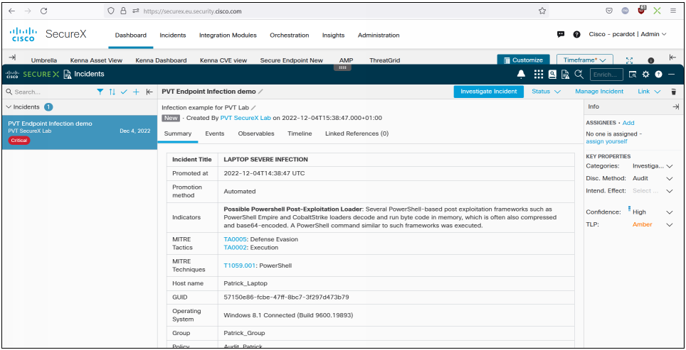

At this point you can roll out a full investigation by going to events, or observables. And the open the relation graph, understand the attack and take some actions.

If you want to dig into how to every details about how  Incidents and Sightings are created, then go [Dealing with SecureX CTIM](https://github.com/pcardotatgit/SecureX_Workflows_and_Stuffs/tree/master/13-Interact_with_CTIM) documentation.

If you participate to a CTF. Find the answers to questions !.

**NEXT STEP : Demo Part 2** 

## Demo Part 2 - Send Alerts into a Webex Team Room 

1. Create a webex Team Bot. Copy and save  the bot authentication token. If you don't already have a Webex Bot go this [ Create a Webex Team Bot Instructions ](https://github.com/pcardotatgit/Create_a_Webex_Team_Bot) and stop at : **OK YOU ARE GOOD TO GO !!** mention in the documentation.
2. Edit the **config.py** script and update the **webex_bot_token** variable value.**( Or :  you can use the GUI in the lab simulator for doing this, and restart flask )**
3. Create an Alert Webex Team Room ([ Instructions Here ](https://github.com/pcardotatgit/Create_a_Webex_Team_Bot) ) and check that you can send messages into it from SecureX workflows. You can run the **u1_test_webex_room.py** script in the **code** folder to test your Webex Team Setup. Run it and you are supposed to receive a message into the Webex Team Room. If everything is Okay then Copy the webex team Room ID. 
4. Edit the **config.py** script and update the **webex_room_id** variable value. **( Or :  you can use the GUI in the lab simulator for doing this, and restart flask )**
5. We are going to use the existing system **Webex Team** target in SecureX Tenant. Then we dont need to create a specific target for webex.
6. Next step is to Go to the **Orchestration table** and import the **Receive observables from a rest client.json** workflow available into the resources you downloaded into your working directory (**/secureX_workflows** folder).  From the Orchestration main page, click on the **Import Workflow** link on the top right. Browse your disk, select the workflow and import it.
7. Normaly this import operation automatically creates a new webhook ( **PVT_Demo_Webhook** ). Check that the webhook exists.
8. If the webhook is not created. 
    - In SecureX Orchestration go to the admin panel on the left,then select Create a webhook **Events & Webhook** at the bottom, then create an event named **PVT_Demo_Webhook** and create within it a webhook named **Webhook_trigger**. Once done copy it's **webhook url**
    
    - In the SecureX Workflow editor, edit the **Receive observables from a rest client** workflow and assign to it the webhook you created above. Go to the trigger section of the workflow properties panel on the right
9. BUT : If the webhook is created as expected, copy its **webhook_url**. For this you have to go to **Events & Webhooks**, and then select the **Webhooks** table and display the **PVT_Demo_Webhook** Details. The webhook url is at the bottom of the popup window.
10. Then Edit the **config.py** file and update the **SecureX_Webhook_url** variable.**( Or :  you can use the GUI in the lab simulator for doing this, and restart flask )**
11. Ready for some tests.  Test your setup with the **u2_test_webhook.py** file. You just have to run it from a terminal console openned into the **./code** folder ( venv activated ). And when you run this script, then you are supposed to see a message arriving into your alert webex team room. This script send a webhook to the SecureX workflow and the workflow is supposed to send a message to the Webex Team room.
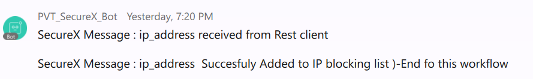

12. If you received the success message, Congratulation ! you are good to move forward. if You didn't receive the message, then In **SecureX Orchestration** edit the **Receive observables from a rest client** workflow and click on the **View Runs** button on the top right. You will be able to see the last run, check that the workflow was triggered and see which workflow activity failed.
13. If the previous workflow worked, then import the second workflow. For this, go to Orchestration and import the **Check Incidents every 5 minutes.json** workflow. Ignore any errors received during import. Don't stop the operation, but move forward ... you will fix the errors later. 
14. Check the SecureX **Private_CTIA_Target** . This one must use a host fqdn that match to your region ( ex : **private.intel.eu.amp.cisco.com** ) and this target must use the **SecureX_Token** you created at the begining of this lab.
15. Run the **Check Incidents every 5 minutes** workflow. You will be asked to enter the **webex_bot_token** and the **webex_room_id**.

    For the purpose of this lab we don't store the **webex_bot_token** and **webex_room_id** variables into global SecureX Variables. We voluntarily let the workflow asking you these values as required inputs.  For production you will have to modify this part and create instead static variables into your secureX tenant.

The expected result is the following an Alert formatted message into your alert webex team room.

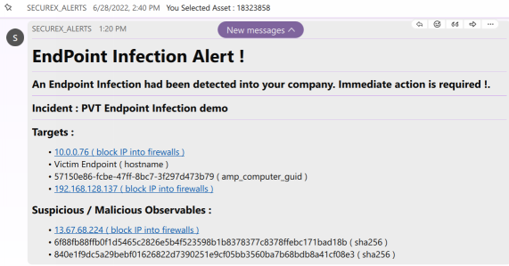

**TROUBLESHOOTING** : The workflow might fail due to the fact it was not able to retreive incidents we created. This specifically happens when you use the DCLOUD.  If this happens, to be able to move forward run the **u3_send_alert_to_webex_room.py** script from a terminal console. This will simulate what the workflow is supposed to do. 

### CONGRATULATION !! you are ready for the last part of this lab.

Webex Team is a great integration in SecureX, that gives to SecureX very efficient user interfaces. Learn more about markdown formatting and webex team cards here : [ How do we manage Webex Alert Messages ](https://github.com/pcardotatgit/SecureX_Workflows_and_Stuffs/blob/master/100-SecureX_automation_lab/webex_team_alert_message.md)

## Demo Part 3 - Add Malicious ip addresses into SecureX blocking feeds.

You have probably noticed that some IP addresses are listed in the webex team alert message. And they are all clickables.  

The purpose of this is to allow security operators to add these malicious IP addresses into SecureX blocking Feeds. 

And once an observable is into SecureX Feeds, then it can be automatically blocked by a company firewalls.

At this point we need :

- To Create SecureX Feeds
- To Create SecureX Workflows that will add observables into SecureX feeds.

And we are going to use workflows for doing that.

Actually these Workflows already exists into the list of Cisco Validated Workflows.

These workflows are :

- **0015A-SecureFirewall-BlockObservable-Setup**
- **0015B-SecureFirewall-BlockObservable**

The next step is to import these two workflows into your SecureX tenant. 

**Notice** If you work on your own SecureX tenant, and you already created your SecureX feeds, and you already use the **0015B-SecureFirewall-BlockObservable** workflow... then skip this part above a go directly to the **Use the 0015B-SecureFirewall-BlockObservable* workflow** step bellow.

Before doing these imports and specifically if you use the DCLOUD lab, the next step is to do some clean up.

Go to **Threat Response** => **Feeds** and check that **SecureX_Firewall_Private_xxx** feeds. If they exist delete all of them. 

Then you have to do the same with indicators. Go to **Indicators** go to **Source:Private** and Delete all **Secure_Firewall_SecureX_xxx** indicators.

Then go to the SecureX Orchestration page **=> all workflows** landing page and search for the following workflows :  **0015A-SecureFirewall-BlockObservable-Setup** and **0015B-SecureFirewall-BlockObservable**.   

If they exist don't delete them. Then Import the two workflows  **CiscoSecurity_Workflows** github and and overwrite existing workflows if needed.

**Next Step** Go to the following instructions and once done come back here and move forward with next steps : 

[ Here the Instructions for creating SecureX Feeds ](https://github.com/pcardotatgit/SecureX_Workflows_and_Stuffs/tree/master/12-create_securex_blocking_lists_for_firewalls)

**Have you done previous step ?**

If the anwser is yes, then let's go the last step of this lab.

**This last part is about using the 0015B-SecureFirewall-BlockObservable workflow in another workflow**

We are going to include the **0015B-SecureFirewall-BlockObservable** workflow into the **Receive observables from a rest client** one. Thanks to this, when we will click on an observable in the Webex Team alert message, then we will add it to the SecureX blocking list.

In **SecureX Orchestration** Go to the SecureX workflow editor and editthe **Receive observables from a rest client** workflow.

When you used it before, you probably have noticed the parallel block in the middle named **Replace this by an Update Judgment activity**.

This activity is by default skipped. It is not runt.

Replace this activity by the **0015B-SecureFirewall-BlockObservable** activity. 

You will be able to find it on the activity left panel ( search for : **0015B-SecureFirewall-BlockObservable**). 

Drag and drop it into the canvas in replacement of the whole **parallel block**.

Then click on it to select it and then go to it's properties right panel. 

- Set the **observable_type** to **ip**
- Set the **observable_value** to the **workflow => local => Observable_List** variable.

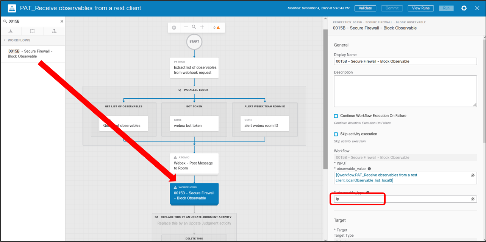

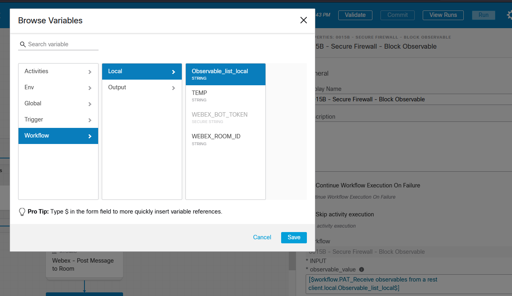

## You are ready for the final test !!

Come back to the Alert Webex Team Room and click on the Malicious IP address ( or anyother IP address ).

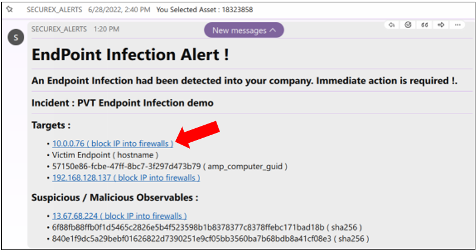

You are supposed to receive Webex Team messages from SecureX which confirm you that the observable was received and added to the feed.

Then the IP address must appear now into the public SecureX feed. 

Come back to the feed and refresh it.

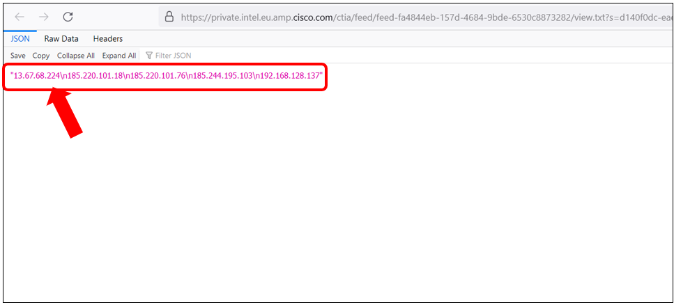

The IP address you clicked on in the Webex Team Message should now appear in the feed.

# CONGRATULATION !!! you completed the full demo !!!

## What to do Next ?

Modify the **Check Incidents every 5 minutes.json** workflow to :

- Use BOT Token ID and Webex Team RoomID stored into the SecureX tenant.
- Schedule the workflow every 5 minutes.

If you don't want to stop here, you can go the the Firewall part and make the feed automatically translated into Firewall Blocking rules.

This will be particularly simple to do with FirePOWER and Security Intelligence ( Or Threat Intelligence Director ). You can use Secure Firewall DCLOUD Demos for this.

Or you can replace or add into the last workflow an new activity that creates Dynamic objects into FMC.

## Utils

You may have seen the **code** folder contains some additionnal python scripts.

They are utililty scripts for doing maintenance and cleaning operations.

You can run these script into a terminal console opened into the **code** folder with venv activated.

Here are the details of these scripts :

- w0_utils_generate_and_save_token.py :asks for a token and save it into ctr_token.txt
- utils.py  : delete all incidents, sightings and judgments we created into the SecureX tenant.
- u1_test_webex_room.py : for testing to send message to the alert webex team room.
- u2_test_webhook.py : for testing that we can trigger the **Receive observables from a rest client** workflow , passed data to it.
- u3_send_alert_to_webex_room.py : Send the alert message to the alert webex team room, in the case that the **Check Incidents every 5 minutes.json** doesn't work.
- x1_utils_incidents_get_all.py . list all incidents. And save results into text files.
- x2_utils_incidents_get_only_critical.py . List only critical incidents. And save details into text files.
- x3_utils_incidents_delete.py : delete incidents we got with the above script.
- y1_utils_sightings_get_all.py : list all sightings . And save results into text files.
- y2_utils_sightings_get_filter_by_something.py : List all sightings we created in the lab.
- y3_utils_sightings_-delete_sightings.py : delete all sigthings we got with the above script
- y4_utils_sightings_-create.py : create a sighting

# Want to dig into the details of this Security Use Case ?

In this section let's discribe all the details of the how the full use case work.

[Click here to have access to the Solution architecture and code descriptions](https://github.com/pcardotatgit/SecureX_Workflows_and_Stuffs/blob/master/100-SecureX_automation_lab/solution_architecture.md)

