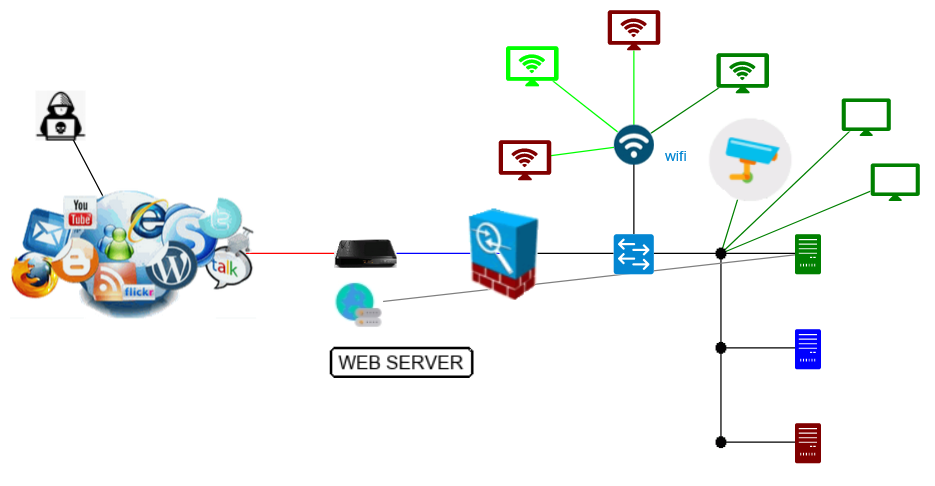
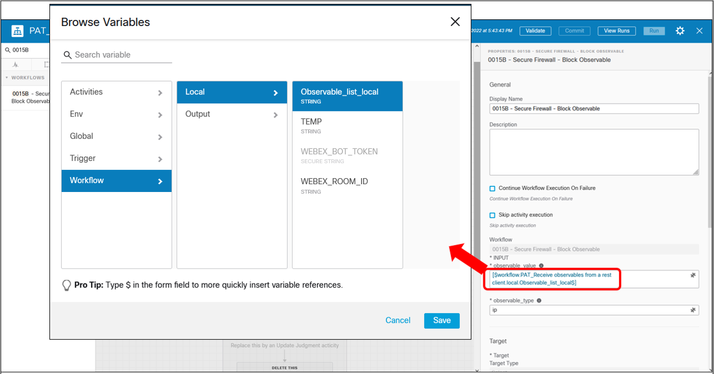

# Introduction

The goal of this lab is to share with participants every details about how to build an automated threat detection and mitigation SecureX Demo.

This scenario is a complete **SecureX XDR demonstration**

## Automated threat detection and mitigation scenario

This automated threat hunting scenario is the following :

Imagine vulnerable a Web server that exposes the log4J vulnerability. This vulnerability open the door to RCE ( remote code execution ) attacks.  

Meaning that an hacker connected to web page of this vulnerable web server, that present a formular,  can use one of the edit field of the formular in order to trigger execution of shell code on server's operating system.

Even if the web server is equiped by an Endpoint Protection solution, this RCE vulnerability can't be detected by it as it is due to unsecured coding of the web page which allow this attack.

So We start with the situation where an hacker have a potential remote administration acces to a victim machine.

This victim machine is a web server is a windows machine that run apache web server and very vulnerable php scripts and which exposes the log4j vulnerability. But the web server is protected by Secure Endpoint.

- Step 1 : the hacker send a log4j Attack into a web server formular. This attack makes the Web server to download  a malicious piece of code that will be executed as shell commands by the windows operating system. This code is a powershell code that runs into memory a version of a "mimikatz" attack. This is actuallly a fileless attack.
- Step 2 : Secure Endpoint will detect this attack and will block it. At the same time, Secure Endpoint will create a SecureX Incident.
- Step 3 : Within SecureX a workflow which runs every 5 minutes reads SecureX incidents. For every new incidents since last 5 minutes, the worklow will analyses their details and will extract from them  targets and malicious observable information. 
- Step 4 : For every incidents with high severity, the workflow will send a documented alert to a an alert Webex team room. The goal is to alert the security operator about this new threat. And call them to instantly react.
- Step 5 : Thanks to clickable links into the webex team Alert message, the security operators will be able to trigger SecureX workflows which will add malicious observables into SecureX blocking feeds.
- Step 6 - Final step will be to deploy the blocking feeds into all company firewalls. This process is an completly automated process for Cisco Secure Firewall.  Once malicious observables exist into the SecureX blocking feeds, they are automatically deployed a few minutes later as new blocking rules into Cisco Secure Firewalls thank to the **Security Intelligence** or the **Threat Intelligence Director** FirePOWER feature.

## What will you learn in this lab ?

In this lab you will learn 

- How to create Incidents and Sightings into SecureX
- How to create feeds
- How to create judgments for observables and how to add them into SecureX Feeds
- How to Read Incident and Sigthings
- How to parse ncident and Sigthings into SecureX workflow
- How to send markdown formatted message to webex team room and how to use Webex Team as a User Interface for SecureX
- How to trigger a webhook and how to send data to a workflow from a script
 

## Lab components

In this lab you need the following components :

- A laptop with a python ( 3.7 + ) interperter installed into it
- The Lab simulator
- A SecureX tenant
- SecureX Threat Response API credentials
- A Webex Team Room that will be used a an Alert Webex Room
- A Webex Team bot that will be used to send alert into the Webex Team Room

## Installation

### Demo Part 1 - Threat Detection & Create Incident 

1. Check your SecureX tenant. If you don't have a SecureX tenant you can use DCLOUD **Cisco SecureX Orchestration v1 - Instant Demo** 
2. Create Threat Response API client with all scopes. Copy Threat Response **client ID** and **Client Password** and save them somewhere.
3. Install the Lab Simulator into you laptop . [see Instructions]
4. Open the **config.py** script located into the simulator root directory. Update the **ctr_client_id** and **ctr_client_password** variables with  CTR client ID and Client Password you got in step 2. 
5. Depending on your region uncomment the **host=xxx** and **host_for_token=xxx** variables. **Notice** DCLOUD demos are located in the US.
6. Create a SecureX Token named **CTR_SecureX_Token** [ See Instructions here ](https://github.com/pcardotatgit/SecureX_Workflows_and_Stuffs/tree/master/10-trigger_your_workflow_with_webhooks). Or you can use the one you already created into your SecureX Tenant.
7. Start the simulator and open your browser to **http://localhost:4000**
8. Check that communication between the Lab Simulator and your SecureX tenant is Ok. Click on the **check SecureX** link on the top left of the displayed web page. 

    The expected result is the following :

    

9. At this point you can run the half of the full demo ( Detection and Alert )

First log into you SecureX tenant and open the **incident manager** into the **SecureX Ribbon**. Have a look to the existing incidents.

Attack the Victim machine.

Open your browser to  **http://localhost:4000** and click on the hacker icon.  This opens an hacker console that is supposed to be used to send some shell commands to the victim. And type **hackthis** into the console.

After a few second youn will see the attack process running into the victim machine.

Now come back to the SecureX Ribbon. Then you can see now a new incident that was created by Secure Endpoint.

At this point you can roll out a full investigation process by going to events, or observables. And the open the relation graph undrestand the attack.

**NEXT STEP : Demo Part 2** 

### Demo Part 2 - Send Alerts into a Webex Team Room and add Malicious observables into SecureX blocking feeds

1. Create a dedicated webex Team Bot for this lab. Copy and save it's authentication token. If you don't already have a Webex Bot go this [ Create a Webex Team Bot Instructions ](https://github.com/pcardotatgit/Create_a_Webex_Team_Bot) and stop at : **OK YOU ARE GOOD TO GO !!** text in the documentation.
2. Edit the **config.py** script and update the **webex_bot_token** variable value
3. Create an Alert Webex Team Room and check that you can send messages into it from SecureX workflows. Copy it's Room ID
4. Edit the **config.py** script and update the **webex_room_id** variable value
5. Create a SecureX target for Webex [ see instructions ]
6. Go to Orchestration and import the **Receive observables from a rest client.json** workflow.
7. Normaly this import operation automatically creates a new webhook. Check this.
8. If the webhook is not created. In SecureX Orchestration go to the admin panel and then select Create a webhook **Events & Webhook** then create an event named **PVT_Demo_Webhook** and create within it a webhook named **Webhook_trigger**. Once done copy it's **webhook url**
9. In the SecureX Workflow editor, edit the **Receive observables from a rest client** workflow and assign to it the webhook you created above. Go to the trigger section of the workflow properties panel on the right
8. BUT : If the webhook is created as expected, copy it's **webhook_url**.
10. Then Edit the **config.py** file and update the **SecureX_Webhook_url** variable
11. Ready for some tests.  Test this setup with the **test_webhook.py** file. When you run this script you are supposed to see a message into your alert webex team room.

10. If you received the success message, Congratulation ! you are goo to move forward. if not check here [troubleshooting instructions]
11. Go to Orchestration and import the **Check Incidents every 5 minutes.json** workflow.
12. Check the SecureX **Private_CTIA_Target** . This one must use a host fqdn that match to your region ( ex : **private.intel.eu.amp.cisco.com** ) and this target must use the **SecureX_Token** you created at the begining of this lab.
13. Run the **Check Incidents every 5 minutes** workflow. You will be asked to enter the **webex_bot_token** and the **webex_room_id**.

    For the purpose of this lab we dont store the **webex_bot_token** and **webex_room_id** variables into global SecureX Variables. We voluntary let the workflow asking you these value is required inputs.  For production you will have to modify this part a create static variables into your secureX tenant.

The expected result is a formatted alert message into the alert webex team room 

### CONGRATULATION !! you are ready for the last part of this lab : Add ip address into SecureX blocking feeds

You have probably noticed that IP addresses observables in the webex team alert message are clickables.  

The purpose of this is to allow security operators to add malicious observables into SecureX blocking Feeds. And once any observable is into SecureX Feeds, it can be automatically blocked by a company firewalls.

This is the goal of this last part of the lab. To do so we need :

- To Create SecureX Feeds
- TO Create SecureX Workflows that will add observables into SecureX feeds.

Actually these Workflows already exists into the list of Cisco Validated Workflows.

These workflows are :

- 0015A-SecureFirewall-BlockObservable-Setup
- 0015B-SecureFirewall-BlockObservable

The next step is to import these two workflows into your SecureX tenant. 

Before doing these imports and If you use the DCLOUD lab, then  do some clean up.

Go to **Threat Response** => **Feeds** and check that **SecureX_Firewall_Private_xxx** feeds. If they exist delete all of them. 

Then you have to do the same with indicators. Delete all **Secure_Firewall_SecureX_xxx** indicators.

Then go to the SecureX Orchestration page => all workflows and search for workflows **0015A-SecureFirewall-BlockObservable-Setup** and **0015B-SecureFirewall-BlockObservable**.   

If they exist don't delete them. Then Import the two workflow  **CiscoSecurity_Workflows** github and and overwrite existing workflows if needed.

**Next Step** Go to the following instructions and once done come back here and move forward with next steps : 

[ Instructions for creating SecureX Feeds ](https://github.com/pcardotatgit/SecureX_Workflows_and_Stuffs/tree/master/12-create_securex_blocking_lists_for_firewalls)

**Have you done previous step ?**

If the anwser is yes, then let's go the last step of this lab.

We are going to include the **0015B-SecureFirewall-BlockObservable** workflow into the **Receive observables from a rest client** one. Thanks to this, when we will click on an observable in the Webex Teal alert message, then we will add it to the SecureX blocking list.

Go to the SecureX workflow editor and open the **Receive observables from a rest client** workflow.

When you used it before, you probably have noticed the parallel block in the middle named **Replace this by an Update Judgment activity**.

This activity is by default skipped. It is not runt.

Replace this activity by the **0015B-SecureFirewall-BlockObservable** activity. 

You will be able to find it on the activity left panel ( search for : **0015B-SecureFirewall-BlockObservable**). 

Drag and drop it into the canvas in replacement of the whole **parallel block**.

Then click on it to select it and then go to it's properties right panel. 

- Set the **observable_type** to **ip**
- Set the **observable_value** to the 

## You are ready for the final test !!

Come back to the Alert Webex Team Room and click on one of the IP addresses.

You are supposed to receive messages from SecureX which tell you that the observable was received and added to the feed.

Then the IP address must appear now  into the public SecureX feed. 

Come back to the feed and refresh it.

# CONGRATULATION !!! you completed the full demo !!!

## What to do Next ?

If you don't want to stop here, you can go the the Firewall part and make the feed automatically translated into Firewall Blocking rules.

This will be particularly simple to do with FirePOWER and Security Intelligence ( Or Threat Intelligence Director ). You can use Secure Firewall DCLOUD Demos for this.