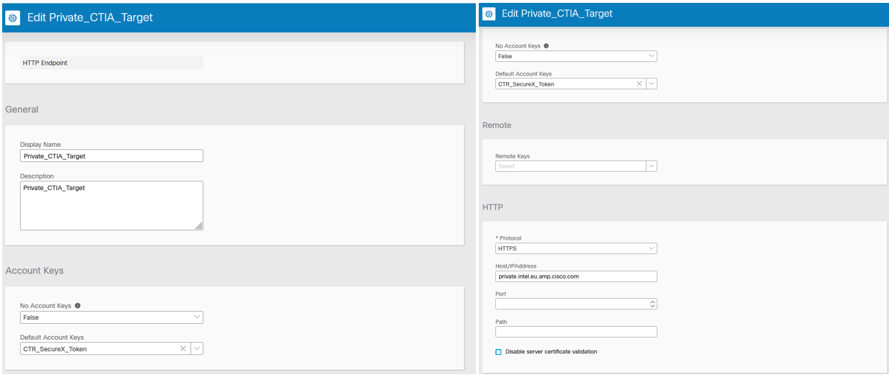
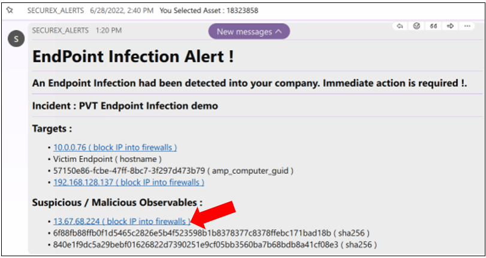

# Detect, Alert and Block Threat Use Case
## Introduction

The goal of this lab is to share with participants every details about how to build an automated threat detection and mitigation Cisco XDR / SecureX Demo.

This scenario is a complete **Cisco XDR / SecureX demonstration**. This lab works on both XDR or SecureX tenants, we don't use into it XDR advanced features.

## Automated Threat Detection and Mitigation scenario

This automated threat hunting scenario is the following :

Imagine a Web server vulnerable to log4J attacks. This vulnerability opens the door to RCE ( remote code execution ) attacks.  

Meaning that an hacker connected to a vulnerable formular exposed by this web server ( login page for example ), can use one of the edit fields of the formular, to trigger execution of shell code on server's operating system.

For example, the log4j vulnerability allows an hacker, thanks to a very simple XSS attack on the web formular, to make the victim web server to download a malicious code hosted somewhere on the INTERNET. Malicious script that contents some executable code that will be runt into the server memory just after the download.

For more information about this Threat you can have a look to the following [Cisco Talos Blog Post](https://blog.talosintelligence.com/apache-log4j-rce-vulnerability/). You will find in this article some examples of partners that can trigger what is describe above.

### Here is the scenario details

For this lab the victim machine is voluntarily a web server which runs on windows protected by Secure Endpoint. A very vulnerable web server is installed into it. So root cause origin of the vulnerability is the Web Server and not the Operating System.

The attacker is connected to a login page on the vulnerable web server.

- **Step 1** : the hacker sends a log4j Attack patern into the web formular. This attack makes the Web server to download  a malicious piece of code that will be executed as shell commands by the Web Servers Operating System. This code is actually a powershell code that runs a version of a "mimikatz" attack into memory ( no copy on disk ). This is actually an fileless attack.
- **Step 2** : Secure Endpoint detects and block instantly this attack. And in parallel At the same time, Secure Endpoint creates fully documented Incident into Cisco XDR.
- **Step 3** : This incident triggers an XDR workflow which sends an alert to an alert webex room. This alert is a web formular from which the Security Operators that will receive it, will be able to select targeted machines and isolate them, and select malicious observables and block add them into the XDR IPV4 blocking feed.
- **Step 4** : Security Operator select in the Webex Formular malicious ip addresses to block and click on the **block** button. This triggers a workflow that add all selected  ip addresses into the **XDR IPV4 blocking feed**.
- **Step 5** : Security Operator select in the Webex Formular targeted machines to isolate. Then a workflow is triggered that isolate the selected machine into at least Secure Endpoint. And isolate it into Identity Service Engine if you have this into your lab

## What will you learn in this lab ?

In this lab you will learn 

- How to create Incidents and Sightings into XDR
- How to create XDR blocking feeds
- How to create judgments for observables and how to add them into XDR blocking Feeds
- How to read Incidents and Sigthings
- How to parse Incidents and Sigthings thanks to workflows
- How to trigger a workflow from an incident
- How to send Webex Alert Adaptative cards
- How to trigger a webhook and how to send data to a workflow from a script

Not only that, you will learn as well how to use python flask as simulators that will completly simulate behaviors of all devices involved in this demo. Then you will not need to install any machines. You will just have to use the simulator.
 
## Lab components

In this lab you need the following components :

- A laptop with a python ( 3.10 + ) interperter installed into it
- The Lab simulator
- A Cisco XDR tenant
- Threat Response API client ID and Client Password generated into your XDR
- A Webex bot that will be used to send alert into an alert Webex Room
- An Alert Webex Room which will be actually the Webex Bot room into which you will be in contact with the Alert webex bot
- 

## Demo Part 1 - Detect the attack & Create Incident 

1. Check your Cisco XDR or SecureX tenant. If you don't have a SecureX tenant you can use the DCLOUD **Cisco SecureX Orchestration v1 - Instant Demo** [Cisco DCLOUD labs](https://dcloud.cisco.com/) -- [See Instructions here](https://github.com/pcardotatgit/SecureX_Workflows_and_Stuffs/blob/master/100-SecureX_automation_lab/dcloud_lab.md)
2. Once logged into your Cisco XDR/SecureX tenant, create a Threat Response API client with all scopes. For this, go the **Administration** then Select **API Clients** in the left panel and click on the **Generate API Client** button. Click on the **Select All** link in the **Scopes** Section and click on the **Add New Client** button.  Copy Threat Response **client ID** and **Client Password** and save them somewhere.[ See instructions here](https://github.com/pcardotatgit/SecureX_Workflows_and_Stuffs/blob/master/100-SecureX_automation_lab/ctr_api_client.md)
3. Install the Lab Simulator into your laptop . [see Instructions here](https://github.com/pcardotatgit/lab_simulator-001). And **Start the lab Simulator**. The lab Portal web page should open.
4. From the lab Portal web page click on the **Settings** button on the top left. Update the **ctr_client_id** and **ctr_client_password** variables with  CTR client ID and Client Password you got in step 2. Select Your Regions. At this point you can just save your changes. 
    
4a.**Notice** DCLOUD instant demos are located in the US.  
4b. This operation actually update a file name **config.py** located into the code root directory. You can edit it manually if you prefer.
5.**Important Notice ! : Flask requires you to stop and restart the simulator in order to make changes to be taken into account**.
6. Now go to the your SecureX/Cisco XDR tenant Web GUI, and go to Orchestration. Then Create a SecureX Token named **CTR_SecureX_Token** [ See Instructions here ](https://ciscosecurity.github.io/sxo-05-security-workflows/account-keys/securex-token). Or you can use the one you may have already created into your SecureX Tenant. In a few words, for creating it, open the **Orchestration** table then on the left panel go to **Account Keys** . Click on the **New Account Key** button and create a new account key named **CTR_SecureX_Token** with the **SecureX_Token** Account key type.  OR check that a SecureX token already exist and use this one in the next steps.
7. Start the simulator if not done. Your browser should automatically open on **http://localhost:4000**. And the lab topology must appear.
8. Check that communication between the Lab Simulator and your SecureX/Cisco XDR tenant is Ok. For doing this, click on the **Checks SecureX / Cisco XDR** button on the top left of the lab portal web page. 

    The expected result is the following :

    

    In case of failure, check your configuration file ( host, host_for_token, ctr_client_ID, ctr_client_password )

    FYI : this part is managed by the **@app.route('/check')** route in the **app.py** script. It asks for a token to SecureX/Cisco XDR and reads Incidents. If it succeed to do so then the success message appears.

9. **At this point you are ready to run the first part of the demo ( the Detection and Alert part )**

First log into your SecureX / Cisco XDR tenant and open the **incident manager** into the **SecureX Ribbon**... Have a look to the existing incidents.

You are supposed to have no incidents named **PVT Endpoint Infection Demo**.

Okay...  Now let's send an attack to the victim machine.

Open your browser to  **http://localhost:4000** and click on the hacker icon.  This opens an hacker console that is supposed to be used to send some shell commands to the victim. And type **hackthis** into the console.

After a few seconds you will see the attack process running into the victim machine.

This actually a video that shows what happens into the victim machine. The reason of using a video is to ask to anyone to run real attacks with real hacking tools.  But the events in XDR / SecureX will be real !

Now come back to the SecureX Ribbon. Then you can see now a new incident that was created by Secure Endpoint ( **PVT Endpoint Infection Demo** ).

At this point you can roll out a full investigation by going to events, or observables. And the open the relation graph, understand the attack and take some actions.

If you want to dig into how to every details about how  Incidents and Sightings are created, then go [Dealing with CTIM](https://github.com/pcardotatgit/SecureX_Workflows_and_Stuffs/tree/master/13-Interact_with_CTIM) documentation.

If you participate to a CTF. Find the answers to questions !.

**NEXT STEP : Demo Part 2** 

## Demo Part 2 - Send Alerts into a Webex Room 

1. Create a webex Bot. Copy and save  the bot authentication token. If you don't already have a Webex Bot go this [ Create a Webex Bot Instructions ](https://github.com/pcardotatgit/Create_a_Webex_Team_Bot) and stop at the **OK YOU ARE GOOD TO GO !!** mention into this documentation.
2. Create an Alert Webex Room ([ Instructions Here ](https://github.com/pcardotatgit/Create_a_Webex_Team_Bot) ) and check that you can send messages into it from XDR / SecureX workflows. The instructions shows you how to retreive this **webex Room ID**. Copy it and save it somewhere.
3. Go to the lab portal web page and then go to **Settings**. Update the **webex_bot_token** and **Webex Room ID** variables.Or :  you can Edit the **config.py** script. **Warning ! ! Don't forget to restart flask !**
4.From the Lab Portal Web Page click on the **Check Alert Room** button, you are supposed to receive a message into the Alert Webex Room. Or You can run the **u1_test_webex_room.py** script in the **code** folder.
5. We are going to use now the existing system **Webex Team** target in XDR/SecureX Tenant. Then we dont need to create any specific new target for interacting with webex.
6. Next step, go to your XDR / SecureX web console and go to **Orchestration**. Then import the **Receive observables from a rest client.json** workflow available into the resources you downloaded into your working directory (**/secureX_workflows** folder).  From the Orchestration main page, click on the **Import Workflow** link on the top right. Browse your disk, select the workflow and import it.
7. Normaly this import operation automatically creates a new webhook ( **PVT_Demo_Webhook** ). Check that the webhook exists.
8. **If the webhook is not created**. 
    - In SecureX Orchestration go to the admin panel on the left,then select Create a webhook **Events & Webhook** at the bottom, then create an event named **PVT_Demo_Webhook** and create within it a webhook named **Webhook_trigger**. Once done copy it's **webhook url**
    - ( [More information on Webhooks](https://ciscosecurity.github.io/sxo-05-security-workflows/webhooks) )   
    - In the Workflow editor, edit the **Receive observables from a rest client** workflow and assign to it the webhook you created above. Go to the trigger section of the workflow properties panel on the right, then click on the **+ Add Trigger** link, select your Webhook trigger and save
    
9. **BUT : If the webhook is created** as expected, copy its **webhook_url**. For this you have to go to **Events & Webhooks**, and then select the **Webhooks** table and display the **PVT_Demo_Webhook** Details. The webhook url is at the bottom of the popup window. 
10. Then Update the Settings into the Lap Portal Web page. Update the **Webhook URL** field, save and restart the Flask Application !! (  Or edit the **config.py** file and update the **SecureX_Webhook_url** variable. )
11. **You are now Ready for some tests**.  You can test your setup with the **u2_test_webhook.py** file. You just have to run it from a terminal console openned into the **./code** folder ( with venv activated of course). And when you run this script, then you are supposed to see a message arriving into your alert webex team room. This script send a webhook to the SecureX workflow and the workflow is supposed to send a message to the Webex Team room.

12. If you received the success message, Congratulation ! you are ready to trigger workflows, and you can move forward. if You didn't receive the message, then In **SecureX Orchestration** edit the **Receive observables from a rest client** workflow and click on the **View Runs** button on the top right. You will be able to see the last run, check that the workflow was triggered and see which workflow activity failed.
13. If the previous workflow worked, then import the second workflow. For this, go to Orchestration and import the **Check Incidents every 5 minutes.json** workflow. Ignore any errors received during import. Don't stop the operation, but move forward ... you will fix the errors later. If you don't have created the SecureX_Token you will be asked to validate it's creation.
14. Check the SecureX **Private_CTIA_Target** . This one must use a host fqdn that match to your region ( ex : **private.intel.eu.amp.cisco.com** ) and this target must use the **SecureX_Token** you created at the begining of this lab.

15. Now Run the **Check Incidents every 5 minutes** workflow. You will be asked to enter the **webex_bot_token** and the **webex_room_id**.

    For the purpose of this lab we don't store the **webex_bot_token** and **webex_room_id** variables into global SecureX Variables. We voluntarily let the workflow asking you these values as required inputs.  For production you will have to modify this part and create instead static variables into your secureX tenant.

The expected result is the following an Alert formatted message into your alert webex team room.

**TROUBLESHOOTING** : The workflow might fail due to the fact it was not able to retreive incidents we created. This specifically happens when you use the DCLOUD.  If this happens, to be able to move forward run the **u3_send_alert_to_webex_room.py** script from a terminal console. This will simulate what the workflow is supposed to do. 

### CONGRATULATION !! you are ready for the last part of this lab.

Webex Team is a great integration, that gives to XDR / SecureX a very efficient user interfaces. Learn more about markdown formatting and webex team cards here : [ How do we manage Webex Alert Messages ](https://github.com/pcardotatgit/SecureX_Workflows_and_Stuffs/blob/master/100-SecureX_automation_lab/webex_team_alert_message.md)

## Demo Part 3 - Add Malicious ip addresses into SecureX blocking feeds.

Here is  the last part of this lab !  Response actions  !

You have probably noticed that some IP addresses are listed in the Webex Alert Message. And they all are clickables.  

The purpose of this is to allow security operators to add these malicious IP addresses into blocking Feeds handled by XDR/SecureX. 

And once an observable is into these Feeds, then it can be automatically blocked by a company firewalls.

At this point we need :

- To Create XDR/SecureX Feeds
- And have a way to add IP addresses to block into XDR/SecureX Feeds.

We are going to use workflows for acheiving both.

Actually these Workflows already exists into the list of Cisco Validated Workflows.

These workflows are :

- **0015A-SecureFirewall-BlockObservable-Setup**  :  Creates XDR/SecureX Blocking Feeds
- **0015B-SecureFirewall-BlockObservable**  : Adds an Observable to an XDR/SecureX Blocking Feeds

The next step for us is to import these two workflows into your SecureX tenant. 

**Notice** 
- If you work on your own XDR/SecureX tenant, and you already created your blocking feeds ( you already use the **0015B-SecureFirewall-BlockObservable** workflow ) then skip this part above a go directly to the **Use the 0015B-SecureFirewall-BlockObservable* workflow** step bellow.

Before doing these imports and specifically if you use the DCLOUD lab, the next step is to do some clean up.

Go to **Threat Response** => **Feeds** and check that **SecureX_Firewall_Private_xxx** feeds. If they exist delete all of them. 

Then you have to do the same with indicators. Go to **Indicators** go to **Source:Private** and Delete all **Secure_Firewall_SecureX_xxx** indicators.

Then go to the SecureX Orchestration page **=> all workflows** landing page and search for the two following workflows :  **0015A-SecureFirewall-BlockObservable-Setup** and **0015B-SecureFirewall-BlockObservable**.   

If they exist you don't delete them. 

Then Import the two workflows  **CiscoSecurity_Workflows** mentionned above and and overwrite existing workflows if needed. [ Instructions for importing workflows](https://github.com/pcardotatgit/SecureX_Workflows_and_Stuffs/blob/master/100-SecureX_automation_lab/importing_workflows.md)

**Next Step** Go to the following instructions and once done come back here and move forward with next steps : 

[ GO TO these Instructions for creating XDR/SecureX Feeds ](https://github.com/pcardotatgit/SecureX_Workflows_and_Stuffs/tree/master/12-create_securex_blocking_lists_for_firewalls)

**Have you done previous step ?**

If the anwser is yes, then let's go the last step of this lab.

**This last part is about using the 0015B-SecureFirewall-BlockObservable workflow in another parent workflow, as resource**

We are going to include the **0015B-SecureFirewall-BlockObservable** workflow into the **Receive observables from a rest client** one. Thanks to this, when we will click on an observable in the Webex Alert Message, then we will add it to the XDR/SecureX blocking list.

**Next Step**  In **Orchestration** Go to the workflow editor and edit the **Receive observables from a rest client** workflow.

When you used it before, you probably have noticed the parallel block in the middle named **Replace this by an Update Judgment activity**.

This activity skipped is by default . It is not runt.

Replace this activity by the **0015B-SecureFirewall-BlockObservable** activity. 

You will be able to find it on the activity left panel ( search for : **0015B-SecureFirewall-BlockObservable**). 

Drag and drop it into the canvas in replacement of the whole **parallel block**.

Then click on it to select it and then go to it's properties right panel. 

- Set the **observable_type** to **ip**
- Set the **observable_value** to the **workflow => local => Observable_List** variable.

## You are ready for the final test !!

Come back to the Alert Webex Team Room and then click on the Malicious IP address ( or anyother IP address ).

You are supposed to receive Webex Team messages from XDR/SecureX which confirm you that the observable was received and succesfully added to the feed.

Then the IP address must appear now into the public SecureX feed. 

Come back to the feed and refresh it.

The IP address you clicked on in the Webex Team Message should now appear in the feed. Firewalls will be able to consume this feed and block this IP address.

# CONGRATULATION !!! you completed the full demo !!!

## What to do Next ?

Modify the **Check Incidents every 5 minutes.json** workflow to :

- Use BOT Token ID and Webex Team RoomID you store as secret keys into XDR/SecureX tenant.
- Schedule the workflow every 5 minutes ([See instructions](https://ciscosecurity.github.io/sxo-05-security-workflows/schedules/)).

If you don't want to stop here, you can go the the Firewall part and make the feed automatically translated into Firewall Blocking rules.

This will be particularly simple to do with FirePOWER and Security Intelligence ( Or Threat Intelligence Director ). You can use Secure Firewall DCLOUD Demos for this.

Or you can replace or add into the last workflow an new activity that creates Dynamic objects into FMC.

## Utils

You may have seen the **code** folder contains some additionnal python scripts.

They are utililty scripts for doing maintenance and cleaning operations.

You can run these script into a terminal console opened into the **code** folder with venv activated.

Here are the details of these scripts :

- **w0_utils_generate_and_save_token.py** : asks for a token and save it into ctr_token.txt
- **utils_delete_all.py.py**  : delete all incidents, sightings and judgments we created into the SecureX tenant.
- **u1_test_webex_room.py** : for testing to send message to the alert webex team room.
- **u2_test_webhook.py** : for testing that we can trigger the **Receive observables from a rest client** workflow , and pass data to it.
- **u3_send_alert_to_webex_room.py** : Send the alert message to the Alert Webex Room, in the case that the **Check Incidents every 5 minutes.json** doesn't work.
- **x1_utils_incidents_get_all.py** . list all incidents. And save results into text files.
- **x2_utils_incidents_get_only_critical.py** . List only critical incidents. And save details into text files.
- **x3_utils_incidents_delete.py** : delete incidents we got with the above script.
- **y1_utils_sightings_get_all.py** : list all sightings . And save results into text files.
- **y2_utils_sightings_get_filter_by_something.py** : List all sightings we created in the lab.
- **y3_utils_sightings_-delete_sightings.py** : delete all sigthings we got with the above script
- **y4_utils_sightings_-create.py** : create a sighting
- Want to see how to display and delete judgments ?  open the **utils_delete_all.py** script
- Want to learn more about incidents, sightings, judgments, verdits and bundles APIs : [See Dealing with CTIM]( https://github.com/pcardotatgit/SecureX_Workflows_and_Stuffs/tree/master/13-Interact_with_CTIM )

# Want to dig into this Security Use Case details ?

In this section let's describe all the details of the how the full use case work.

[Click here to have access to the Solution architecture and code descriptions](https://github.com/pcardotatgit/SecureX_Workflows_and_Stuffs/blob/master/100-SecureX_automation_lab/solution_architecture.md)

