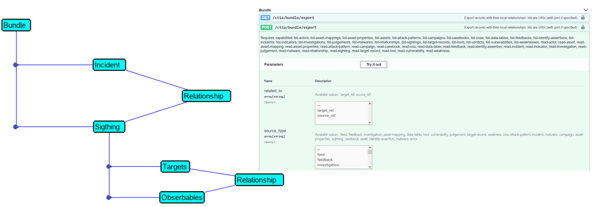

# Solution achitecture

## Solution components

The key components of this solution are the following :

- A python host wich host the lab simulator
- The Lab simulator
- A SecureX tenant 
- Two SecureX Automation workflows
- An Alert Webex Room
- A Webex Team bot

## The Flask application

The Flask application provides with the user interface. It exposes the portal web page from where to show the endpoint attack.

The Flask application has another role in this solution. It provides with a Bot Logic that receives calls from Webex when the security operator click on a link.

In one hand, the application exposes API endpoints for managing :

- Application Configuration
- Attack simulation
- Webex Team Operator choices and SecureX webhook

In the other hand the Flask application run several functions which are triggered by REST calls received on exposed API Endpoints.  These functions are mostly about interaction with SecureX and Webex.

For code clarity, these functions are not all embeded into the **app.py** main script, but they are located into dedicated python scripts outside the **app.py** scripts but linked with it thanks to **import** statements.

## Check for new incidents

When the attack is blocked into the endpoint, then an Incidents is created within SecureX with attached incidents.

This part is managed by functions in the **create_incident_and_sightings_with_dynamic_data.py** script, called from **app.py**.

We use the Threat Response **Bundle** API. This API allow us to use one single call in order to create everything at once into SecureX.

What we have to do actually is to create a single JSON payload that contains :

- The new **Incident**
- Several **Sightings**
- For every **Sightings** a **member of** **relationship** which link the **Sighting** to the **Incident**
- In every **Sightings**, **observables** and **targets**
- For every **observables** and **targets**, a **relationship** which is a **connected to** **relationship**

This JSON payload is passed as a POST variable to the REST call we send to SecureX and then automatically Incident and Sightings are created. And SecureX Automatically does enrichement for every observable and draw the Relation Graph.

If you dig into the code ( **create_incident_and_sightings_with_dynamic_data.py** ), you will be able to see that we attach 2 sightings with the incident we create. First we decide the value of the Incident ID. This is the **target_ref** variable. And we do the same for **Sigthings IDs** . This is the **source_ref** variable.

These IDs uniquely identify these objects.

So in the first step, we create an new **Incident** and we include into it the first **Sightings**. And in a second call we send a REST call for the same **Incident ID** but with a New **Sighting**  ( with a new ID ) and a new **relationship** with the same incident.   Then automatically our Incident will contain a New **Sighting**.

**Sightings** are actually representations of the Security Alert generated by Security Products in the network. **Sightings** APIs are an easy way to ingest these original alerts from these security products, into SecureX and link them to the same Security Incident.

## Extract observables and targets , and then send an alert to Webex Team

Within SecureX we run a workflow named **Check Incidents every 5 minutes.json**. This one check if an new incident appeared since the last poll, and if the answer is yes, it read it and extract all **observables** and **target** from them.

When Incident and Sighthings were created within SecureX, IDs were assigned to them. 

- **target_ref** : identifies Incidents
- **source_ref** : identifies Sigthings

Specifically within **relationships**. So for retreiving all **Sightings** that are attached to an incident, we have to retreive all relation ships.