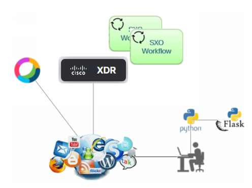

# Solution achitecture

## Solution components

The key components of this solution are the following :

- A python host wich host the lab simulator
- The Lab simulator
- A SecureX tenant 
- Two SecureX Automation workflows
- An Alert Webex Room
- A Webex Team bot

## The Flask application

The Flask application provides with the user interface. It exposes the portal web page from where to show the endpoint attack.

The Flask application has another role in this solution. It provides with a Bot Logic that receives calls from Webex when the security operator click on a link.

In one hand, the application exposes API endpoints for managing :

- Application Configuration
- Attack simulation
- Webex Team Operator choices and SecureX webhook

## Check for new incendent and send an alert

When the attack is blocked into the endpoint, then an Incidents is created within SecureX with attached incidents.

This part is managed by functions in the **create_incident_and_sightings_with_dynamic_data.py** script, called from **app.py**.

We use the Threat Response **Bundle** API. This API allow us to use one single call in order to create everything at once into SecureX.

What we have to do actually is to create a single JSON payload that contains :

- The new **Incident**
- Several **Sightings**
- For every **Sightings** a **member of** **relationship** which link the **Sighting** to the **Incident**
- In every **Sightings**, **observables** and **targets**
- For every **observables** and **targets**, a **relationship** which is a **connected to** **relationship**

This JSON payload is passed as a POST variable to the REST call we send to SecureX and then automatically Incident and Sightings are created. And SecureX Automatically does enrichement for every observable and draw the Relation Graph.

