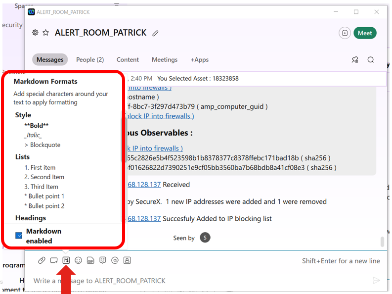
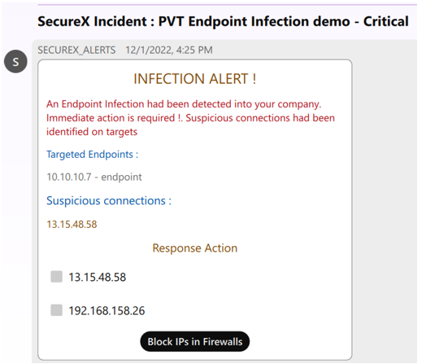

# Webex Team Alert Message

The goal of this section is to share more details about how to create Nice Alert Messages into Webex Team. And How manage user interactivity with Webex messages.

Actually there are two ways for doing this.

- Markdown messages
- Webex Team Cards

Both allow us to include clickable links into the messages displayed to people who will read them.

But Webex Team Cards are much more nice than markdown messages. They are more close to Web GUI than Markdown Messages.

In our use case as we want to trigger a SecureX workflow with a webhook. And we want to pass data ( ip address, Webex Bot Token, Room ID ). There is an impact on the way to handle the user click action.

Within SecureX, the workflow will handle only data that will be passed by a POST operation, and not a GET. 

A direct consequence of this is that we can't put the webhook_url + data in the URL into URL link into the Webex Message. Because Webex http call when click on links are only GET calls and not POST.

For this reason we must use a bot logic underneath the Webex Team Message where to send the calls with he GET method. And ask to this bot logic to send to SecureX the Webhook + data thru a POST call.

This is a perfect job for the lab simulator which is a flask application which exposes APIs endpoint in one hand and send REST calls in the other hand. This is exactly what we do in this use case.

This part is handled by the **@app.route('/block',methods=['GET'])** route in the **app.py** script.

## Webex Team Markdown

Markdown messages are basic in terms of format. And they are limited in term of markdown tags. 

You can see what are the available tags by clicking on the markdown icon available int the webex team GUI

The only interactivity capability is an url link we can insert into the message thanks to the approriate markdown tag.

All this is enough to acheive our goal. Another benefits is that the bot logic we need underneath is very basic a very fast to write. Which is not the case for Webex Team Cards.

This is because this only reason that I decided to use it in this use case.

It is very simple to create a Webex Team Markdown message.

Open the **u3_send_alert_to_webex_room.py** script and have a look at it. 

The alert is contained into the **message_out** string variable. This variable can be a mix of static string and dynamic string.

This **message_out** variable is just assigned to the **markdown** key sent to Webex Team. 

And that's it.

## Webex Team Cards

Webex Team Cards are much more nice than markdown message. They act exactly like Web Pages and actually behave the same.

They offer the capability to create web formulars with complexe behaviors. With colorisation,images, Select boxes, check boxes and other nice components dedicated to interactivity with users.

Interactive Webex Team cards are very powerful, but they require "complex" bot logic needed to handle actions and selections user does.

Once again, our simulator is a perfect place to put this "complex" bot logic. And to keep the lab simple I decided to not handle this part.

Here are some awesome resources for working with Webex Team Cards :

- [Webex Team Card Designer ](https://developer.webex.com/buttons-and-cards-designer)
- [PyAdaptiveCards](https://developer.cisco.com/codeexchange/github/repo/CiscoSE/pyadaptivecards)

The Webex Team Card Designer is an online tool you can use to create to create your own Webex team card. The result is a JSON payload you have to pass to the REST call you send to Webex into the **attachments** key.

## Learn more about Webex Team Cards

Go to this link [ under construction ] if you want more information about how to work with Webex Team Cards.