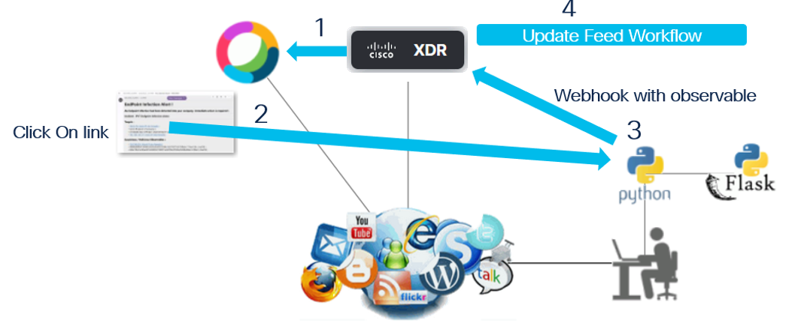

# Webex Team Alert Message

The goal of this section is to share more details about how to create Nice Alert Messages into Webex Team.

Actually there are two ways for doing this.

- Markdown messages
- Webex Team Cards

Both allow us to include clickable links into the messages displayed to people who will read them.

But Webex Team Cards are nicer than markdown messages. They are more close to Web GUI than Markdown Messages.

In our use case we want to trigger a SecureX workflow with a webhook. And we want to pass data ( ip address, Webex Bot Token, Room ID ).

Within SecureX, the workflow will handle only data that will be passed by a POST operation, and not a GET. 

A direct consequence of this is that we can't put the webhook_url + data in the URL into URL link into the Webex Message. Because Webex http call when click on links are only GET calls and not POST.

For this reason we must use a bot logic underneeth the Webex Team Message where to send the calls with he GET method. And ask to this bot logic to send to SecureX the Webhook + data thru a POST call.

This is a perfect job for the lab simulator which is a flask application.  This is exactly what we do in this use case.

This part is handled by the **@app.route('/block',methods=['GET'])** route in the **app.py script.

