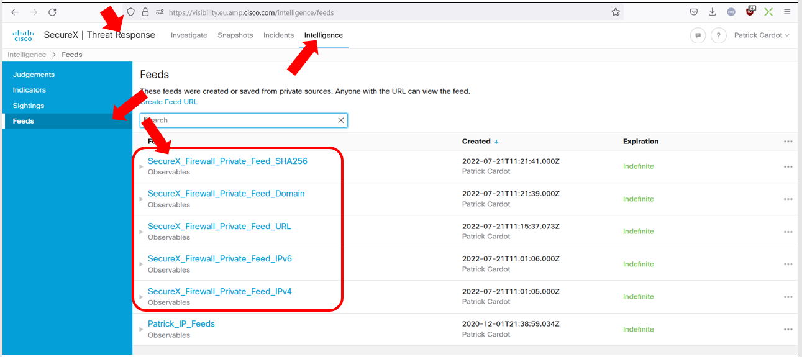
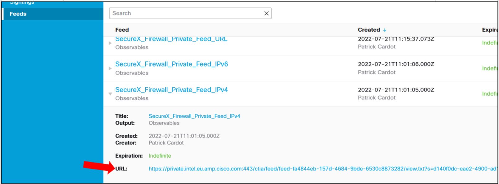
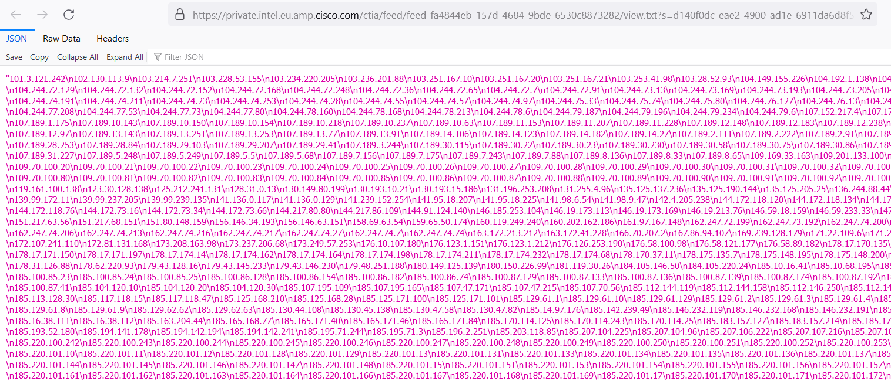
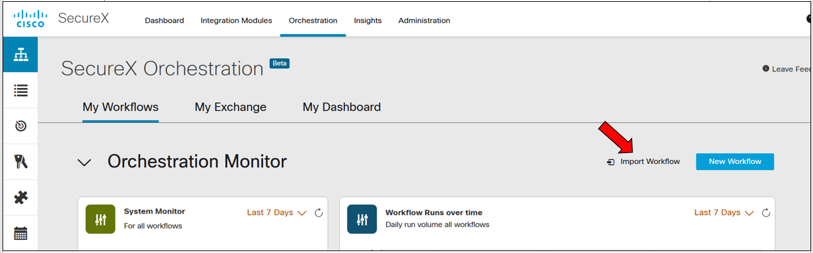
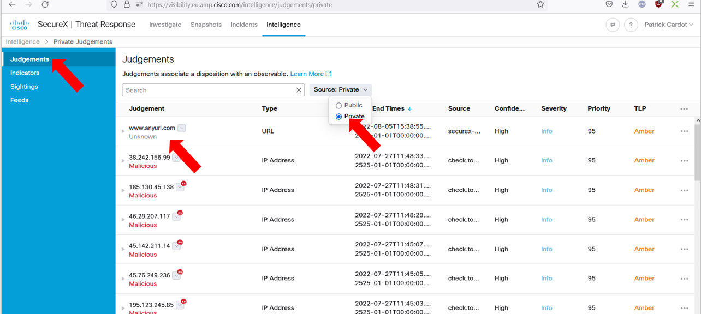
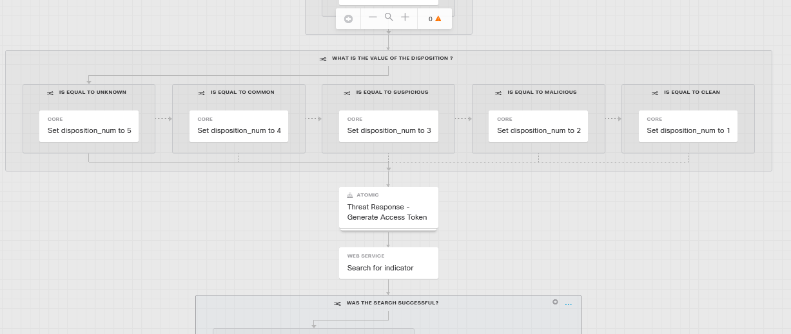
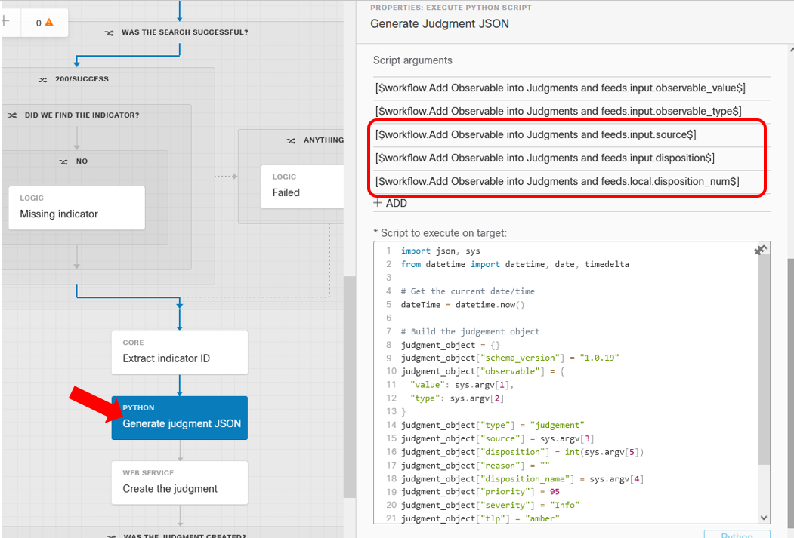

# Create Text Public Feeds for firewalls

This article describes how to create within SecureX, in less than 15 minutes, all the SecureX Infrastructre which manages Public Feeds for Firewalls.

This capability is one of the great SecureX Capabilities.  
SecureX has the capability to publicly expose feeds. These feeds are located in Threat Response > Intelligence > Feeds





SecureX hosts 5 feed types :

- ipV4 addresses
- ipv6 addresses
- urls
- domains
- sha256

Each feed has his own public URL



And eahc feed contains text lists of observables of the specific type



Firewalls like Cisco Secure Firewall ( FirePOWER ) can consume any of these feeds thanks to the Security Intelligence Features ( or Threat Intelligence Director ). And all observables in the list will blocked by the firewall.

The great benefits is that Security Administrators just have to configure Firewalls once, by telling them to download the feed every 5 minutes for example, and then the observables in the feed will be blocked.

The only job is then to update the feeds regularly. No need to do anything in firewalls !!!


---
## Installation

This use case is one of the most easiest to install !!

Go to the orchestration worflow library page and click on the **import workflow** link.



From the CiscoSecurity_Workflow Git repository import the 2 following workflows :

- 0015A-SecureFirewall-BlockObservable-Setup
- 0015B-SecureFirewall-BlockObservable


Select their last git versions

And without any customization then run the first one ( 0015A-SecureFirewall-BlockObservable-Setup ).

It must succeed and then you can check the result in Threat Response Intelligence > Feeds. Your feeds must be created


You are ready !!!

Now add an observable into the feeds... for doing this, run the second workflow ( 0015B-SecureFirewall-BlockObservable )

Enter an observable_value ( any url : www.anyurl.com for example ) and a matching type ( url ) and then submit.

After a few seconds this workflow succeed and then you can check that the URL you entered had been added into the URL Feed. Opening the feed's URL.

Now go your private judgments. And check that the url you entered is on the top of the list. 



**Notice:** If you delete it, then it will disapear from the feed.

And you may notice the the disposition is : **Unkown** and the source is : **securex-orchestration**

Let's modify this in order to be able to send specific dispositions and sources.

## Add source and disposition inputs to the workflow

What is nice with SecureX worflow is that if you are not happy with what they do... You can modify them completely.

This exactle what we are going to do in this section. We are going to add 2 addionnal input variables. And manage their values

First, add 2 new workflow variables as required input text variables  :

**source** and **disposition**

type: string
scope: input
required: true
value: no value

And add another string variable that will be a local variable

**disposition_num**
type: string
scope: local
required: true
value: no value

Then at the top of the worflow add a conditionnal block with 5 branches into it that will assign to the **disposition_num** variable :

- disposition_num=5 if disposition=Unkown
- disposition_num=4 if disposition=Common
- disposition_num=3 if disposition=Suspicious
- disposition_num=2 if disposition=Malicious
- disposition_num=1 if disposition=Clean



The location to place this conditionnal block is anywhere before the **Generate judgment JSON** python activity.

Now go the python activity named : **Generate judgment JSON**

And add 3 new script variables in the same order as the image bellow ( source, disposition, disposition_num) :



And now replace the whole python code of this activity by the following code :

```python
import json, sys
from datetime import datetime, date, timedelta

# Get the current date/time
dateTime = datetime.now()

# Build the judgement object
judgment_object = {}
judgment_object["schema_version"] = "1.0.19"
judgment_object["observable"] = {
	"value": sys.argv[1],
	"type": sys.argv[2]
}
judgment_object["type"] = "judgement"
judgment_object["source"] = sys.argv[3]
judgment_object["disposition"] = int(sys.argv[5])
judgment_object["reason"] = ""
judgment_object["disposition_name"] = sys.argv[4]
judgment_object["priority"] = 95
judgment_object["severity"] = "Info"
judgment_object["tlp"] = "amber"
judgment_object["timestamp"] = dateTime.strftime("%Y-%m-%dT%H:%M:%SZ")
judgment_object["confidence"] = "High"

judgment_json = json.dumps(judgment_object)
```

This new code take into account the source, disposition and disposition_num.

Okay her we go !

Run the workflow again and now you are asked to enter a source and a disposition ( Unknown, Common, Suspicious, Malicious, Clean ).

Once done check that your new observable is correcty added into Your private Judgments with the correct informations.

And if this answer is yes, you are done !!

## Conclusion

You have now a workflow which can be used in other workflows for adding an observable into you private Jugdment.

## Want to use the modified workflow ?

You can download the workflow in this folder. 

This new one contains all modifications above. You will have to use it instead of the **0015B-SecureFirewall-BlockObservable** workflow

