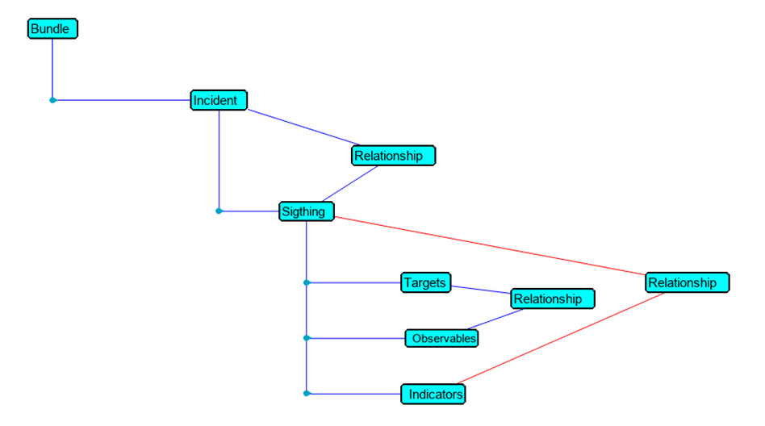
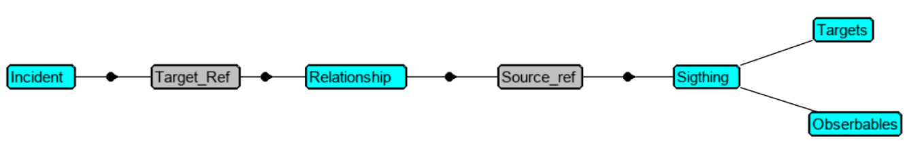

# Dealing with XDR CTIM ( Cisco Threat Intelligence Model )

In this repository You will find  some python scripts given as examples of interaction with CTIM components.

CTIM is one of the core of XDR. This the Threat Hunting dedicated engine.

The components described into this article are the following here under. But CTIM contains more components not described here.

- Judgments ( for enrichment from private data or for automated Allow / Blocking Feeds creation )
- Sightings ( Ingest single events from 3rd Party Security Solutions into XDR/SecureX Sightings )
- Incidents ( Create Incidents )
- Bundles ( Incidents and attach Sightings to them )
- Verdicts ( for enrichment )

The **create_incidents_from_appache_logs_use_case** subfolder  contains an example of use case.

The [**Automated Threat Detection and Mitigation scenario**](https://github.com/pcardotatgit/SecureX_Workflows_and_Stuffs/tree/master/100-SecureX_automation_lab) repository contains a full XDR/SecureX demo which is based on CTIM interaction for creating Incidents and Sightings and read them as well.

## Instructions

Before using the python scripts you must first create a XDR / SecureX API client within your tenant, and you must store its **client_id** and **client_password** either into the **./keys/ctr_api_keys.txt** file located into the **/keys** subfolder ( This global configuration file will be used by every scripts in every subfolders ), or into the **config.py** scripts of every subfolders that will be read first by the python scripts.

Depending on your region, You have to uncomment the host fqdn. You have to do this either into the **config.py** scripts or into the **./keys/ctr_api_keys.txt** file.

Instead of editing the **config.py** file, you can use the Lab Portal Web page by clicking on the **Settings** button.

## How can we create Incidents and Sightings within XDR / SecureX ?
### Introduction 

Before going to the details about how we can create **incidents** and **sightings** within XDR, you must start first on understanding the CTIM model ( Cisco Threat Intell Model )

### Cisco Threat Intell Model

XDR / SecureX Threat Hunting and Incident Management rely on an internal data structure which is there as a very fast and efficient backend for supporting Threat Hunting activities.

This data structure has several services which all have APIs. That means that we can have access to these services from outside of XDR / SecureX either for reading data, or for ingesting data.

Managing **Incidents** within XDR / SecureX is exactly that. Every components of the Incident Manager has an API and we use several of these APIs for creating **Incidents**.
- To learn more about **Cisco Threat Intell Model** you can to go to the following [ DEVNET Learning Lab ](https://developer.cisco.com/learning/tracks/cisco-xdr/cisco-xdr-advanced/private-intel-threat-feed/xdr-private-intelligence-overview/), which will help you to understand the details of how the CTIM APIs can be used into your Threat Hunting activities.
- And you will naturally want to intensively use CTIM API. Then the [ CTIM API documentation here ](https://github.com/threatgrid/ctim/blob/master/doc/tutorials/modeling-threat-intel-ctim.md) will be very usefull for you.

Once Having understanding the CTIM data structure, you are ready to move forward.

### Create Incidents and Sightings.

In order to create documented incidents into the XDR / SecureX Incident Manager, we just have to create an **Incident** object and we have to attach to it one or several **Sightings**. 

**Incidents** act as a container that will give us access to all the Threat details. This is the list of events ( Sightings ), timeline , observables and referenced links. Every sorted and presented in a maner that accelerate Threat Hunting operations.

**Sightings** are representation of Security Alert generated by Security Products. This is the Security Events. They are not the original alerts created by the security product, but they are  translations of these original events into XDR Alert Schema. 

That means that **Sightings** are created from original raw products alerts. And **Sightings** are interpretation for these product events, which either sumarize the original alert or which extend it.

A single **Incident** is supposed to contain several **Sightings** that can have been created by several Security Solutions which detected events that are related to the same security threat. Gathering these interpreted alerts in one place ( into an **incident** ) helps the Security Team to better understand what happen and react efficiently.

**Sightings** are supposed to contain **targets** and **observables** ( all suspicious objects which target victim machine ( **targets** ) ). 

When XDR receives any **observable**, then several Threat Hunting operation are automatically triggered. Like enrichment and relation graph calculations.  And this is what help Security Operators to go very fast into Investigation Operations. XDR automatically takea part of the investigation and present results to Security Operators.

All the threat Intelligence is automatically done by XDR Threat Response.

That means that from the Security Operator side, he just have to create an Incident and all relevants sightings that will contains same obervables can be linked together. Then **relationships** can be automatically created between all these components.

**Relationship** is one of the key components of CTIM. It is used at several levels. This is a table that exists within the CTIM data structure. **Relationships** is used to attach a Sighting to an Incident. And **Relationship** is used to link an **observable** to a **target**.

In theory, to create an Incident , we have to use the following APIs :

- Incident
- Relationship
- Sightings
- Judgments ( optionnal )

From the original Security Product events, we have to create one **Sightings per event**. Every **Sightings** must contain **Observables** and their **targets** and for every couple the **Relationship** that link the **observable** to the **target**. 

Once **Sightings** Created we can create an new **Incident** and attach to it every **Sigthings** thank to a **member of relationship** .
All this means that we are supposed to use several APIs calls for achieving all this. 

CTIM developpers thought about making life easy for programmers who want to create **Incidents**. They thought about creating the **bundle** API.

This API allow programmers to create an Incident with everything inside thanks to one single API call.

The **bundle API** expect a JSON payload to be sent be sent to the API. This JSON payload must contain all the objects we need to create for the Incident.

**How can we invoke the bundle API ?**

We create a "bundle" JSON payload which contains one **incident** and all its details. And then we create several **Sightings** into it .

Then we add into the JSON payload, **relationships** that link every **sightings** to the **Incident** thanks to a **"member of"** **relationship**.

Into every single **sighting**, we include all involved **targets** and **observables**. And we create as well **relationships** between all these objects within the **sightings**.

And that's it.

Have a look to the [**SecureX Threat Response CTIM Bundle Builder** page ](https://github.com/CiscoSecurity/tr-05-ctim-bundle-builder) to learn about a python module that simplifies **bundle** creation.

### How to read an Incident and parse all Sightings it contains ?

When we create the **Incident** and all **Sightings** it contains, we assign IDs to all objects, and these IDs will be used within the **relationships**. These IDs are known as **target_ref** for incident ID and **source_ref** for Sighting IDs.

For reading **sigthings** that belong to an **Incident** we must first retrieve its **target_ref** and search for **relationships** based on this **target_ref** information. Thanks to this, we get the list of all **sightings** that belong to the **Incident** and we can get their **source_ref** IDs. Then, for each **Sighting**, based on its **source_ref** we parse it and extract from it everything which is relevant for additionnal investigation. This is mainly **Targets** and **Observables**

## How to add observable into XDR / SecureX public feeds thanks to CTIM ?

For doing this, we have to deal with **Judgment**, **Indicators** and **Feeds** APIs.

In order to assign an **observable** to a public feed, we must create a **judgment** for it and we must link it to an **indicator** that is link the a **feed**. Basically we already created these **indicators** and their attached **feeds** when we created the XDR blocking Feeds.

In order to add an **observable** to a public feed, we must create a **judgment** for it link it to an **indicator**.

The type of the **observable** is important at this point because this is what will route the **observable** to the correct **feed**. If you remember, we have within XDR one feed per observable type.

So for every relevant **observable** we want to add into XDR feeds, we have to create a **judgment** that link it to matching **Indicator** based on it's type. And we do this thanks another **Relationship**. 

Thanks to these chains of relationships, new observables automatically appears into the matching **feed** ( base on their type ), when a  they are added into **judgments**.

**Pre requisits**  

The condition to be able to use these XDR / SecureX feed Services is that **feeds** , **indicators** and **relationships** must have been created first. And None of these objects are created by default when an XDR /  SecureX tenant is started. We have to create them.

Creating the feeds is the role of the following workflow :

- **0015A-SecureFirewall-BlockObservable-Setup**

You must import it and run it first.

## Additional resources

Don't hesitate tohave a look to this awesome DEVNET learning lab that digs into Incident creation and bundle details.

[Create an Incident with Workflow for Cisco XDR](https://developer.cisco.com/learning/tracks/cisco-xdr/cisco-xdr-advanced/create-incident-with-workflow/introduction/)