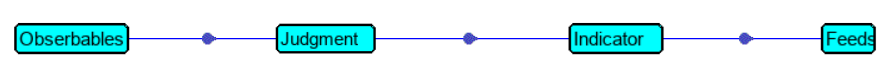

# Dealing with SecureX CTIM

You will find in this repository some python scripts given as examples of interaction with CTIM components  :

- Judgments ( for enrichment with private data or for automated Allow / Blocking Feeds creation )
- Sightings ( Ingest single events from 3rd Party Security Solutions into SecureX Sightings )
- Incidents ( Create Incidents )
- Bundles ( Incidents and attach Sightings to them )
- verdicts 

The **create_incidents_from_appache_logs_use_case** subfolder  contains an example of use case.

The [**Automated Threat Detection and Mitigation scenario**](https://github.com/pcardotatgit/SecureX_Workflows_and_Stuffs/tree/master/100-SecureX_automation_lab) repository contain a full SecureX demo which is based on CTIM interaction for creating Incidents and Sightings and read them as well.

## Instructions

Before using the python scripts you must first create a SecureX API client and you must store its **client_id** and **client_password** either into the **./keys/ctr_api_keys.txt** file located into the **/keys** subfolder. This files will be used by every scripts in everysubl folders or into the **config.py** scripts of every subfolders.

Depending on your regions, You have to uncomment the host fqdn for asking a token and the host fqdn. You have to do this either into the **config.py** scripts or into the **./keys/ctr_api_keys.txt** file.

## How can we create Incidents and Sightings within SecureX ?
### Introduction 

Before going to the details about how we can create incidents and sightings within SecureX, you must start first on understanding the CTIM model ( Cisco Threat Intell Model )

### Cisco Threat Intell Model

SecureX Threat Hunting and incident management rely on an internal data structure which is there as a very fast and efficient backend for supporting Threat Hunting activities.

This datastructure has several services that allhave APIs. That means that we can have access to these services from outside of SecureX either for reading datas, or for storing data.

Managing Incidents within SedcureX is exactly that. All components of the SecureX Incident manager has an API and we use several of these APIs for creating Incidents.

To learn more about Cisco Threat Intell Model don't hesitate to go to the following [ DEVNET Learning Lab ](https://developer.cisco.com/learning/modules/securex-serverless-relay-modules/SecureX-2-CTIM/cisco-threat-intelligence-model-labs/)

Once Having understanding the CTIM data structure, you are ready to understand what we will do in this lab

### Creating Incident and Sightings.

In order to make documented incidents appearing into the SecureX Incident Manager, as we can see in day to day SecureX Threat Hunting activities. Incidents that give us details about the threat, list of events, timeline , observables and referenced links, we just have to create an Incidents and we have to attach to it Sightings.

Sightings are representation of Security Alert generated by Security Products. They are bot the original alerts but they are  translation of these alerts into SecureX Alert Schema. 

That means that Sightings are created from original raw products alert. And Sightings are interpretation for these product alerts, which either sumarize the original alert or extend it.

A single incident is supposed to contain several Sightings which can have been created by several Security Solutions which detected events that are related to the same security threat. Gathering these interpreted alerts in one place into an incident helps the Security Team to react efficiently.

Sightings are supposed to contains at least targets and observables ( all suspicious objects which has a relation with targets ). 

When SecureX receive these information, then several Threat Hunting operation are done like enrichment and relation graph calculations.  And this is what permit Security Operators to go very fast into Investigation Operations.

All the threat Intelligence is automatically done by SecureX.

That means that from our side, we just have to generate an Incident and all relevants sightings that will contains obervables and their relationships.

Attaching a Sighting into an Incident is as well a relationship within SecureX.  Relationship is one of the key components of CTIM.

CTIM developpers thought about making life easy for programmers who want to create incidents. They created the **bundle** API.

This API allow programmer to create thanks to one single API multiple objets at once.

For doing this programmer must create a JSON data go be sent to the bundle API, which content all the objects we want to create.

How do we use the bundle API ?

We create a "bundle" JSON payload which contains one incident and all its details and we create into it several Sightings.

Then we add into the JSON payload relationships that link every sightings to the incident thanks to a "member of" relationship 

Into every single sighting we include all involved targets and observable. And we create as well relationships within the sightings between all these objects.

And that's it.

Have a look to the [**SecureX Threat Response CTIM Bundle Builder** page ](https://github.com/CiscoSecurity/tr-05-ctim-bundle-builder) to learn about a python module that simplofy **bundle** creation.

### How to read an Incident and parse all sightings it contains ?

When we create the Incident and all sightings it contains, IDs will be automatically generated and these IDs will be used within the relationships. known as **target_ref** for incident ID and **source_ref** for Sighting IDs.

For reading sigthings that belong to an Incident we must first retrieve its **target_ref** and filter relationship based on this information. And then we get the list of all sightings that belong to the incident. And finally for each sighting based on its **source_ref**, parse it and extract from it everything which is relevant for additionnal investigation.

## How to add observable into SecureX public feeds

For doing this, we have to deal with Judgment, Indicators and feed APIs.

In order to assign an **observable** to a public feed, we must create a **judgment** for it.

The type of the **observable** is important at this point because this is what will route the **observable** to the correct **feed**.

For every relevant observable types in **judgment** we must link it to a corresponding **indicator** thanks to relationships. And this indicator must linked to a **feed**.

Thanks to these chains of relationships, when a new observable is added into **judgment** , then it automatically appears into the corresponding **feed**.

### Just to remind you some terminology :

A **judgement** is the disposition of an observable given by one source of threat intelligence. Judgment are not permanents they have lifetime duration.

An **indicator** is a test, or a collection of judgements that define criteria for identifying the activity, or presence of malware, or other unwanted threats.