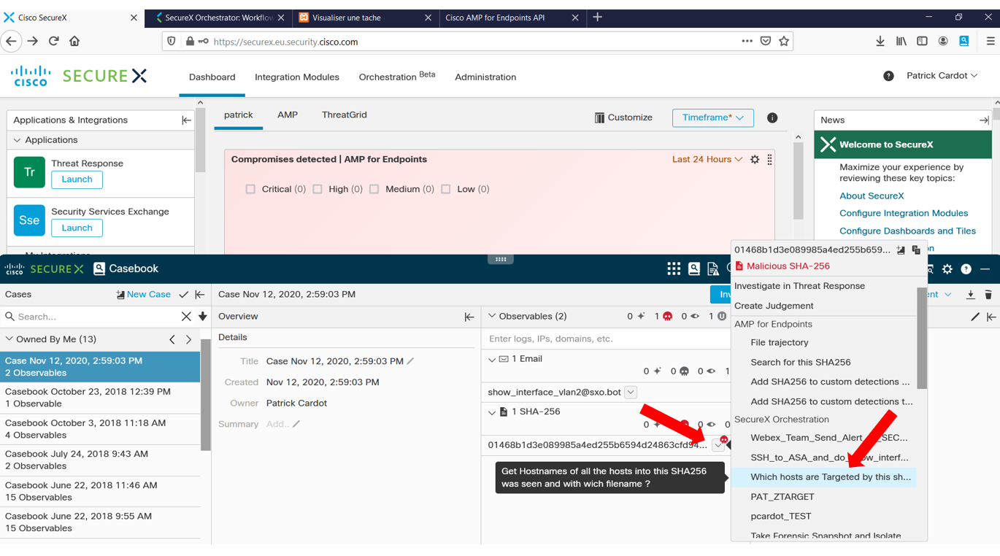
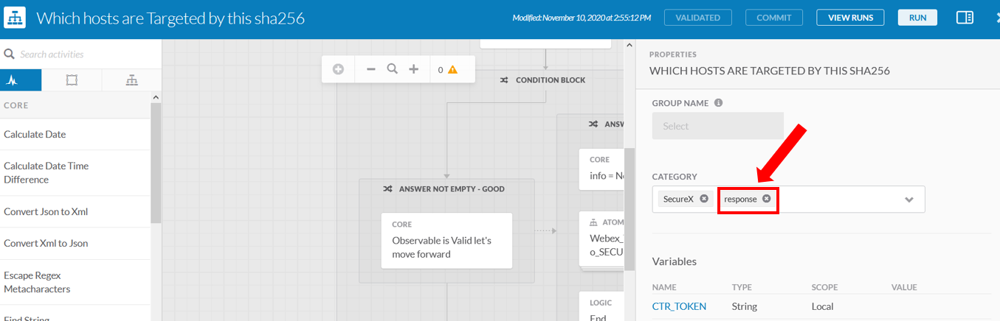
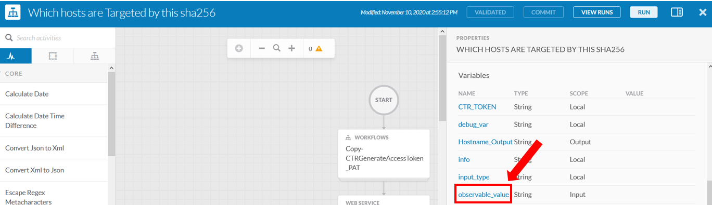
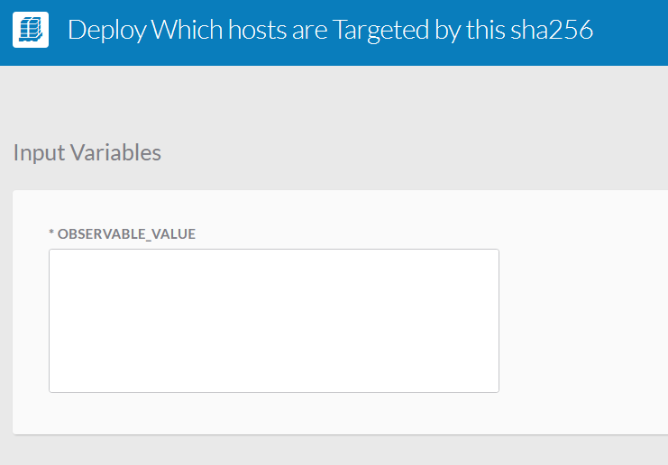
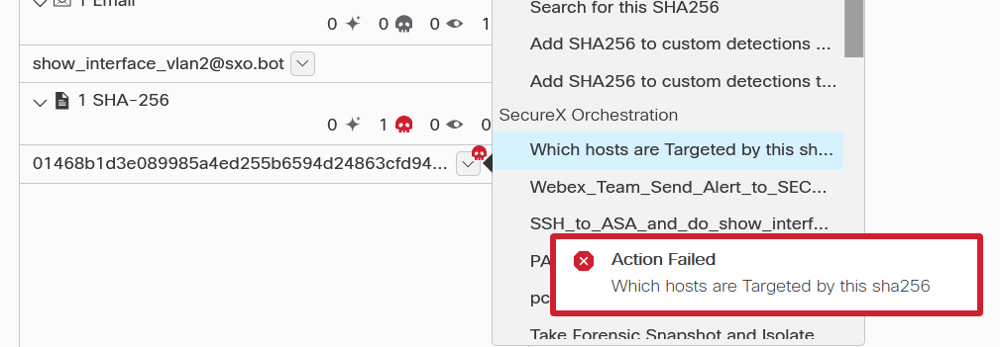

# Trigger Your SecureX Workflow from the Ribbon

This section is about how to trigger Your workflow from the SecureX Ribbon or the from Pivot Menu.

There are 2 importants actions to do to do so.

### First
- First, in order to make Your SecureX Workflow appearing in the Pivot Menu you must add the **reponse** category into it.

### Second

- Second : You must mandatorily Name you input variable **observable_value** !

If you miss that you will get the following error.

