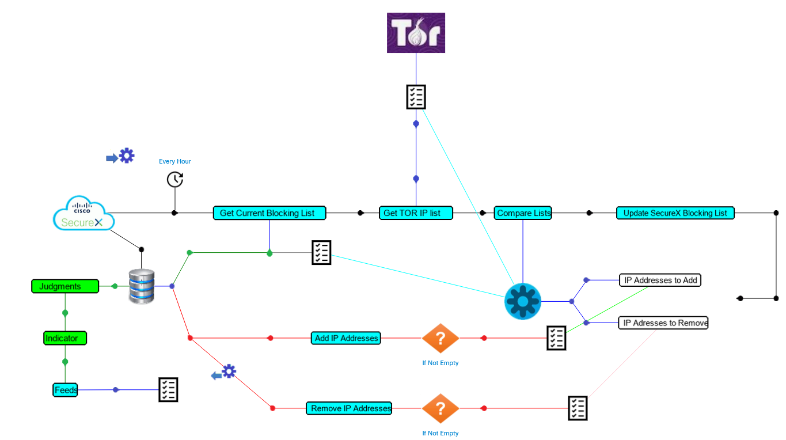
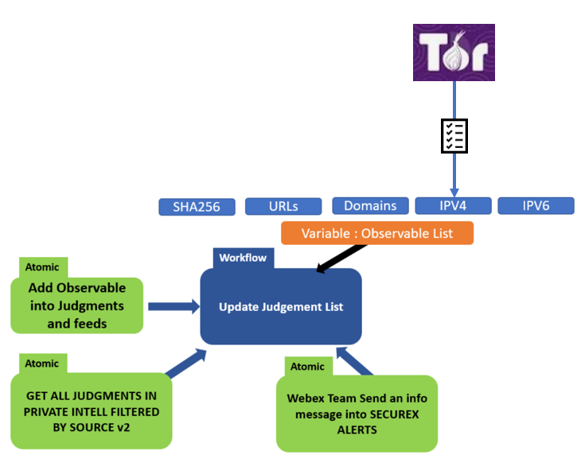
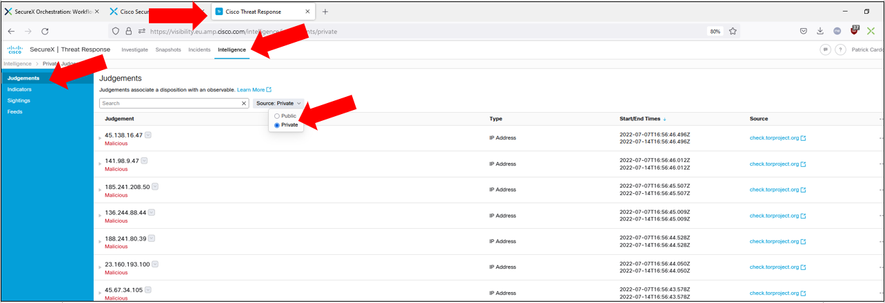
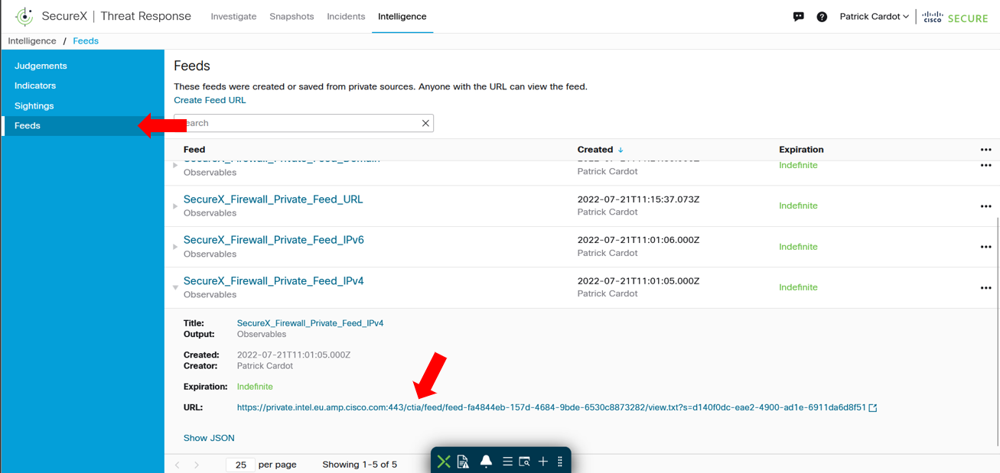
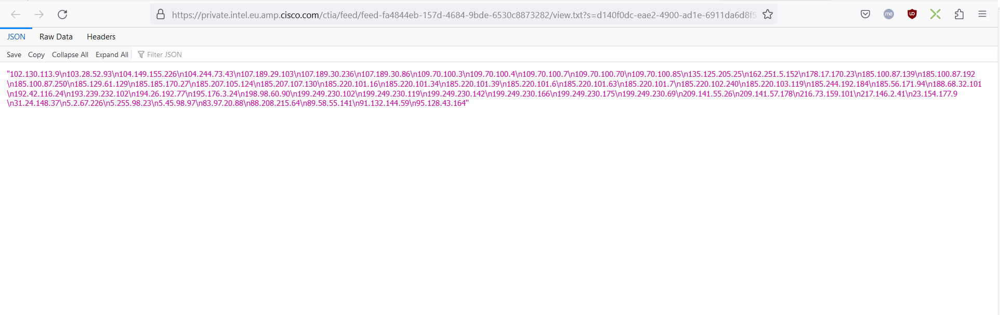

# TOR BLOCKING LIST TO FEEDS

This workflow read every hour the TOR IP blocking list at the following location https://check.torproject.org/torbulkexitlist . And update the Private Intell Judgment and then Update a public SecureX Feed which becomes availabale for Firewalls.

---

## Change Log

| Date | Notes |
|:-----|:------|
| November 20, 2022 | - Initial release |

---

## Requirements
* The following  workflow is used by this workflow:
	* [Update judgments and public feeds in private intell](https://github.com/pcardotatgit/SecureX_Workflows_and_Stuffs/tree/master/500-SecureX_Workflow_examples/Workflows/update_judgments_in_private_intell)
* The [targets](#targets) and [account keys](#account-keys)
* The **Secure_Firewall_SecureX_Indicator_IPv4** indicator and the matching **Secure_Firewall_SecureX_Feed_IPv4** must already exist into the SecureX tenant. ( see : [Create Text Public Feeds for firewalls](https://github.com/pcardotatgit/SecureX_Workflows_and_Stuffs/tree/master/12-create_securex_blocking_lists_for_firewalls))
---

## Workflow Steps
1. A schedule trigger named **tor_schedule** run this workflow every hours
1. The Workflow:
	* Connects to the **https://check.torproject.org/torbulkexitlist** location and download the IP addresse List it contains
	* Then for every IP address in the downloaded list, the workflow create a judgement into the Private Intelligence and link it to the **Secure_Firewall_SecureX_Indicator_IPv4** indicator, which is linked to the **Secure_Firewall_SecureX_Feed_IPv4**

The final result is to update every hours the SecureX **Secure_Firewall_SecureX_Feed_IPv4** feed with the TOR entry / exit IP addresses.

---

## Configuration
There is no specific instructions for this workflow.

Just import it and activate the trigger.

Then let it run
---

## Targets

| Target Name | Type | Details | Account Keys | Notes |
|:------------|:-----|:--------|:-------------|:------|
| TOR entry / exit IP addresses | HTTP Endpoint | _Protocol:_ `HTTPS` _Host:_ `check.torproject.org` _Path:_ ``|No account Key needed||

---

## Account Keys

No account Key Needed

## Workflow Justification

The following URL maintains an updated list of IP addresses which are the current entry and exit TOR network IP addresses.

https://check.torproject.org/torbulkexitlist

This IP address list in constantly updated.

The recommendation for security administrators is to download this list every hours and deploy it as blocking rules into all company INTERNET firewalls.

This is a perfect job for SecureX. And this is the purpose of the workflow described here.

This security recommendation is typically a good example of Security Action Human Team CAN'T acheive. We can't imagine to have in the security team someone who update Company firewalls every hours , night and day , with the TOR entry / exit IP addresse list.

This use case is a perfect example where automation is mandatory.

## Whole Workflow architecture and behavior

The whole processes runt by this workflow are discribed here under.

This workflow update a global SecureX variable named **generic list of ip addresses** . And this variable is consumed by the **Update Judgement List** subworkflow which synchronizes the SecureX Private Intelligence Judgments with it.

This modular architecture allows to create other IPv4 SecureX feed synchronization workflows, for other sources than TOR IP blocking List. 

Other workflows for other Public Sources of malicious IP addresses would be the same as this current workflow except the TOR HTTP Get part.

The final result can be checked into the SecureX Judgements and Feeds.

