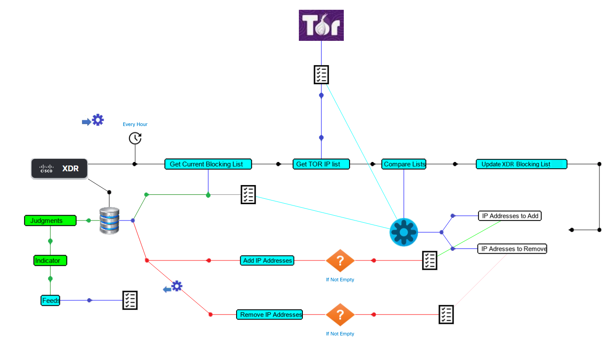
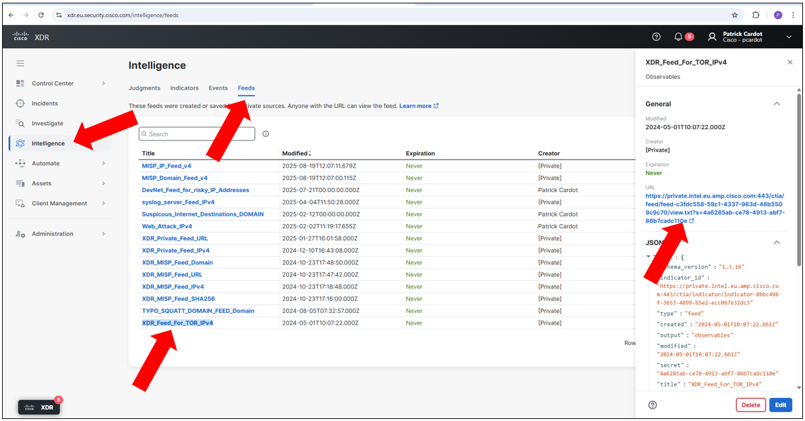
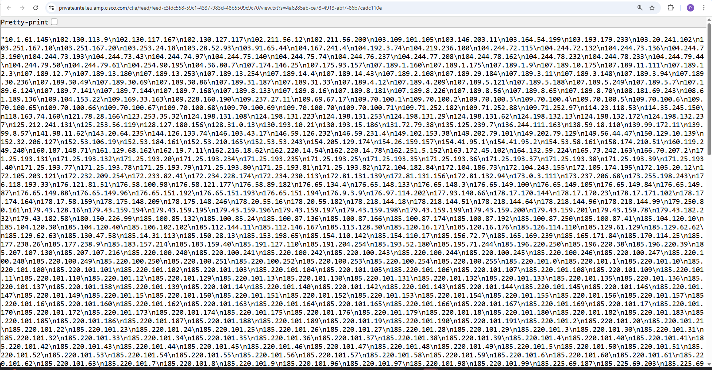

# TOR NETWORK TO IPV4 XDR FEEDS

This workflow is supposed to be triggered every hour thanks to a schedule. It collects the TOR IP address list located at https://check.torproject.org/torbulkexitlist which is the list of the entry / exit IP addresses for the TOR network, and update an XDR feeds meant to be cosummed by INTERNET firewalls.

---

## Change Log

| Date | Notes |
|:-----|:------|
| September 10, 2025 | - Public Version 2 |
| November 20, 2022 | - Initial release |

---

## Requirements
* The following  workflow is used by this workflow:
	* [Update judgments and public feeds in private intell](https://github.com/pcardotatgit/SecureX_Workflows_and_Stuffs/tree/master/500-SecureX_Workflow_examples/Workflows/update_judgments_in_private_intell)
* The [targets](#targets) and [account keys](#account-keys)
* It requires an indicator named **TOR_Feed_Indicator_IPv4** linked to a feed named **XDR_Feed_For_TOR_IPv4**. These two must already exist into the XDR tenant. ( see : [Create Text Public Feeds for firewalls](https://github.com/pcardotatgit/SecureX_Workflows_and_Stuffs/tree/master/12-create_securex_blocking_lists_for_firewalls))
---

## Workflow Steps
1. A schedule trigger named **Schedule_for_W0025_TOR_FEED** run this workflow every hour.
2a. The workflow:
	* Do a HTTP GET to the **https://check.torproject.org/torbulkexitlist** URL and download the IP addresse List it contains
	* Then for every IP address in the downloaded list, the workflow create a judgement into the Private Intelligence and a relationship between the new judgment and the **TOR_Feed_Indicator_IPv4** indicator, which automatically add the ip address to the  **XDR_Feed_For_TOR_IPv4**
2b. Another operation executed by this workflow is to remove from the feed ( delete judgement ) every IP address which no longer bellong to the last TOR IP address list.

---

## Configuration
There is no specific instructions for this workflow.

Just import it and activate the trigger.

Then let it run

---

## Targets

| Target Name | Type | Details | Account Keys | Notes |
|:------------|:-----|:--------|:-------------|:------|
| TOR entry / exit IP addresses | HTTP Endpoint | _Protocol:_ `HTTPS` _Host:_ `check.torproject.org` _Path:_ ``|No account Key needed||

---

## Account Keys

No account Key Needed

## Workflow Justification

The following URL maintains an updated list of IP addresses which are the current entry and exit point of TOR network IP.

https://check.torproject.org/torbulkexitlist

Then this IP address list is periodically updated, stored into a Feed and exposed thru a public URL.

The recommendation for security administrators is to download this list every hours and deploy it as blocking rules into all company INTERNET firewalls.

This is a perfect job for XDR. And this is the purpose of the workflow described here.

This security recommendation is typically a good example of Security Action Human Team CAN'T acheive. We can't imagine to have in the security team someone who update Company firewalls every hours , night and day , with the TOR entry / exit IP addresse list.

This use case is a perfect example where automation is mandatory.

## Whole Workflow architecture and behavior

The whole processes runt by this workflow are discribed here under.

This workflow update a global XDR variable named **generic list of ip addresses** . And this variable is consumed by the **W0026-Update Judgement List for TOR Blocking List** subworkflow. This subworkflow synchronizes the XDR Private Intelligence Judgments with the last version of the TOR IP address list.

This modular architecture allows to create other IPv4 XDR feed synchronization workflows, for other sources than TOR IP blocking List. 

Other workflows for other Public Sources of malicious IP addresses would be the same as this current workflow except the TOR HTTP Get part.

The final result can be checked into the XDR Judgements and Feeds.

