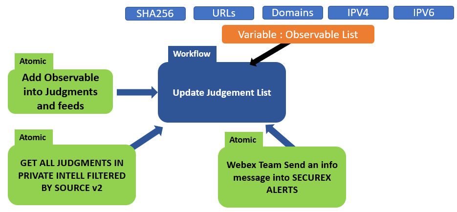

# Update judgments and public feeds in private intell

One of the nice SecureX feature is the capability to easily create allow / blocking feeds to be consumed by company firewalls.

SecureX Feeds are based on the Private Intelligence Judgments content. Every observable in the Judgments table can be automatically added into SecureX Public Feeds. And any time we remove this observable from the judgments, this one will be removed from the public feeds.

So, keeping the SecureX Judgments updated is the best way to keep the feeds updated as well. 

Then SecureX can help to update blocking rules of all company firewalls.

The goal of this workflow is to manage the Private Intelligence Judgment updates. Based on a **source** and an **observable list**. This workflow will add new observables to be added into the SecureX judgment list. And will remove all observables that must be removed.

The **source** is a location from where to read observable to ingest into the judgment list ( a CERT blocking list for example : www.source.com or My Threat Intell ).

## Workflow steps

Here is how this workflow work.

This workflow reads the content of a SecureX Global Text variable which contains a list of observables we want to have into the SecureX judgments. The goal is to synchronize the Judgments list in the SecureX private intelligence with this global variable list...

Then a pre requist before running the workflow is to have updated the observable list. Regarding this observable list, this one can be passed as an input variable to the workflow. This variable is named **Local observalbe list**.

But you can put the observable list into one of these 5 SecureX global variables :

- **generic list of ip addresses**
- **generic list of ipv6 addresses**
- **generic list of domains**
- **generic list of urls**
- **generic list of sha256**

Which can be done by another workflow. In such case the value of **Local observalbe list** must be : **-no-**.

The format of the observable list must be one observable per line.

Example :

```
185.244.195.103
185.220.101.18
185.220.101.76
185.194.142.90
185.220.101.68
```


As the idea behind this workflow is to regularly fill the global variable list from a external source  ( every hours, every 5 minutes for example ), then the workflow will compare the existing observables in the SecureX judgment list ( for the specified source ), with the new list collected from the external source, stored into one of the five global variable lists. And then the workflow identifies which observables to remove from SecureX judgments and which observables to add.

As we have 5 observables types and one SecureX feed for each of them, then we decide to use 5 separate global variables. One for each observable type.

Here is what happen when the workflow runs

- Step 1 - We must input the **observable_type** and we must either enter the list of observables in the **Local observable list** or put the value to the string : **-no-**. We must input the source as well
- Step 2 - if the value of **Local observable list** is equal to **-no-**, then the workflow reads the global variable list which matches to the observable type. And if not the the workflow reads the content of the **Local observable list**
- Step 3 - The workflow reads in SecureX judgments all observables from the specified source, and keep them into a local variable. It keeps as well all Judgment IDs because we will need them in order to delete observables
- Step 4 - The workflow compares the judgment list and the new downloaded list, and then creates 2 separate lists, One for observables to be removed from judgements and one for observables to be added.
- Step 5 - If the list of observables to remove is not empty then the workflow delete them one by one thanks to their IDs
- Step 6 - If the list of observables to add is not empty the workflow add one by one all the new observables
- Step 7 - The workflow creates a message to be send into the Alert Webex Team Room. This message contains the number of removed observables and the number of new observables
- Step 8 - The workflow sends the message to Webex Team

# Dependencies and requirements

The following sub-workflows are required by this workflow :

- [Webex Team Send an info message into SECUREX ALERTS](https://github.com/pcardotatgit/SecureX_Workflows_and_Stuffs/tree/master/1-Create_a_Webex_Team_Bot_Target) ( dont hesitate to replace this one by your own )
- [Add Observable into Judgments and feeds](https://github.com/pcardotatgit/SecureX_Workflows_and_Stuffs/tree/master/500-SecureX_Workflow_examples/Atomics/Add_an_Observable_into_Judgments_and_feeds) - the workflow you created in the previous steps
- [get all judgments in private intell filtered by source](https://github.com/pcardotatgit/SecureX_Workflows_and_Stuffs/tree/master/500-SecureX_Workflow_examples/Workflows/get_all_judgments_in_private_intell_filtered_by_source) workflow you created in the previous steps




## Variable initialization

SecureX Global Variables : strings

- generic list of ip addresses
- generic list of ipv6 addresses
- generic list of sha256
- generic list of urls
- generic list of domains

We must update one of this list before running this workshop and then pass to the workflow the following **input variables** :

- **observable_type** =  ip / ipv6 / url / domain / sha256
- **Local Observable List** = -no-
- **source** = string that describes the best the source

But if **Local Observable List** = contains a list of observables, then the global generic list won't be used

And then run the workflow.

## Targets

Target Group: `Default TargetGroup`

| Target Name | Type | Details | Account Keys | Notes |
|:------------|:-----|:--------|:-------------|:------|
| My_CTIA_Private_Intelligence | HTTP Endpoint | _Protocol:_ `HTTPS`<br />host : `private.intel.eu.amp.cisco.com`<br>`private.intel.amp.cisco.com`<br>`private.intel.apjc.amp.cisco.com`<br>_Path:_ `/ctia` | SecureX Token | |

## Account Keys

| Account Key Name | Type | Details | Notes |
|:-----------------|:-----|:--------|:------|
| SecureX Token | automatically defined | no need to be defined | |

## Trigger

This workflow is suppesed to be runt every hour. a trigger named **Every_Hours_of_The_Day** manages this.

