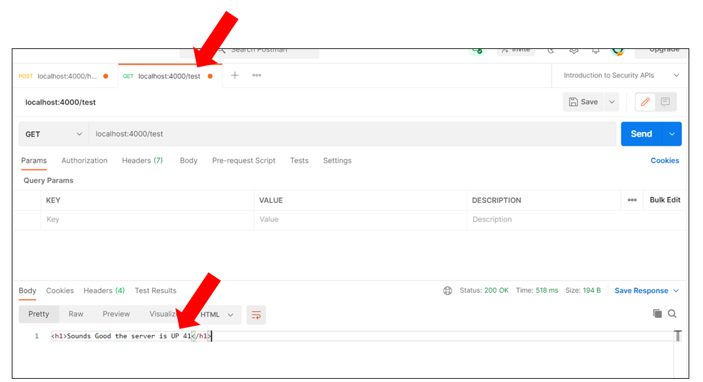
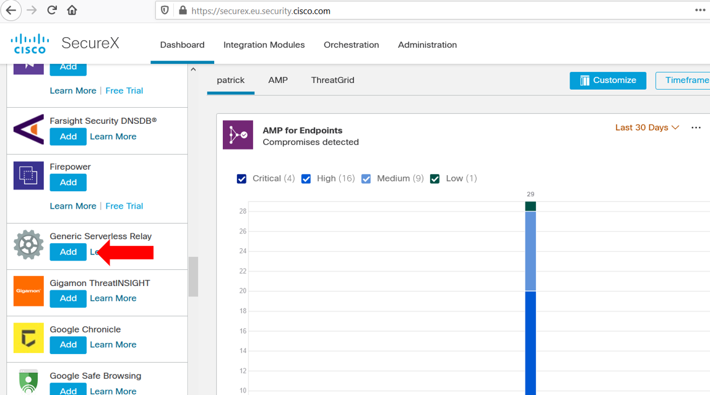
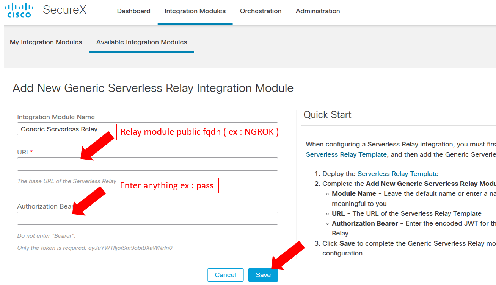
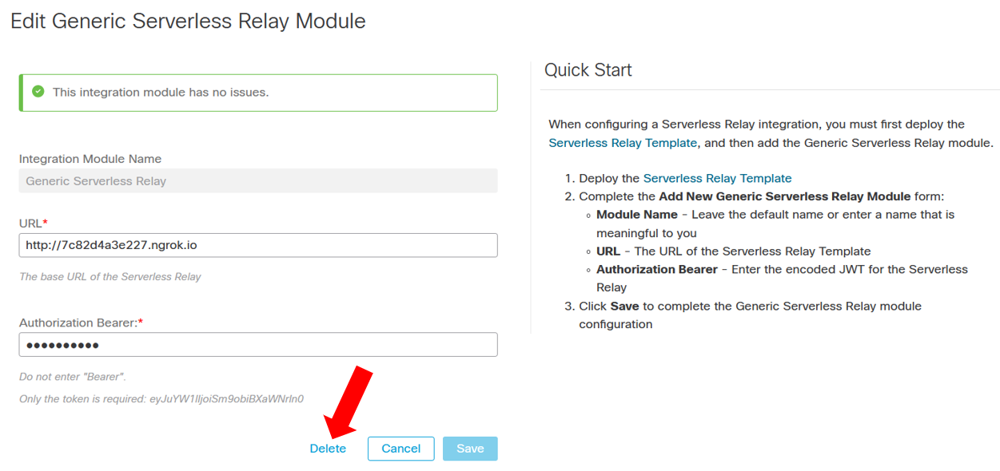
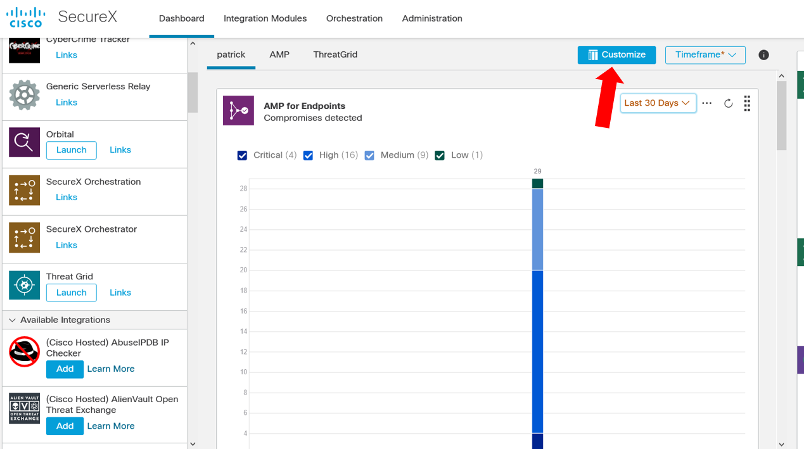
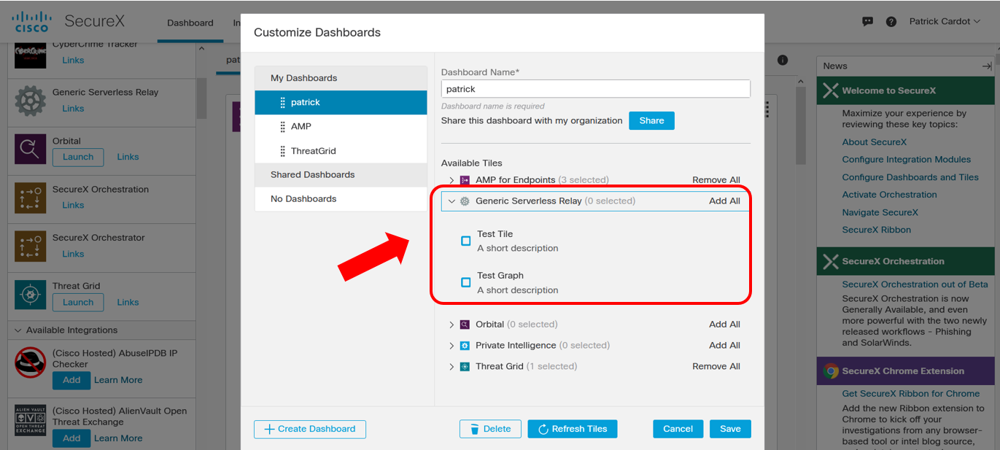
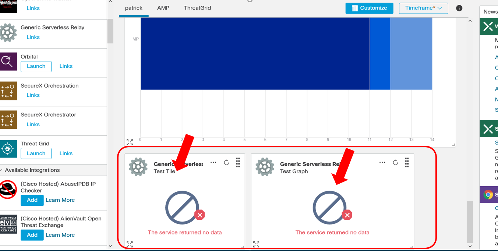
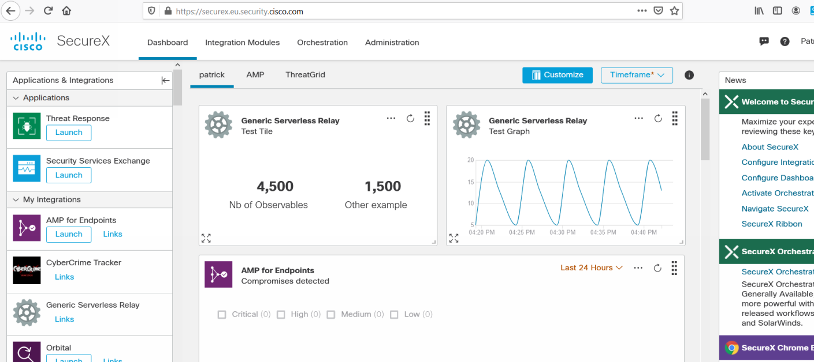
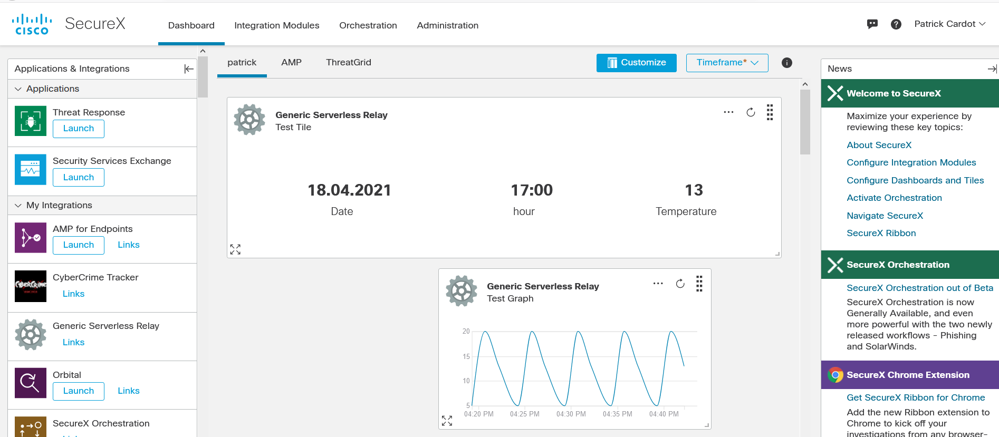

# Introduction

This tutorial explains the basic details needed to create an integration that has some tiles into wich we will send some data to graph.

## STEP 0 - The basic python flask template (app_0.py )

In order to understand step by step how we can built a basic dashboard relay module, let's start with a basic flask template.

```
from flask import Flask
from flask import Flask, flash, redirect, render_template, request, session, abort
import os

app = Flask(__name__)

@app.route('/test')
def test():
    truc = 1 + 40
    return "<h1>Sounds Good the server is UP "+str(truc)+"</h1>"
    

@app.errorhandler(404)
def not_found(error):
    return render_template('error.html'), 404 

    
if __name__ == "__main__":
    app.secret_key = os.urandom(12)
    app.run(debug=False,host='0.0.0.0', port=4000)
```

run the application :

    python app_0.py


Test it from POSTMAN

GET htt://localhost:4000/test



## STEP 2 - Import modules and add script functions (app_1.py)

Now let's add to the template some module import and some script functions that are needed as services for the script.

Replace the import section of the script by the following :

```
from flask import Flask
from flask import Flask, flash, redirect, render_template, request, session, abort, jsonify
from schemas import DashboardTileDataSchema, DashboardTileSchema
from utils import get_json, get_jwt, jsonify_data
import os
from crayons import *
```

We add some imports that are mandatory for the correct execution of our custom relay module.

We add the jsonify function to flask that will help us to format in JSON the result we want to output.

We add the crayons python module.

We we import 2 important modules taken from the Cisco **serverless template relay module** :

- utils.py
- schemas.py
- errors.py

Basically, these modules provides with some functions used by Cisco relay modules.  We need some of these functions in our example. But it will help us in our futur development to do some copy and paste of piece of codes from existing relay modules.

**Note:** these files had been a little bit modified in order to make our example work.

Add the following functions :

```
def jsonify_data(data):
    return jsonify({'data': data})


def jsonify_errors(data):
    return jsonify({'errors': [data]})
```

## flask routes and python functions

Now let's add our function and the first one is the health function needed for the SecureX Integration.

### /health

In order to confirm to secureX that the relay module is alive we must add the following route.

```
@app.route('/health', methods=['POST'])
def health():   
    data = {'status': 'ok'}
    return jsonify({'data': data})  
```

We just answer **{'status': 'ok'}** to the secureX **/health** request.

That's enough and let's test it. Start NGROK ( instruction at the end of this article ).

### SecureX Integration






- Enter the Relay Module public FQDN
- Authorization Bearer can't be empty. Then enter anything
- Click on save


## Add some tiles into the Dashboard

Delete the previous SecureX Integration. Go to your integrations, find the Generate Serverless Relay module you just integrated, click on Delete and Confirm.



Edit the **app.py** file and add the following route within it ( just above the main function )

```
@app.route("/tiles", methods=["POST"])
def tiles():
    return jsonify_data(
        [
            {
                "id": "test-summary",
                "type": "metric_group",
                "title": "Test Tile",
                "periods": ["last_24_hours"],
                "short_description": "A short description",
                "description": "A longer description",
                "tags": ["test"],
            },
            {
                "id": "test-graph",
                "type": "line_chart",
                "title": "Test Graph",
                "periods": ["last_24_hours"],
                "short_description": "A short description",
                "description": "A longer description",
                "tags": ["test"],
            },
        ]
    )
```

This function defined the tiles generated by this relay module, and their characteristics.

When secureX queries the relay module during the first integration phase, it queries this API in order to get the available return tiles. And this function above will trigger the tiles availability into the **customize** window.

restart the flask application 

    python app.py

And integrate it again into your secureX tenant.

Click on the **customize** button from the dashboard. Then you can see new available tiles in a new category named **Generic Serverless Relay**. Select the 2 new tiles and Save.




Now in you dashboard, the 2 new tiles appeared at the bottom of the page.



But we understand that we have an issue with missing data within the tiles.

If we look to the relay module console, we see some calls from secureX to the **/tiles/tile-data** API endpoint on the relay module with **404** not found error code.

## Add some data into our tiles (app3.py )

Ok we understand that we have to add a new flask route to **/tiles/tile-data** API endpoint.

Add the following route into your **app.py** file and restart your flask application.

```
@app.route("/tiles/tile-data", methods=["POST"])
def tile_data():
    data = get_json(DashboardTileDataSchema())
    print (green(data["tile_id"],bold=True))     
    if data["tile_id"] == "test-summary":
        return jsonify_data(
            {
                "observed_time": {
                    "start_time": "2020-12-19T00:07:00.000Z",
                    "end_time": "2021-01-18T00:07:00.000Z",
                },
                "valid_time": {
                    "start_time": "2021-01-18T00:07:00.000Z",
                    "end_time": "2021-01-18T00:12:00.000Z",
                },
                "data": [
                    {
                        "icon": "brain",
                        "label": "Nb of Observables",
                        "value": 4500,
                        "value-unit": "integer",
                    },
                    {
                        "icon": "percent",
                        "label": "Other example",
                        "value": 1500,
                        "value-unit": "integer",
                    },
                ],
                "cache_scope": "org",
            }
        )
    else:
        return jsonify_data(
            {
                "observed_time": {
                    "start_time": "2020-12-28T04:33:00.000Z",
                    "end_time": "2021-01-27T04:33:00.000Z",
                },
                "valid_time": {
                    "start_time": "2021-01-27T04:33:00.000Z",
                    "end_time": "2021-01-27T04:38:00.000Z",
                },
                "key_type": "timestamp",
                "data": [
                    {"key": 1611731572, "value": 13},
                    {"key": 1611645172, "value": 20},
                    {"key": 1611558772, "value": 5},
                    {"key": 1611431572, "value": 13},
                    {"key": 1611345172, "value": 20},
                    {"key": 1611258772, "value": 5},
                    {"key": 1611131572, "value": 13},
                    {"key": 1611045172, "value": 20},
                    {"key": 1610958772, "value": 5},
                    {"key": 1610831572, "value": 13},
                    {"key": 1610745172, "value": 20},
                    {"key": 1610658772, "value": 5},
                    {"key": 1610531572, "value": 13},
                    {"key": 1610445172, "value": 20},
                    {"key": 1610358772, "value": 5},
                ],
                "cache_scope": "org",
            }
        )
 
```

Restart your relay module and then reload the SecureX Dashboard page.

You should see now data within your relay Module.



If you had a look to the code we added you might understand that for every tiles exposed by the relay module, Securex send the tile_id as an query argument to the **/tiles/tile-data** API endpoint. In the attached python function, we did en **if check**  on this tile_id and depending on it's value, we returned back to the secureX queries a static JSON result that contains the value we seen in the tiles.

The tile's type ( histogram, line chart, metrics, etc ) is defined in the JSON data we return to SecureX in the **/tiles** API Endpoint.

## Return dynamic results into the tiles

The static example above gives us the JSON result format we must return to secureX queries for these 2 specific tiles types ( **metric_group** and **line_chart**).

So it is easy now to understand that for these two example, if you want to send back dynamic result, you just have to add to your relay module a function that will be called by the **/tiles/tile-data** API endpoint. This function can queries any data sources and they just have to format the result into the expected format and send them back to secureX.

Okay, let's take an example. Let's display in the **test tile** ( id = test-summary) the current temperature in Paris.

We can get this information thanks to this public API Endpoint :

https://www.prevision-meteo.ch/services/json/lat=46.259lng=5.235

Let's add a new function to our relay module.

```
def paris_temperature():
    response=requests.get('https://www.prevision-meteo.ch/services/json/lat=46.259lng=5.235')
    payload=response.content
    json_payload=json.loads(payload)
    return (json_payload['current_condition']['date'],json_payload['current_condition']['hour'],json_payload['current_condition']['tmp'])
```

and then let's modify the **tile_data()** function this way :

```
...
...
    if data["tile_id"] == "test-summary":
        date , hour , temp = paris_temperature()
        return jsonify_data(
            {
                "observed_time": {
                    "start_time": "2020-12-19T00:07:00.000Z",
                    "end_time": "2021-01-18T00:07:00.000Z",
                },
                "valid_time": {
                    "start_time": "2021-01-18T00:07:00.000Z",
                    "end_time": "2021-01-18T00:12:00.000Z",
                },
                "data": [
                    {
                        "icon": "brain",
                        "label": "Date",
                        "value": date,
                        "value-unit": "string",
                    },
                    {
                        "icon": "percent",
                        "label": "hour",
                        "value": hour,
                        "value-unit": "string",
                    },
                    {
                        "icon": "percent",
                        "label": "Temperature",
                        "value": temp,
                        "value-unit": "integer",
                    },                    
                ],
                "cache_scope": "org",
            }
        )
    else:
        return jsonify_data(
...
...            
```

Restart the Relay Module and let's check the result in the SecureX dashboard.



Here we are !

We are ready now for more complex graphs.


## Make your Relay Module available to SecureX with NGROK

For the purpose of this lab, we need to make our Relay Module reachable by SecureX. We need to expose it on the INTERNET.

**NGROK** is a wonderful tool for doing that in minutes. 

NGROK is going to expose a public URL on the INTERNET and built a tunnel between this public location and the Relay Module which work within your laptop.


### Install NGROK

https://ngrok.com/download


Open a new CMD console window.  Change directory to the folder where you unzipped ngrok and start it thanks the following command.

    cd {ngrok directory}
    ngrok http 5000


Copy the NGROK FQDN that was assigned to you ( it will remain available during 7 hours ), we will used it in SecureX

Test again your Relay Module with to Postman and now use the NGROK Relay Module FQDN

Send a POST request to :

    https://ngrok_relay_module_fqdn/health

Perfect,  We are ready now to go to the next step that is to start the SecureX Integration.
