# Let's parse some logs

Let's take a nice parsing example as a next step after having ask to SecureX Threat Response for a bearer token.

Among all nice security services Threat Response provide us with we have the **inspect** API that is a very powerfull API which can parse for us very big raw text data, and will extract from it all the observables and their types.

Do you see what we can do with this ?

We can ask to SecureX to tell us which observables contained in any security logs, are malicious !

Let's do it :-)

we have some logs here in the file named **log/log**. You can have a look to this file content.

## Create a new automation workflow

Go to workflow and click on the **New Workflow** button.

Go to the workflow properties on the right and name your workflow **Extract Observables from logs**.

Let's create an input variable for the workflow.

Click anywhere into the canvas and then go to the properties panel on the right, scroll down until the variable section.
Click on the **+ ADD VARIABLE** link and add a string variable.

    name : raw_text
    type : string
    scope : Input
    REQUIRED : True

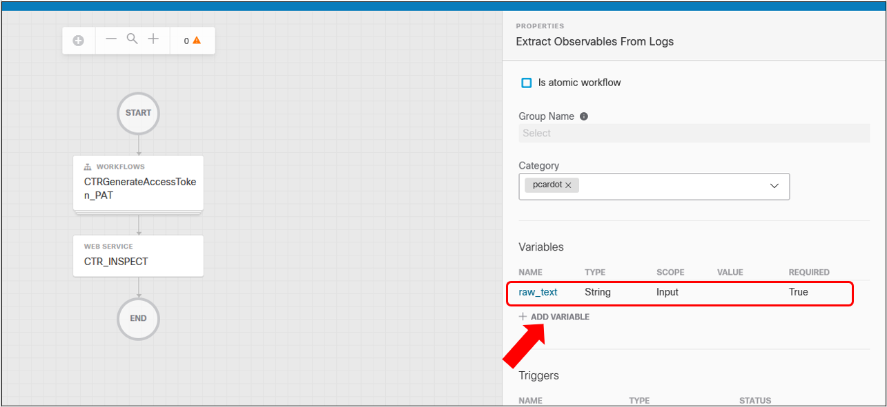

This variable will contain the text to parse

On the activity panel on the left click on the workflow icon on the top right of the panel and search for the **CTR ACCESS TOKEN REQUEST** workflow you created prior. Drag and drop it into the canvas.

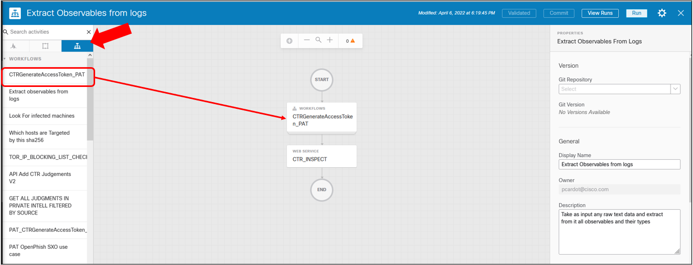

Now on the activity panel on the left click on the activity icon on the top left of the panel and search for **http request**. Drag and drop the http request activity you found  into the canvas jsut bellow the first activity.

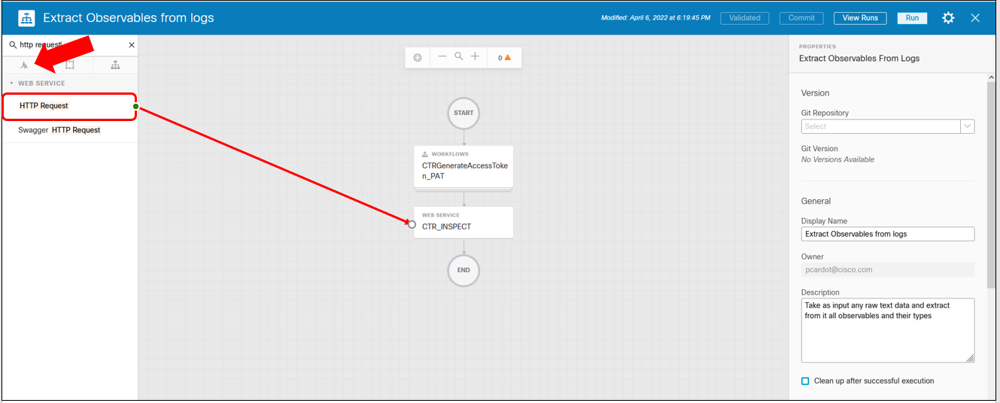

This activity will use a target that is Threat Response.

Create an **HTTP Endpoint** target. Give it a name and define it this way :

    No Account Key : True
    protocol : HTTPS
    Host/IPAddress : visibility.eu.amp.cisco.com

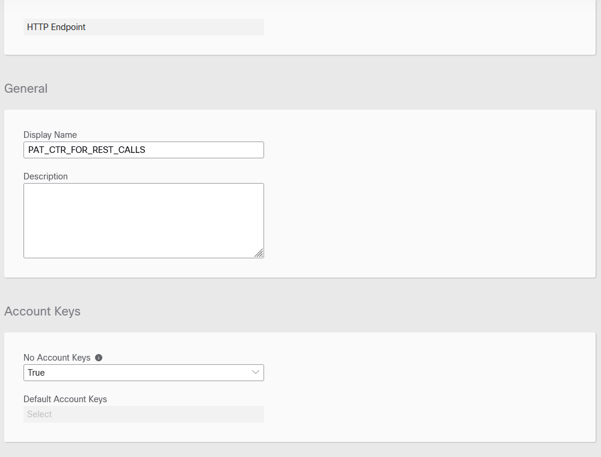
Notice : Host/IPAddress actually depends on your region.

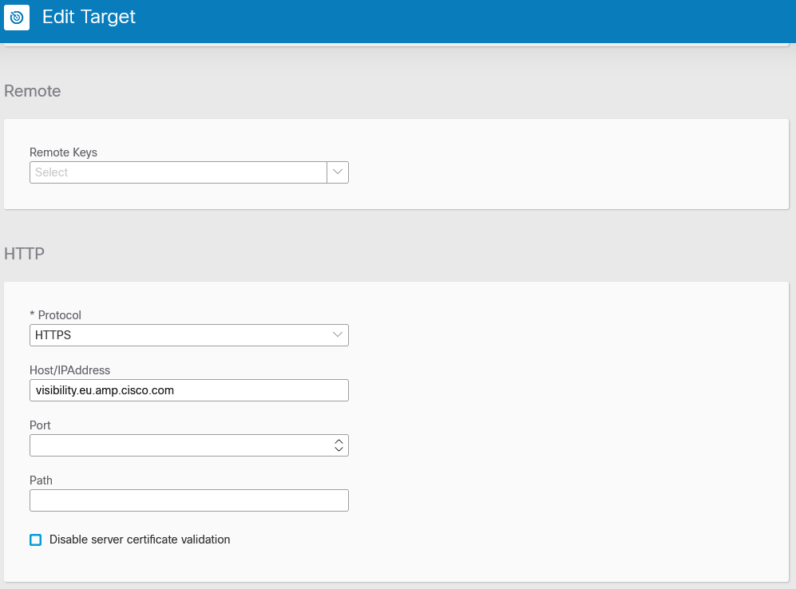

Click on the http request properties on the right panel

Give a meaningful name to your activity.

Scroll down to the target section and click on the **Override workflow target** radio button. Then select the target you created prior in the select list box.

Scroll down to the http request section and in the **Relative Url** edit box enter the following API path :

    /iroh/iroh-inspect/inspect

Select the **POST** method.

In the **Request Body** enter the following :

    {"content:""}

Then Put the cursors between the 2 empty double quotes and click on the hashtag icon.

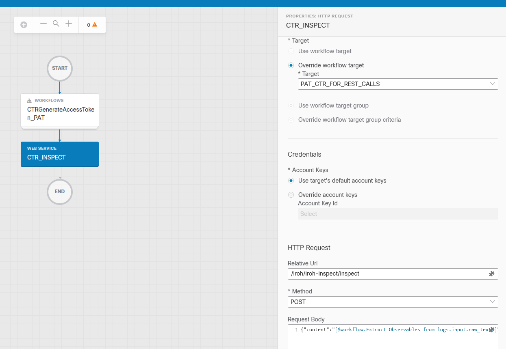

Search for the workflow **raw_text** variable. Select it an **Save**.

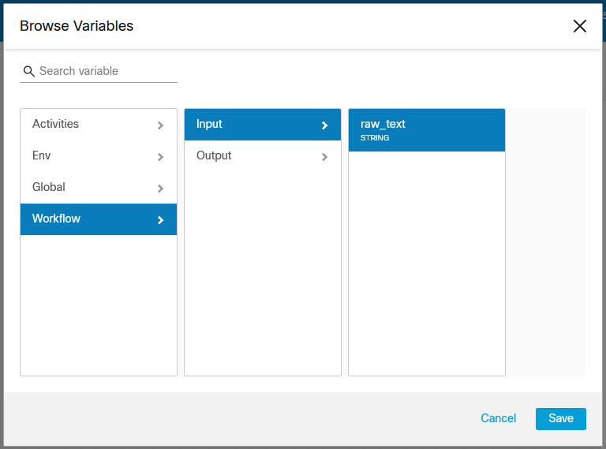

Scroll Down to the Header section. Then enter JSON into the **Content Type** edit box.
And scroll down again to the **Custom Header** section. Click on, the HEADER **+ ADD** link and create a new variable named **Authorization** and assign to it the following string : **Bearer ** ( with a space at the end ).

Don't forget to add a space just after Bearer !!

Put your cursor just after the space and then click on the hashtag icon in order to open the variable browser.

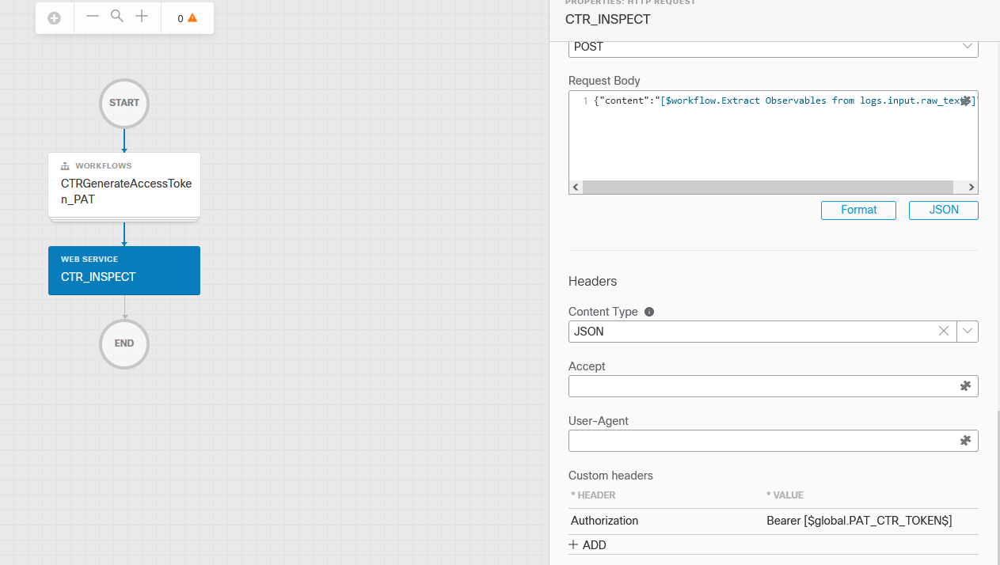

Then search for the SecureX Global variable where you store the Threat Response token ( PAT_CTR_TOKEN in my case).

So what we understand here is that this API and, anyother Threat Responses APIs, uses the Bearer Authentication Token we requested in the first activity.

This Beearer Token is passed to the Threat Response API thru the http header. It will be valid 10 minutes

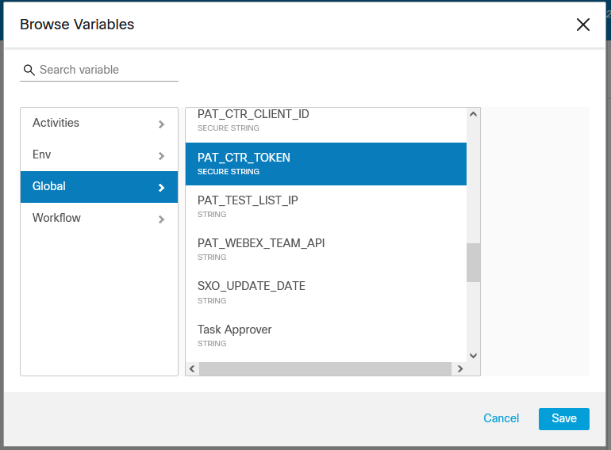

And Here we go !!!

Our workflow is ready for test !

Click on the **RUN** button and check the result

When the workflow starts, then it prompted us to enter the raw text into a textarea box.  At this point you can copy the whole content of the **log.log** located in the github repository, and paste it into the textarea box. Or you can copy and paste any other text content that contains observables.

Then click on the **RUN** button.

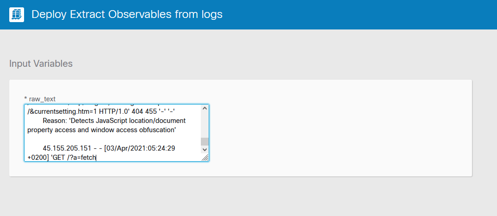

Every activities turned green, meaning that everything is Okay. Click on the last activity ( the http request acitvity ) and check the result of this activity on the right panel.

The answer to the Threat Response inspect API call is the body of this answer.

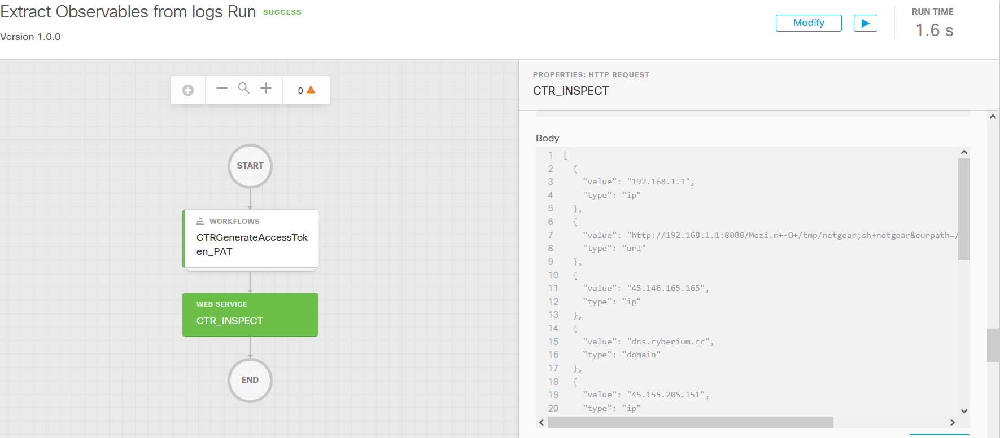

When we look deeper into it we see that this is a JSON result that contains all observables found in the inputed raw text with their types.

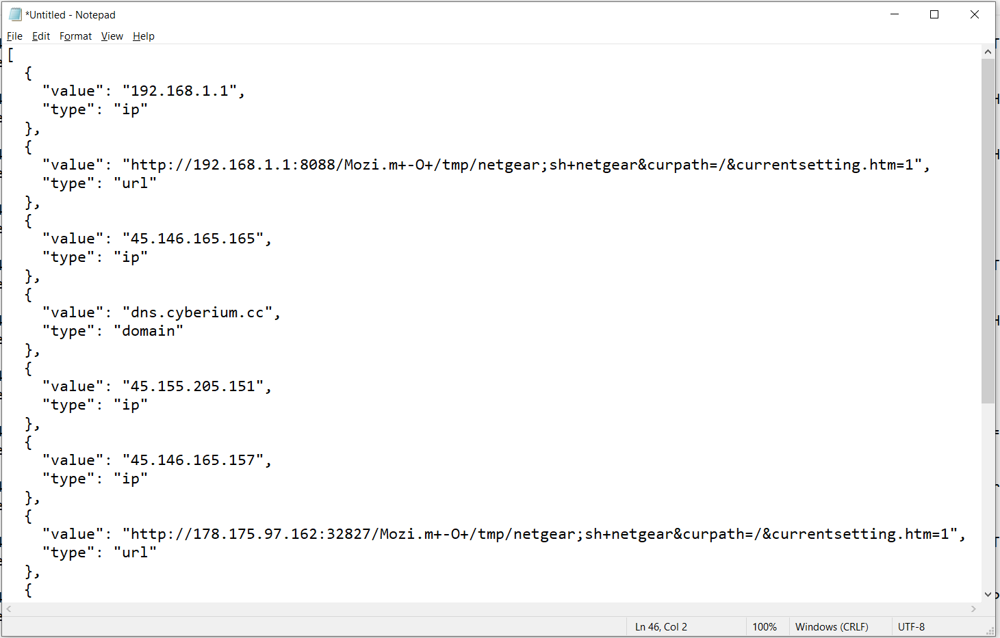

Dont' hesitate to try again with a very big text content or big files log file.

# Improvement

Here are some improvments 

1/ Manage the Authentication expiration

TODO : automate the Threat Response renewal if this one expires.

For information, if the Threat Response Token is not valid the the http status code will be 401.

2/ double quotes into the raw_text input will make the workflow fail 

TODO : Manage this situation into your workflow

3/ JSON PARSING

TODO : Parse the Threat Response JSON result and create a SecureX table from it.

4/ Imagine that you want to analyse the content of a security log file

TODO : add to your workflow an activity that reads the content of any Security blog post and send it to your parser

It's up to you !