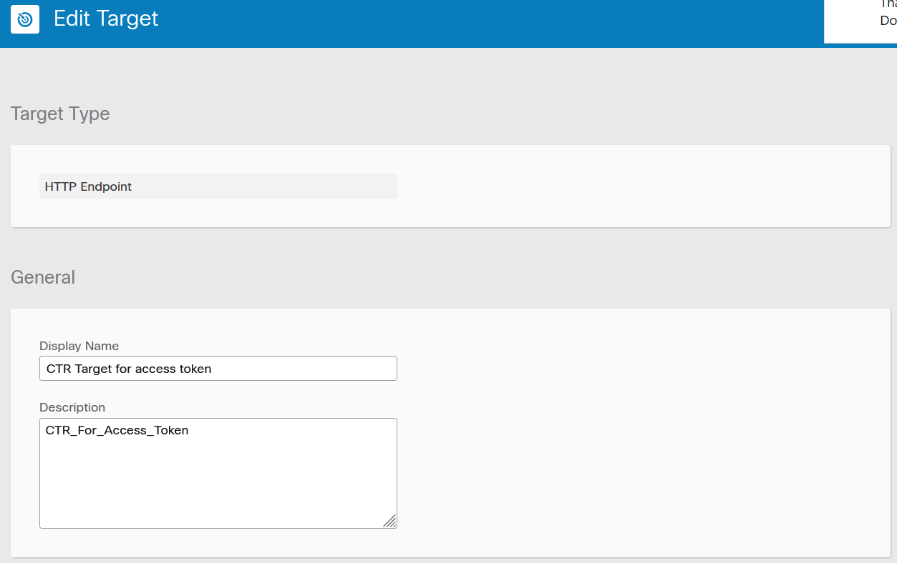
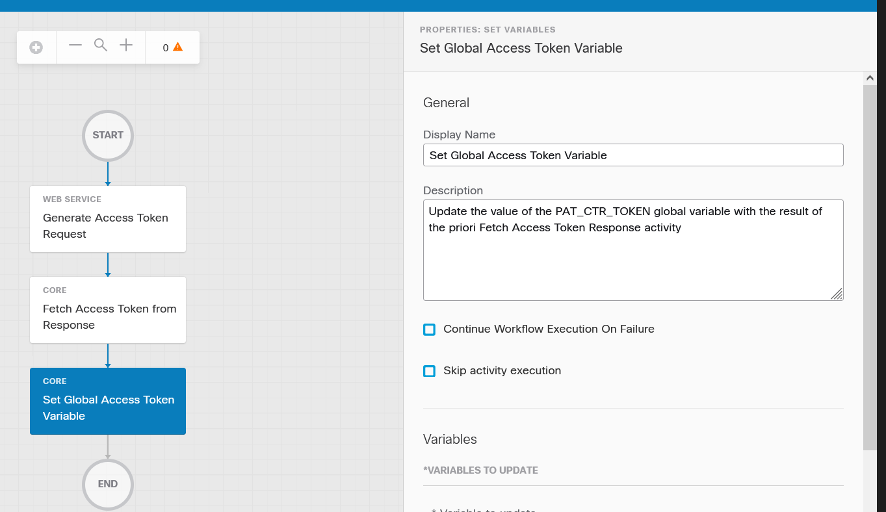

# Ask for a Cisco Threat Response Authentication Token

Asking to SecureX for a Threat Reponse authentication will be for us a very frequent operation.

I would say that this is a mandatory operation.  At the point that we already have a pre-builted atomic automation workflow for this.

But the goal of this tutorial is to show how to create our own atomic workflow.

Threat Response is pure power !!  and it is fully based on APIs. 

The Threat Response APIs contains a very big set of APIs for a lot of very useful purposes.

Threat Hunting is probably the first Threat Response API service we use within SecureX. The Threat Hunting relation graph is an example of application that uses Threat Reponse APÏs. And we can consider Threat Response enrich APIs as an access to the TALOS backend and other intergrated Threat Intelligences.

But we have as well a lot of other APIs which can invoke  incident management services, casebooks, notifications, vulnérabilities , attacke campaigns, judgments , verdicts, feeds, databases and other services !!!

To conclude on this SecureX Threat Response is one of the most powerful security free platform of the market.

To conclude, we will interact with SecureX Threat Response APIs all the time.

How does it work ?

Threat Response API authentication is based on OAUTH.  That means that the API authentication is based on an authentication token.

The authentication token is a **Bearer** token that must be assigned to a variable named **Authorization** that will be passed thru the http header of the API call.

This token must be generated on the fly before calling Threat Response APIs. And in the case of Threat Response, it will remain valid only 10 minutes.  After this life time we have to ask for a new token.

Ask for this token to Threat Response must be done thanks to a dedicated API : 

Based on the documentation of this API here is bellow the details :

    API : https://visibility[.]eu[.]amp[.]cisco[.]com/iroh/oauth2/token
    Method : POST
    Request body ( text ) : grant_type=client_credentials
    Header content-type : application/x-www-form-urlencoded
    Header Accept : application/json
    http authentication : Basic ( client-ID  : client-password )

So we understand that the first operation is to create a Threat Response API client

## Create a Threat Response API client

Step 1 : from the SecureX main page, click on the question **Administration** link on the top menu.


Step 2 : Click on **API Client** on the left menu 


Step 3 : Give a name to your API client, **Select All** scopes and click on the **Add New Client**  button.


Step 4 - Copy and save somewhere the client-ID and client-Password. This is the only opportunity to see the client-password in clear text !


**close** the popup windows.

That's it !!

# SecureX Workflow

Now let's create an atomic workflow that will ask to SecureX Threat Response an authentication token. And that will store this token into a SecureX Global variable.

## Create a Threat Response Target

Step 1 - In orchestration, go to targets on the left menu and create a new **HTTP Endpoint** target.


I called it : **CTR Target for access token**.




( Notice : Host/IPAddress depends on your region )

## Create a global variable that will store the Threat Response Token

In orchestration, go to variables on the left and add a new global variable. Give it a name

- Variable name : PAT_CTR_TOKEN
- Type : Secure String
- Scope : global


## Create the workflow

Go to workflow and click on the **New Workflow** button.


Go to the workflow properties on the right and give to it a meaningful name. Add a detailled description.

Tips : I personnaly add the **_PAT** keyword to all my workflow names. It helps me to easily find in my workflow libray. ANd the **category** value helps as well.


The other only thing to csutomize in the workflow properties is the target. And we are going to use the target we created above.


Only 3 activities are needed here.

Drag and drop them from the activity panels on the left and put them one after the others into the canvas.

We need :

- 1/ an HTTP request activity
- 2/ a JSON Path Query activity
- 3/ a set variable activity

## The HTTP REQUEST ACTIVITY

This activity is the one that will query the SecureX Threat Response API to ask for an Bearer Token.

On the activity panel on the left, search for **http request** and drag and drop the activity within the canvas.

No inputs are needed for this activity. By default it will use the workflow target and use the Basic Authentication we defined for this target.

The result of this request will be a JSON result available in the output body of the activity.

Scroll Down to the **General** section.


**Custom Header Section** :


**HTTP Request Section** :

Select the Target


**Target Section** :


**DONE**

At this point you can run it and the expected result is a JSON Result that contains the requested Token.

Click on the run Button on the top right


And check in the run that every activity goes to green. That means that the activity was successful.

If the workflow stop somewhere you will see that the activity where there the issue will turn in red. Then Click on it and have a look to the activity results on the rigth panel.

If everything went well you can watch the right panel and you will see the result of the workflow execution.


The result of the request is a JSON RESULT like the following. And it will be located into the body of the http answer.

```
{

  "access_token": "eyJhbGciOiJSUz.........R6Lg",
  "scope": "integration private-intel admin profile enrich:read feedback sse registry users casebook inspect:read orbital oauth response telemetry:write notification global-intel:read webhook",
  "token_type": "bearer",
  "expires_in": 600
}
```

We can see that the token type is **bearer** and the token value is assigned to the **access_token** key.

Next step is to extract the token from the JSON result

## The JSON Path Query activity

Go to the activity panel on the left and serch for **JSON Path Query** and drag and drop the found activity into the canvas just after the first http request activity.

This activity extract the token value from the JSON result above.

It need as an input the JSON result we got in the prior activity. And it must output it's result into a variable that is an activity variable.

Define this activity like the following way.


**JSON Query section**


We have to select a JSON Source to parse. And this source is the output of the first http request acitivity.

In the **Source JSON to Query** textarea box click on the hashtag icon in order to launch the variable browser.


Select the **Activities ==> Generate Access Token Request ==> Body** variable and **Save**.

We did this selection because the variable we want to select belong to a worflow activity, the name of this activity is **Generate Access Token Request** and the data will be into the **body** of the http answer we got from Threat Response.

Next Step ... Let's extract from the JSON result only the **access_token** value.

The results of a JSON Path Query can't be assign directly to any global or workflow variables. We must assign these results to variables of this current activity and in a next step we will be able to assign the values of these activity local variables to workflow variable.

This is what we do in the **Property Name** edit box by declaring there a variable name **access_token** which is a **String**. This variable is a temporary variable just for storing the value of the Bearer token.

And we assign to this variable the result of a JSON parsing operation we do with the following path filter : **$.access_token**.

Why did we use this path filter ?.

Because this is the full path to the key.value we want to extract from the JSON result.

Let's me explain you that ion the coming section.

### How to quickly parse JSON result ?


Here is a nice tip about how to identify quickly what is the exact value of the **JSONPATH Query** filter we have to use.

Easy ....

1. Copy the whole JSON result ( the example we have above )
2. Go to the JSON Parser online tool : http://jsonpathfinder[.]com
3. Locate the variable you want to extract and copy it's full path
4. in the path result we got from jsonpathfinder, replace the first letter that is an **x** by **$**. And here we go !
5. paste the **$.xxxx...path....** final filter into the JSONPATH Query edit box of the JSON Path Query activity.

And that's it !


**Notice**.  I will show you in another tutorial how to parse more complex JSON data structure.

The result of this activity is to store temporarly into a JSON Path Query output variable the bearer access token.

## The set variable activity

The goal of this activity is to uopdate the value of the **PAT_CTR_TOKEN** global variable with the content of the output ( access_token ) of the previous JSON Path Query activity.

Go to the activity panel on the left and search for **set variables**. Drag and drop the found activity into your canvas just bellow the JSON Path Query Activity.



Give a meaningful name to this activity and a description.

This activity is very simple , it allows us to assign to a variable we are going to select, the value of another variable.

And what we are going to do is to assigne the the **PAT_CTR_GLOBAL** variable the content of the **JSON Path Query** activity **access_token** variable. Which is our final goal !!

First click on the hashtag icon of the **Variable to update** edit box.

Then in the variable browser search for the **PAT_CTR_TOKEN** variable. Select it an **Save**.

Second click on the hashtag icon of the **New Value** edit box.

And search for the **JSON Path Query** Activity **access_token** variable. Select it and **Save**


And That's it !!!

We are ready to test the whole workflow. Just Run it and have a look the the result.


Then the **PAT_CTR_TOKEN** can be used during 10 minutes into any workflow that need it.

## Congratulation you have reached the end of this tutorial

# Next Step

The next step is to use the Authentication Token in order to query Threat Response for any relevant service.

[example of how to interact with Threat Respoonse](https://github.com/pcardotatgit/SecureX_Workflows_and_Stuffs/tree/master/7-ask_for_a_threat_response_token/inspect.md)