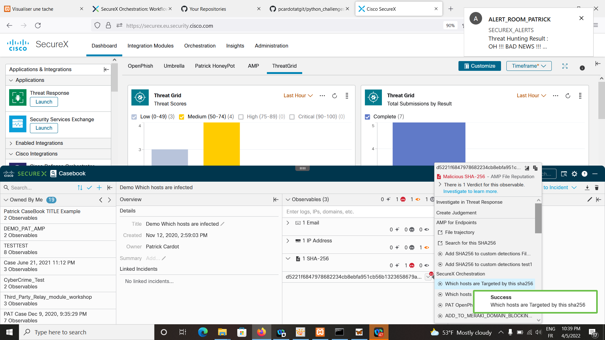
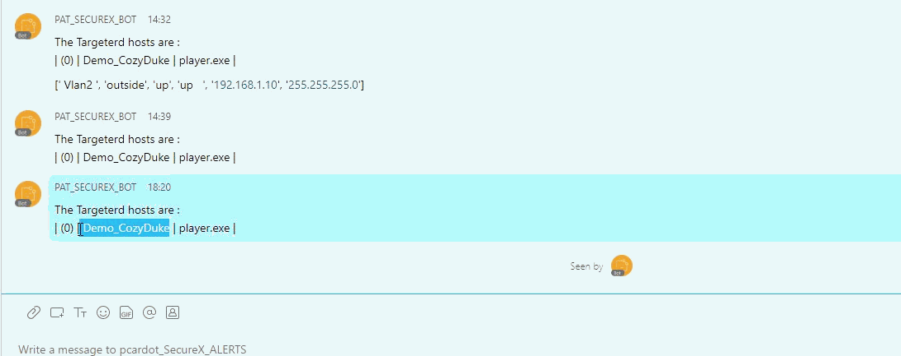
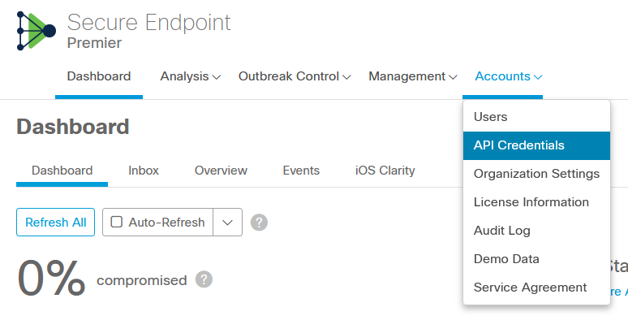
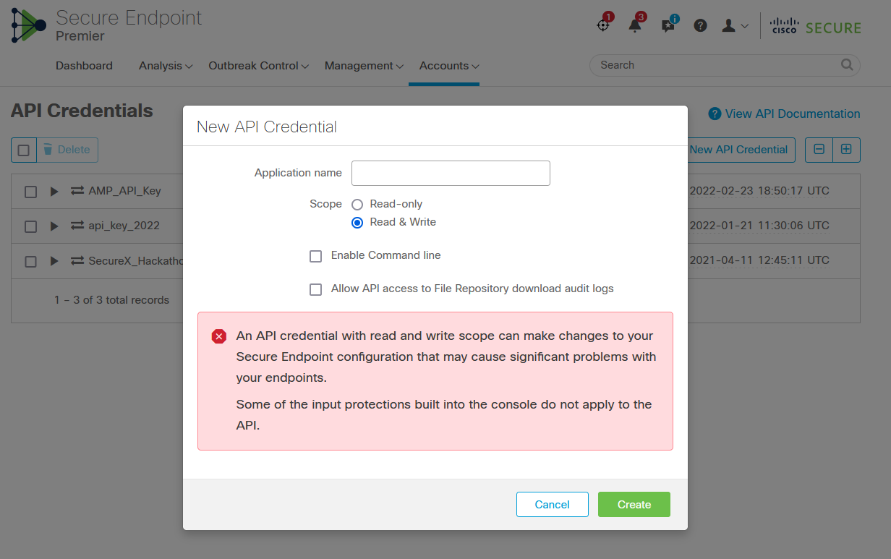
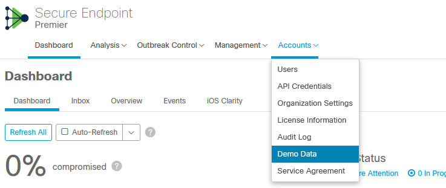
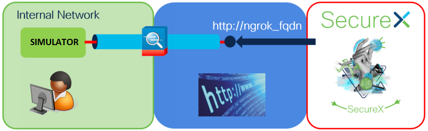
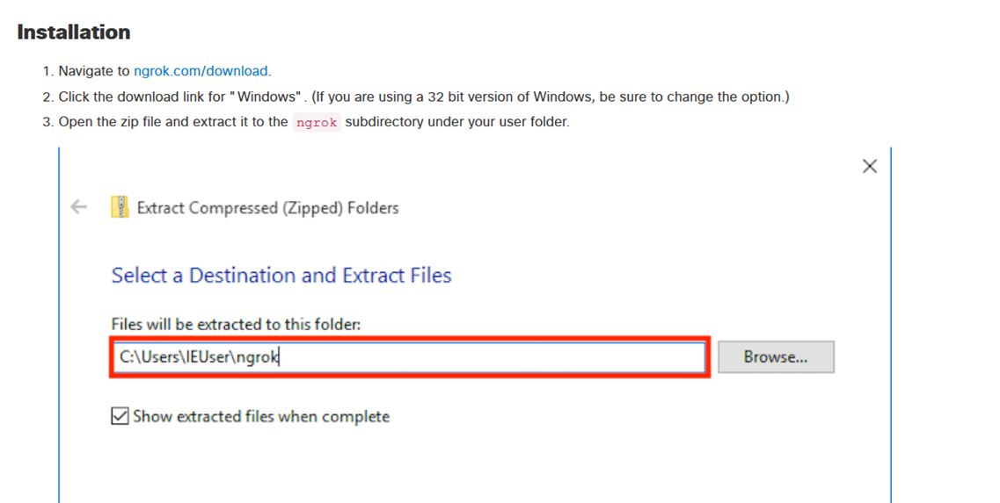
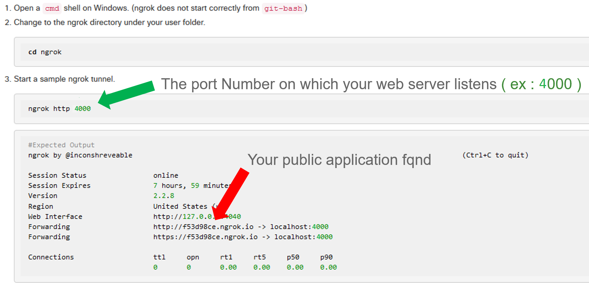
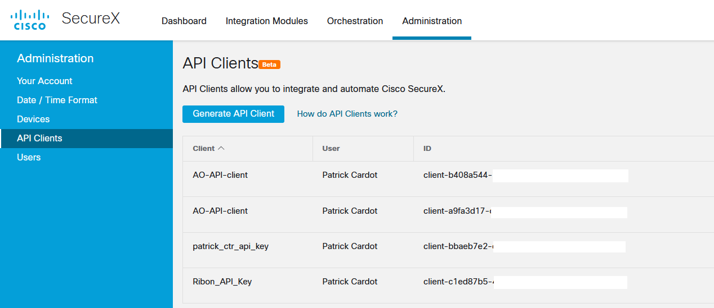
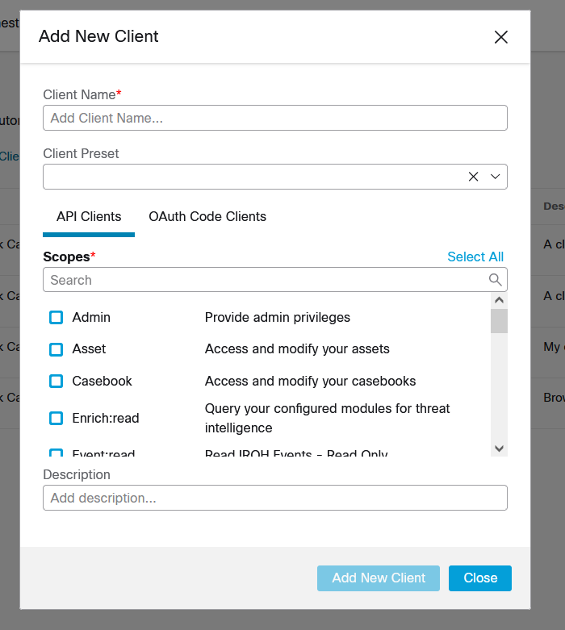

# Introduction

This article is a step by step tutorial that describes the creation of a SecureX automation Workflow.

The goal is to share with readers all the details of the development of the workflow.

The targeted audience is "beginners". So if you just discoverd SecureX Orchestration and you want to understand all the basics needed for creating a realistic automation workflow, then this tutorial is for you !.

## First Step, Let's setup the goal ?

Imagine that one day in the morning you wake up and suddenly you need this !

A tool that tells you if you are infected by this very bad malware that came out yesterday during the night. And if yes...Next question Who is infected ?

We want :

- From the ribbon, and from the casebook manager. 
- I want to ba able to copy and paste a SHA256 in the observable edit box ( the malware's SHA256 )
- Then I want an activity in the pivot menu which triggers a SecureX Workflow named **which_host_are_infected_by_this_sha256**
- And I expect to receive into a Webex Team Room the list of  hostnames of all my infected machines.
- Then I will be able to repair them quickly

This realistic scenario would help any security administrators to know in less than 20 seconds if they had been infected by a malicious file, and which host must be repaired.

## The workflow logic

Here are the steps thru which we will go thru to acheive our goal.

The Security Backend is Cisco Secure Endpoint ( AMP4E ). This is the backend we will query in order to know if we are infected.

The alerting system is Webex Team. And actually a dedicated Webex Team Room.

The workflow must be triggered from the pivot menu that appears when we right click on the sha256 value we put in a casebook.

1. We must pass the sha256 value to the workflow
2. We must check if the observable is a valid sha256.  
3. If the observable is valid an not empty then we will query Cisco Secure Endpoint to get the list of all endpoints that had any security events which invovled this sha256.
4. Then we will parse the JSON result we received from Cisco Secure Endpoint. We will extract all infected machine hostnames
5. We will then built a text message to be sent into our alert webex team room.
6. We will send the resulting message to the Alert Webex Team Room.

Nice isn't it ? 

## Prerequisits

To be able to create this workflow we need.

- A Cisco Secure Account . No need to have protected machines attached to it as we are going to use AMP4E demo data.
- A Webex Team Account
- A Account into a SecureX tenant with admin rights. 

If you don't have a SecureX account, then you can use Cisco DLCOUD SecureX Demos ( search for : Cisco SecureX Orchestration v1 - Instant Demo - and book it ).  

Open your browser and a good practice before going to the lab will be to switch your browser into the incognito ( private window ).

Then go to cisco dcloud ( https://dcloud[.]cisco[.]com) then go to **catalog** and search for **Cisco SecureX Orchestration V1 - Instant Demo** and click on the **view** button.  The lab will start and will be available for you for 2 hours.

If Your company has a SecureX tenant, then find who is the Super Admin of the tenant and ask him to invite you as a new admin in the tenant.

If you don't have any Secure Endpoint tenant, don't worry we share with you an AMP4E simulator you can use for this lab.

We need some API keys.  Let's start with that !

## Cisco Secure Endpoint - generate an API Key

From the Cisco Secure Endpoint dasboard select **Accounts** on the top right menu. Then click on **API Credentials**.

Then click on the **New API credential** on top right.

Give a **name**, select **Read & Write**

Click on **Create** and don't forget to save somewhere **Client-id** and **Client_API_Key_**.

## Cisco Secure Endpoint - activate Demo Datas

Our workflow example uses AMP4E demo data. So we have to activate ( or refresh ) these demo data into our Cisco Secure Console.

## If you don't have Cisco Secure Endpoint then use the Secure Endpoint simulator

If you don't have any Cisco Secure Endpoint console, use the simulator.

The goal of this simulator is to help you to develop your SecureX workfow without the need to have a Cisco Secure Endpoint account.

It will completely emulate the Cisco Secure Endpoint behavior but the counterpart is that it is limited only to the sha256 given in example. And second you must expose it on the INTERNET in order to make SecureX able to interact with it. For acheiving this, NGROK is an awesome solution for lab.

[Go to this link](https://github.com/pcardotatgit/python_challenges/tree/master/Preparation_challenges_for_Threat_Hunting_Mission/6-AMP_Threat_Hunting/amp_simulator) in order to get the simulator. Have a look to the instructions in order to use it.

API Keys are :

- AMP_API_KEY = 12345678-4f95-43d5-908d-7a7d41ad385z

- AMP_CLIENT_ID = defg26458064a05f1faz

### Use NGROK to make the simulator exposed on the INTERNET

For the purpose of this lab, we need to make our Secure Endpoint backend simulator reachable by SecureX. We need to expose it on the INTERNET.

**NGROK** is a wonderful tool for doing that in minutes. 

NGROK is going to expose a public URL on the INTERNET and built a tunnel between this public location and the Relay Module which work within your laptop.

### Install NGROK

https://ngrok.com/download

Open a new CMD console window.  Change directory to the folder where you unzipped ngrok and start it thanks the following command.

    cd {ngrok directory}
    ngrok http 4000

**The port number to use is 4000 !**

Copy the NGROK FQDN that was assigned to you ( it will remain available during 7 hours ), we will used it in the SecureX workflow.

Test the simulator with Postman and use the NGROK FQDN for this.

Send a POST request to :

    https://ngrok_simulator_fqdn/test

Perfect,  We are ready now to go to the next step that is to start the SecureX Integration.

## SecureX Threat Response API token

In our scenario, we will use the Threat Response **inspect** API in order to check that the observable type we pass from the ribbon is a SHA256. For this reason we need to create API credential.

For this, from the SecureX landing page, go to **administration** on top right menu, then select **API Client** on the left menu, then click on the **Generate API Client**  button.

Add a **client name**, select **all scopes** and click on the **Add New Client** Button.

Save the **client-id** and **client-password** somewhere. 

## What to do Next ?

* 1/ [Create a webex team bot](https://github.com/pcardotatgit/Create_a_Webex_Team_Bot)
* 2/ [ Create the SecureX Webex Team Target and Send messages to an alert Webex Team Room ](https://github.com/pcardotatgit/SecureX_Workflows_and_Stuffs/tree/master/1-Create_a_Webex_Team_Bot_Target)

* 3/ [ Prepare interactions with Securex Threat Response  ](https://github.com/pcardotatgit/SecureX_Workflows_and_Stuffs/tree/master/7-ask_for_a_threat_response_token)
* 4/ [ Create a Secure Endpoint Target ](https://github.com/pcardotatgit/SecureX_Workflows_and_Stuffs/tree/master/4-Create_an_AMP_Target)
* 5/ [ Ready to Create the main automation workflow !! ](https://github.com/pcardotatgit/SecureX_Workflows_and_Stuffs/tree/master/8-detect_and_alert_workflow_lab/step-2)

