# Create the automation workflow

From the SecureX Dashboard, go to the orchestration. The select the workflow icon on the top left. Then you will your workflow library. Now click on the [ New Worflow ] button.

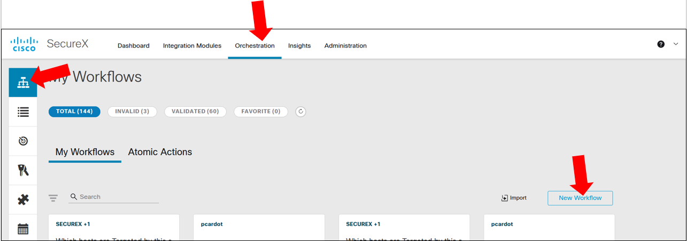

Then the workflow editor opens on an empty canvas.

Activities to drag and drop are on the left, and on the right you have the activities customization panel ( properties ).

We will use 3 targets in this workflow. And we will create these targets on the fly during the worflow creation.

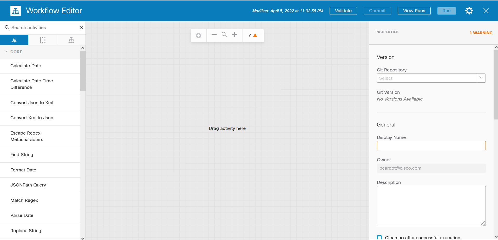

1 - go to the customization panel on the right and give a name to you workflow and a description.

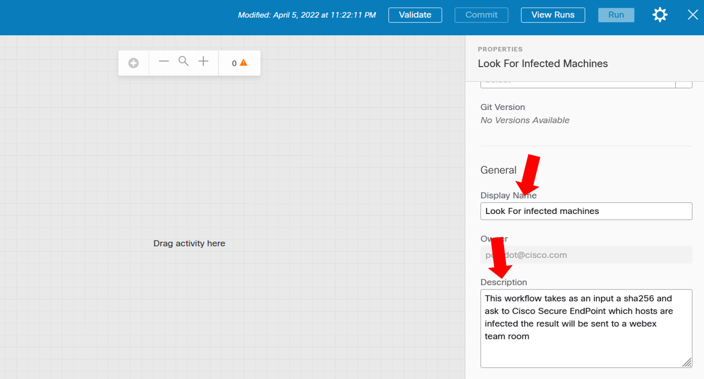

2 - Add into the categories at least the **response** choice because this is what will make the workflow choice into the pivot menu

3 - Create the 2 workflow variables

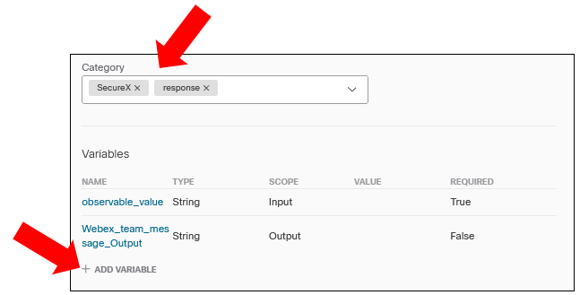

The first one **MUST** be named **observable_value**, and exactly this name !!.

This is very important because this is the name of the variable that will be automatically passed to the workflow by the SecureX Pivot Menu when we do a right click on a observable either in the ribbon, or in the relation graph.

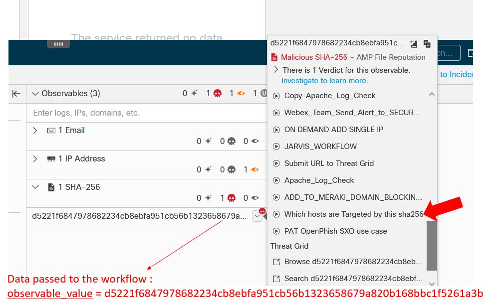

Notice that there is another variable name which act the same which is **observable_type**. And this one will contains the type of the observable passed to the worfklow.

Now let's create our workflow.

From the activity panel on the left search for the name of the workflow that ask a token to Threat Response . 

The one you created in the following section : [ Prepare interactions with Securex Threat Response  ](https://github.com/pcardotatgit/SecureX_Workflows_and_Stuffs/tree/master/7-ask_for_a_threat_response_token)

Drag an Drop it in the canvas.

Then search for **http request** and Drag and Drop this activity just bellow the first one.

Customize this activity exactly as you already did it in the following exercice :

[Example of how to interact with Threat Respoonse](https://github.com/pcardotatgit/SecureX_Workflows_and_Stuffs/tree/master/7-ask_for_a_threat_response_token/inspect.md)

Actually this is exactly the same activity !

And third, search for the **execute python script** acitivity. Drag and Drop it bellow the second http request activity

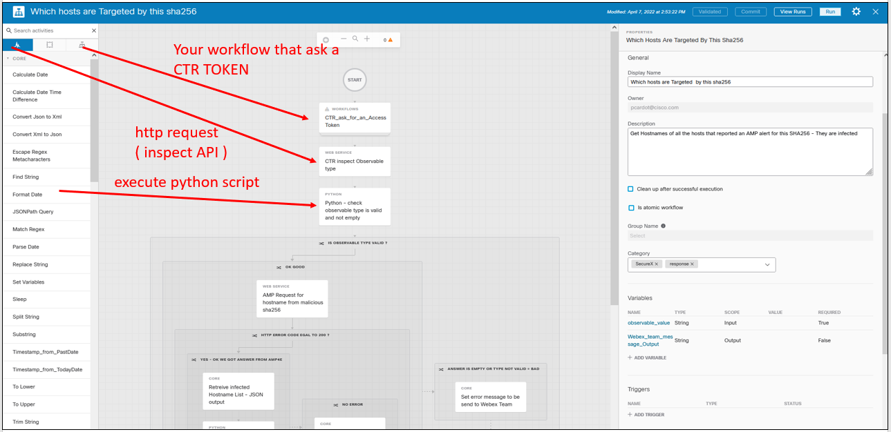

And let's talk about **execute python script**  activities.

You understand that this one allows you to ingest python script into SecureX workflow and this is exactly this !!! And this makes SecureX workflow incredibly powerful, and incredibly open !.

In these activities you can insert very big python scripts with a lot of python functions. And an easy way to develop python scripts is to use your favorite IDE and python interpreter. develop and test your code script, and once it runs well then just copy and paste it into the SecureX Python activity.

Have a look to the link here to see what are the [supported python modules](https://ciscosecurity.github.io/sxo-05-security-workflows/activities/python/modules)

## How to pass variables from the SecureX workflow to the python module ?

Easy !

Click on the python activity and go to properties panel on the right, Scroll down to **Python Query** ==> **Script arguments** .  Then click to the **+ Add** button. An edit box will appear. Click on it's hashtag icon in order to open the variable browser and select the variable you want to pass to the python script.

Add how many variables you want to pass to the script this way. 

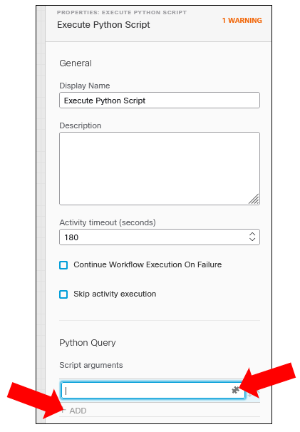

The python script will be edited into the **script to execute on target** textarea box.

Then you must start the script with the **import sys** command. And after this use the **sys.argv[x]** python command exactly like we do in any python script.

With the only difference that is ( as far as I saw ) to not start at the index 0 but the index 1.

Meaning that **sys.argv[1]** will be the first **script argument** you defined.

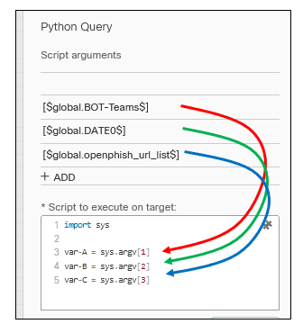

## How to we pass results from the python script to the SecureX workflow ?

Easy !

In your script you can use any variable names right ?.  In order to pass the value of any of these variables to the workflow, you just have to create a new variable attached to the python activity. Give it a name, select it's type and link it to the python script variable name.

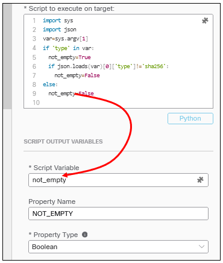

The Workflow variable you linked to the python script variable is an activity variable. You can add how many new variables as you want.  They will be all available in the variable browser.

## customize the execute python script activity

Only one script argument needed which is the output body of the CTR inspect query activity

The output is a variable named **NOT_EMPTY** linked to the python script variable named **not_empty**.

Paste into the **Script to execute on target:** textarea box the following python script.

```python
import sys
import json
var=sys.argv[1]
if 'type' in var:
	not_empty=True
	if json.loads(var)[0]['type']!='sha256':
		not_empty=False
else:
	not_empty=False

```

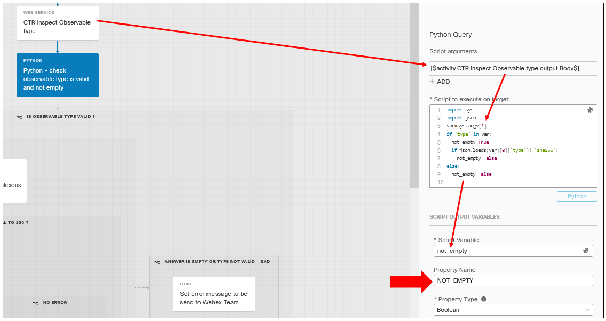

### what does this python activity ?

This activity is there for checking that the observable passed from the pivot menu is not empty and is a valid sha256.

If the ansxer to this question is OK. Then we set the **NOT_EMPTY** variable to True. and we will use it later.

Was python script mandatory for doing this ?

The answer to this question is NO ! we have other ways to check this. But it was the opportunity to describe this python activity.

You will see that in a lot of cases it will be more interesting to do some complexe operation thanks to python than trying to do them thru Workflow activities. Heavy computing, parsing, deal with JSON,tables and huge databases content...

## Okay ... let's move forward !

What are we going to do now ?

- We are going to check if the observable is valid
- If not we will send an error message into our Webe Team Room
- If Yes we will move forward by query Cisco Secure Endpoint API in order to check if there are host that had been infected byt the sha256
- If the query was succesful then we will parse the JSON result in order to extract the hostname list of the infected Endpoint and we will put this list into a message to be sent to Webex Team
- If the query was NOT succesful we will prepare an error message to be sent to the Webex Team Room
- Last operation will be to send the result of the workflow into the Webex Team Room.

Okay Let's do this !!

Drag and Drop at the end of you worflow a **condition block**. Customize the 2 branches 

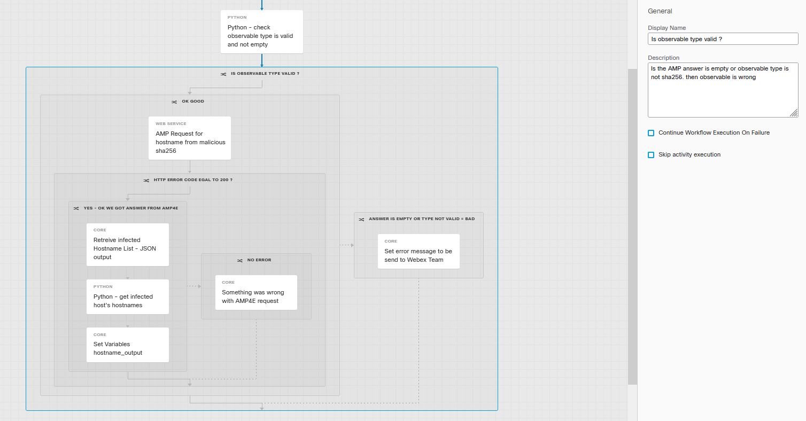
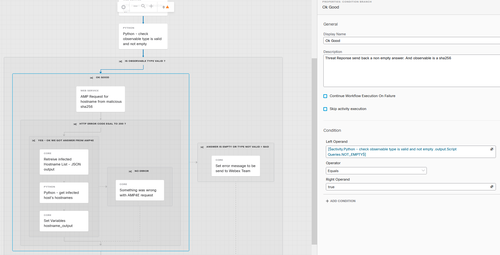
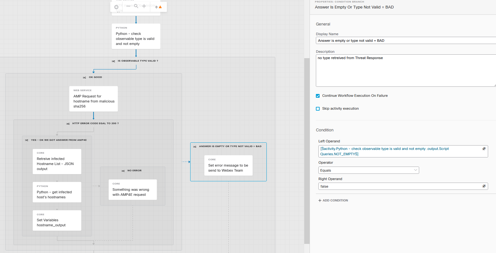

The AMP Request is a **http request** activity that will use the AMP Target you created in the following exercise.
[ Create a Secure Endpoint Target ](https://github.com/pcardotatgit/SecureX_Workflows_and_Stuffs/tree/master/4-Create_an_AMP_Target)

The request we create here query the event Secure API [documented here](https://api-docs.amp.cisco.com/api_actions/details?api_action=GET+%2Fv1%2Fevents&api_host=api.eu.amp.cisco.com&api_resource=Event&api_version=v1)

According to the API documentation the relative URL for this request is :

    /v1/events?detection_sha256=[sha256_variable]

Put your cursor after the equal sign and click on the hashtag icon in order to open the wariable browser. Search for the **observable_value** workflow variable. Select it and **Save**.

Method is **GET**

This API Request will reply back all the events that involve the sha256 we pass to it.

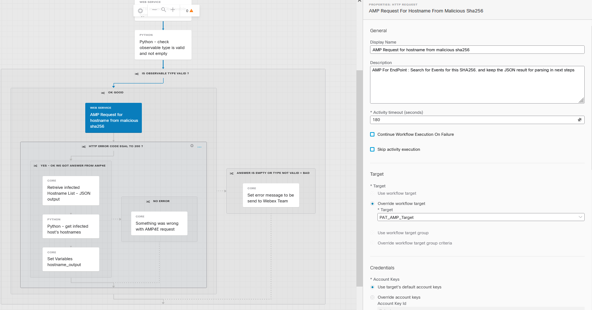
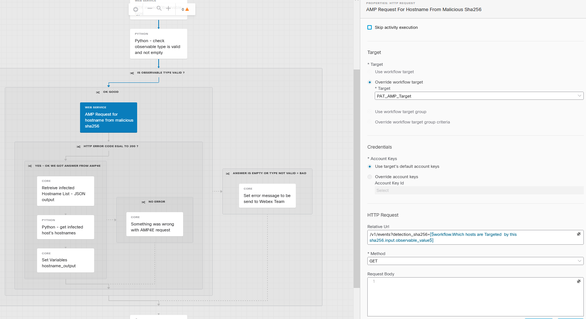

Then thanks to anothed **condition block** activity we check that the REST Query to Secure Endpoint was OK. We check that the status code of the request is equal to 200. You have to select this status code variable in the variable browser after having clicked on the hashtag icon of the Left Operande edit box. The operator is **equal** and the Right Operand is **200**. 

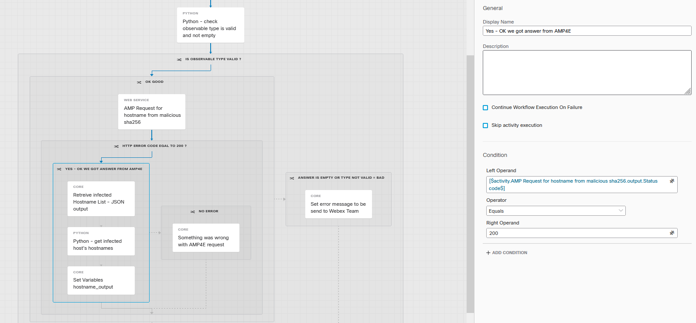

As the API request to Secure Endpoint was OK, then we can parse the result thanks to a **JSON Path Query** activity you have to drag an drop within the **Yes condition branch**.

The JSON source is the output body of the API Request to Secure Endpoint. You have to select it into the variable browser.

The JSONPath filter is equal to **$.data**. The result of this is to extract from the JSON result of the AMP ( Secure Endpoint ) request the item named **data**. And this one is a actually list. 

We understand this if we run the workflow and if we look at the output of the AMP Request activity. If we copy the whole JSON result and we paste it into the left panel of the online JSONPATH FINDER tool, then we can see the **data** item and then we can understand that the path to this item is **$.data**.

We assign this list to a workflow variable named **temp_hostname** as a string. 

That means we convert the list into a string !

The reason for doing that is because it is really easy for for to deal with string within python scripts. It will be the next step.

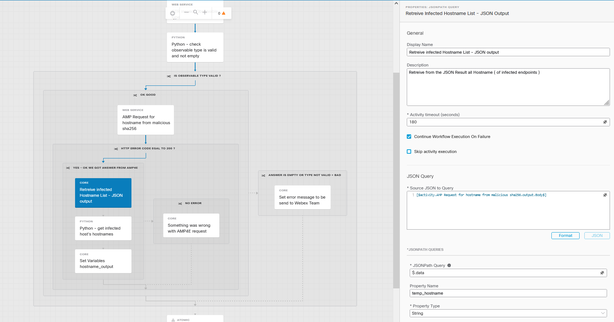

Next step is to Drag and Drop a python activity just below the JSON Path Query activity.

Add one script argument that is the **temp_hostname** variable of the JSON Path Query activity. 

Add a script output variable named **W_OUTPUT** that will be string. And we will assign to it the value of a python script variable named **result**.

The **script to execute on target** will be the following code.

```python
import json
import sys
data=json.loads(sys.argv[1])
result='OH !!! BAD NEWS !!!\\n'
i=0
if data:
	for item in data:
		if 'file_name' in item['file']:
			fichier=item['file']['file_name']
		else:
			fichier=''
		new_item="|  ("+str(i)+")   | "+item['computer']['hostname']+" | "+fichier+" |"
	if (new_item not in result) or fichier=='':
			result+=new_item
			result+="\\n"		
			i+=1
else:
	result="GOOD NEWS You are safe !\\nNo hosts are targeted by this sha256 in your organization"
```

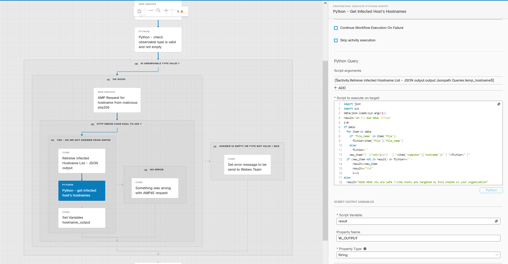

Let's have a look to what does this code.

The code takes as an argument the content of the string **temp_hostname** variable.  Actually this string contains a JSON data structure.

So we translate the string into JSON first and we put this JSON into a variable named **data**

We check if **data** is not empty.

If not wo go to every items of data and we extract only the computer hostname among all the key found.

We add this computer hostname into the variable named **result** if it is not already exist within it.

Notice **result** is an string and we separate every hostnames with **\n**

Finally we store the python script result into the workflow **W_OUTPUT** variable.

Now add a **set variable activity** just below the above python script activity and customize it as below.

**Variable to Update** must be the **Webex_Team_message_Output** and the **New Value** must be the **W_OUTPUT** variable.

Thanks to this activity we prepare a message we will send into our Webex Team Room.

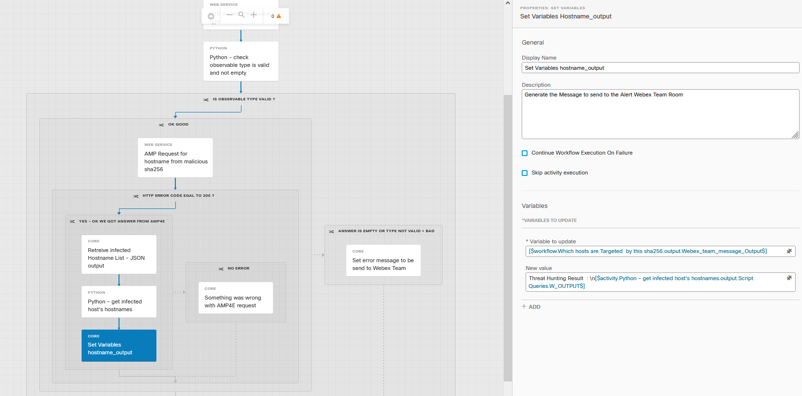

And here the last activity !  Send the result of this workflow execution into a Webex Team Room.

You create an atomic workflow for this in the following exercise :

[ Create the SecureX Webex Team Target and Send messages to an alert Webex Team Room ](https://github.com/pcardotatgit/SecureX_Workflows_and_Stuffs/tree/master/1-Create_a_Webex_Team_Bot_Target)

Search for this workflow in the left panel. Then Drag and Drop it into the canvas at the end of the workflow.

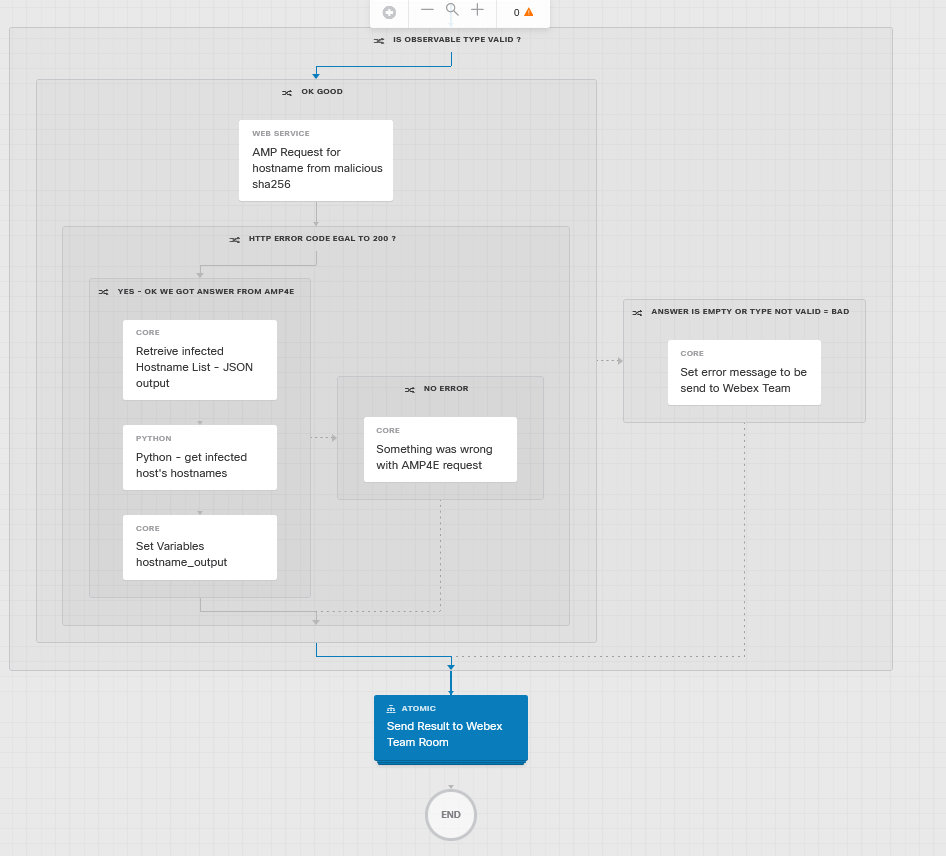

And here we go !!!  We are ready to test !

Click on **RUN**

The workflow asks you for a sha256. Paste one in the textarea box an click on **RUN**

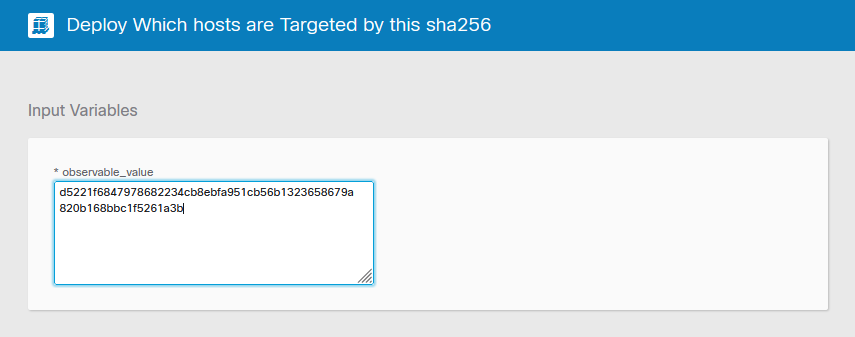

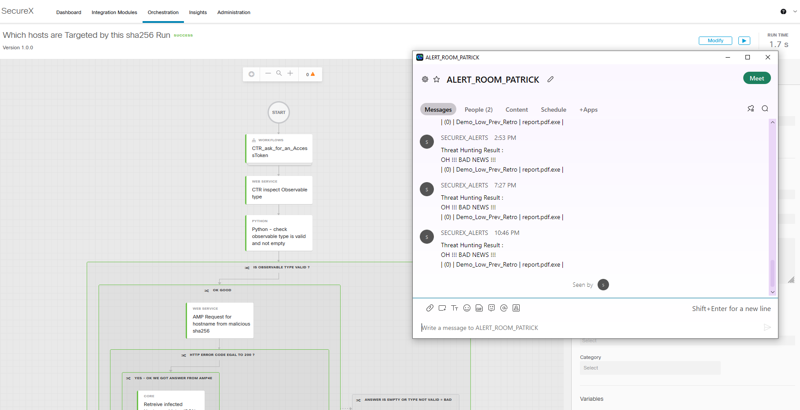

Okay ! Now let's try from the SecureX Pivot Menu

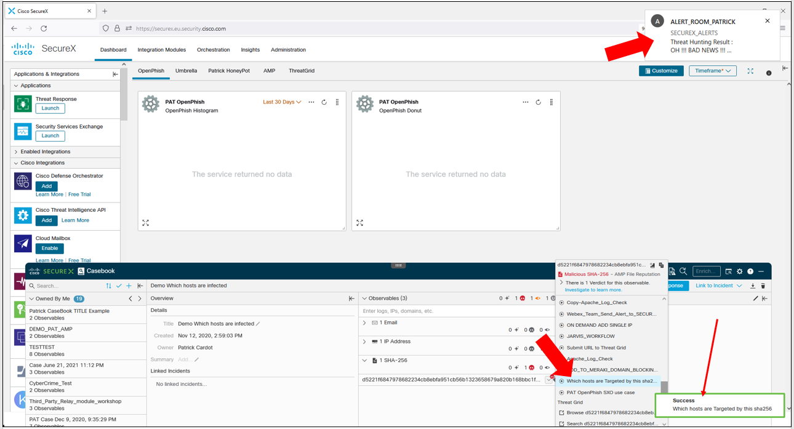

## Congratulation you have reached the end of this tutorial !
