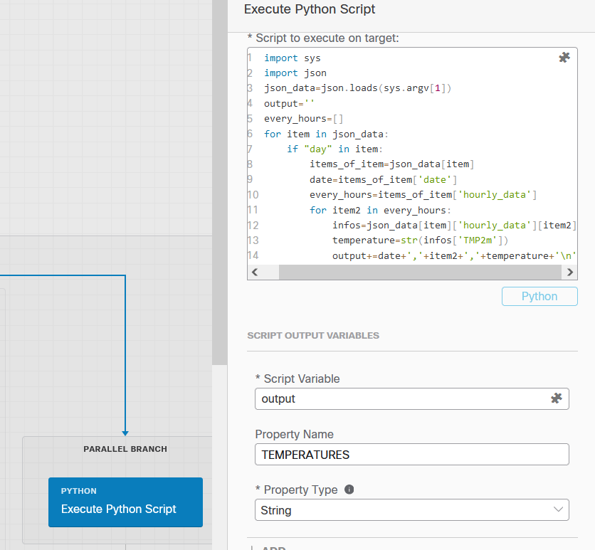

# JSON Parsing with python

Python has strong JSON parsing capabiities. JSON data are  strings, and JSON data structures are python dictionnaries.

Thanks to this it is very easy to pass from JSON to Dictionnary an vice versa within python.

The SecureX Python activiy is a very powerful activity because it is a perfect location to host very complex python application with lot of functions.

This activity can be use to add new services within secureX when we miss them. Just by writing an python script and host it into the SecureX Python activity.

In other words, a good practice to create a new Python Services with SecureX is to create it outside of secureX with our favorite IDE,  Make it work and when it work just copy and paste it into a SecureX Python activity.

The only things we will have to deal with will be SecureX variables and how to ingest SecureX variables into python scripts and how to output variables from the python Script to the secureX workflow.

Okay let's dig into that :

Go to your SecureX workflow an in the left activity panel search for the **execute python script** activity. Drag and Drop it in to your workflow ( into the parallel block for example ).

Befor moving forward let's say a few word about how to deal with this python activity.

## How to pass variables from the SecureX workflow to the python module ?

Easy !

Click on the python activity and go to properties panel on the right, Scroll down to **Python Query** ==> **Script arguments** .  Then click to the **+ Add** button. An edit box will appear. Click on it's hashtag icon in order to open the variable browser and select the variable you want to pass to the python script.

Add how many variables you want to pass to the script this way. 


The python script will be edited into the **script to execute on target** textarea box.

Then you must start the script with the **import sys** command. And after this use the **sys.argv[x]** python command exactly like we do in any python script.

With the only difference that it is not startiong at the index 0 but the index 1. Because index 0 refers to the activity name.

Meaning that **sys.argv[1]** will be the first **script argument** you defined.


So all variables you add into the **Script arguments** section will be pass to the python script thanks to an index in the order that the variable add been added.

**IMPORTANT** the sys.argv[x] command will ingest **strings** within the python script.  That means that you must not forget to convert these strings into other types within the python script !!.  For example if you ingest an SecureX integer into the python script ( enx : 23 ).  It will be a string within the python script ( "23" )  !!!. 

## How to we pass results from the python script to the SecureX workflow ?

Easy !

In your script you can use any variable names right ?.  In order to pass the value of any of these variables to the workflow, you just have to create a new variable attached to the python activity. Give it a name, select it's type and link it to the python script variable name.


The Workflow variable you linked to the python script variable is an activity variable. You can add how many new variables as you want.  They will be all available in the variable browser.

## customize the execute python script activity

The python script must be pasted into **Script to execute on target:** textarea box .

For example, let's take the following python snippet :

```python
import sys
import json
var=sys.argv[1]
if 'type' in var:
	not_empty=True
	if json.loads(var)[0]['type']!='sha256':
		not_empty=False
else:
	not_empty=False

```

Paste it into the edit box


## Let's parse our Nested JSON example

First on the activity panel on the right go to the **Script arguments** Section, click on the hashtag icon and select the reponse body on the **GET JSON DATA FROM WEB SITE**.  This what we want to pass to our python script. **And remember, this will be a string for the python script !**


Then copy the following snippet into the ** Script to execute on target** edit box 

```python
import sys
import json

json_data=json.loads(sys.argv[1]) # ingest the SecureX JSON data and convert it into json
print(json_data['current_condition']['tmp']) # parse the JSON data and output the current temperature
```


Then Run the code and check the result


Ok we were able to extract the information we wanted to extract.

Next. Let's extract from the JSON data, every temperatures for every hours of every days.

Thanks to the **JSON PAth Finder** online tool we are able to locate every temperatures of every hours. We understand that we have to deal with 2 collections that are :

- At the root of the JSON data : all **fcst_day_(x)**   ( Days )
- fcst_day_x / hourly_data

And 2 items :

- date at : fcst_day_(x).date
- Temperature for the hour at : fcst_day_(x).date.(hour).TMP2m

And we have to loop into every ( days ) keep the date , and for this date loop into every hours keep the hour value and the temperature

After a few minutes of test we can arrive to the following python snippet that does the whole Job.

```python
import sys
import json
json_data=json.loads(sys.argv[1])
output='date,hour,temperature\n' # a string where we put the result of the operation
every_hours=[]
for item in json_data:
    if "day" in item:
        items_of_item=json_data[item]
        date=items_of_item['date']
        every_hours=items_of_item['hourly_data']
        for item2 in every_hours:
            infos=json_data[item]['hourly_data'][item2]
            temperature=str(infos['TMP2m'])
            output+=date+','+item2+','+temperature+'\n'    
```

Copy the above code and paste it into the **Script to execute on target** edit box of your **execute python script** activity

And then go to the **Script output variables** section and add a new SecureX variable names **TEMPERATURES** with the type : **string**. Assign to it the script variable named **output** **Script Variable = output**.



Here is some explanations. The final result we expect is a table that contains the temperatures of everyhours of everydays.

If you have a look to the possible types for the **execute python script** output, we understand that we don't have a lot of choices : 


The more relevant type to use here is **string** in order tho create a **CSV like** result : several lines that contains in every line items separated by a comma. 

Why do we do that ?  You will se the answer later. Because we have within SecureX an activity that easily convert this result into tables.

So what this python script does ?

It creates a string variable named **output** that will be a CSV like result.
Thanks to python JSON path command we extract date, hours and temperatures. and thanks to loops we browser every days and then every hours of every days.

For every hours parsed in the JSON Data we create a line in the following format :

    date , hour , temperature

And we add this line to the **output** result and we go to the next hour for doing the same operation. And we do this until we the last hour contained into the JSON data.

Run the workflow and check the result :


Next step ... put this result into a SecureX Table

Go back to your workflow and Drag and Drop the **Read table from text** under the python activity.

CLick on this activity and On the right properties panel

- In the **source text** edit box , search for the **TEMPERATURES** variable and add it. 
- click on the : **Populate Columns from the first line in Text** check box. This will map column names to what we wrote in the first line of our CSV Like result
- In the **Split Options** add **\n** that is actually the end of the line.
- Click on the **Persist** check box in order to keep the table available for next activities.


Run the workflow and check the result


