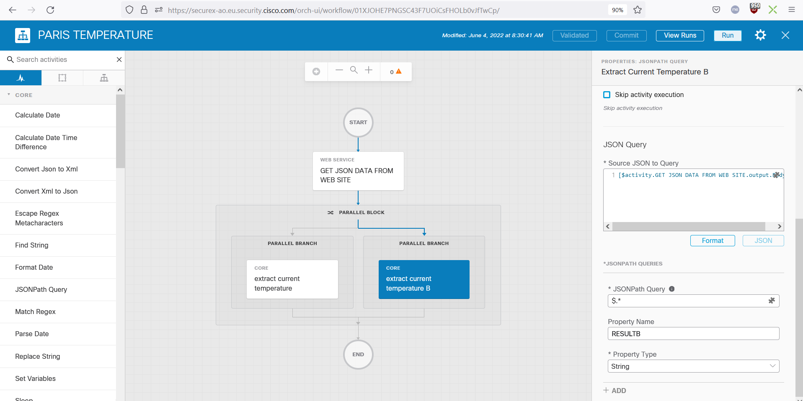
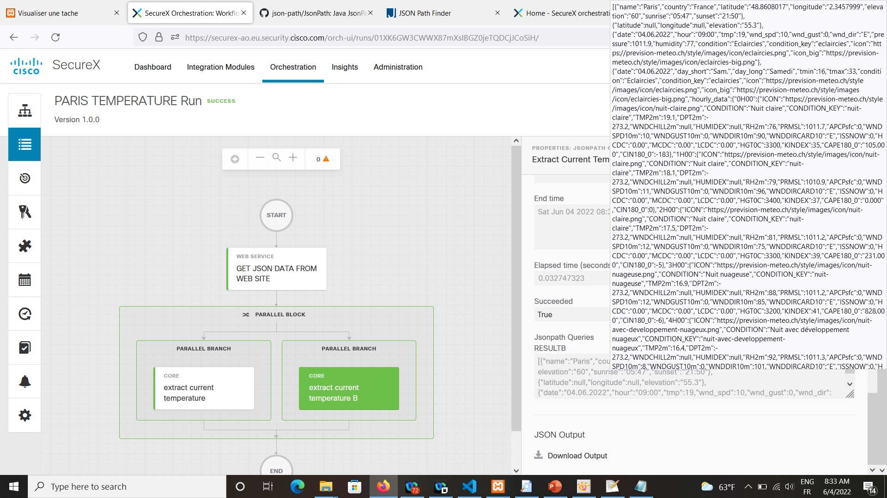
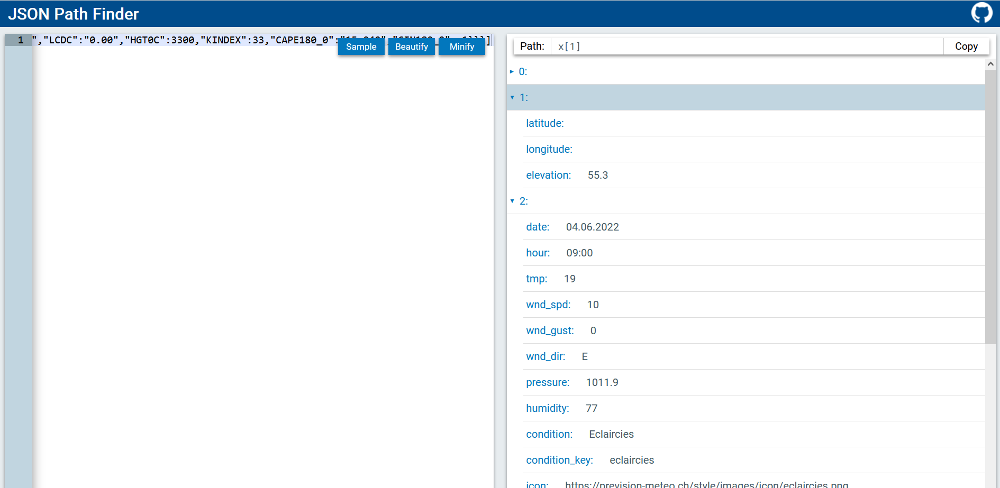

# JSON PARSING

In this section we are going to see how to quickly parse any big JSON data.

Open the followiing online JSON validator tool JSONPATH FINDER :

[JSON PATH FINDER](http://jsonpathfinder.com)

1. Copy the whole JSON result ( the result we had in the previous step above )
2. Go to the JSON Parser online tool : http://jsonpathfinder[.]com
3. Paste the JSON data to parse on the left panel of the tool.
4. You will see the tree structure appearing in the right panel. This one is now easy to read for humans.

On the right panel click on any item in the JSON result and look at the path edit box on the top of the panel. It contains the full path to the item.

The item will be either a final key and it's value, or a collection ( list or dictionnary ).

For example, if you search for the **hourly_data** item in the JSON result. you will understand that this one is a collection.

Okay Next step. Let's comeback to our SecureX Workflow and let's extract the current temperature in Paris.

Comeback to your workflow and in the left activity panel search for the **JSONPath Query**. Then Drag and Drop it under the **GET JSOIN DATA FROM WEB SITE** activity.

Name it : **extract current temperature**

Click on the activity and on it's properties panel on the right go to the **JSON Query / Source JSON to Query** edit box.

We have to put here the JSON data we want to parse. And remember this one was in the **Body** result of the **GET JSON DATA FROM WEB SITE** activity.

Then open the SecureX variable browser by clicking on the hastag icon of the **Source JSON to Query** edit box.

Then select the **Body** variable of the **GET JSON DATA FROM WEB SITE** activity.

Then scroll down to the **JSONPATH QUERIES** Section and click on the **Add** button

**JSONPath Query** edit box is where we must put the path to the key we need to extract from the JSON result.

What must we put here ?

Easy ...

Comeback to the JSONPath Finder online tool and in the right panel select the **tmp** item in the parsed data. Then copy the Path on the top of the panel.

You should have copied the following path :

**x.current_condition.tmp**

Replace the **x** letter by **$** and copy the resulting line

**$.current_condition.tmp**

This is what you have to paste in the **JSONPath Query** edit box !

This filter will extract the **tmp** item from the JSON Result and now we must assign this result to a SecureX Variable. For doing this we just have to name a variable in the **Property Name** Edit box and select it's type in the **Property Type** list box bellow.

**Property Name : RESULT**
**Property Type : Integer**

Okay, Run the workflow and check the result ... Bingo !!

So the current temperature in Paris had been assign to a SecureX Variable. This variable is now available in the SecureX Variable browser and you can use it as an input into anyother activity in this workflow.

You can update as well a global SecureX variable and make this temperature result available for other workflows !

If so, then you just have to use a **Set variable** activity, and update a Global variable that must be created first, the result of the JSONPath Query activity.

### What to do next

- Try to update a SecureX global variable
- Use the condition block activity in order to send an alert into a webex team room alert for example, if the temperature is less than 20 degrees.

## More about JSON Path Query filter

You understood that the **JSON Path Finder** online web site help a lot to figerout which **JSON Path Query filter** to use.

In order to understand why the filter must be the one we use, open the following documentation :

[https://github.com/json-path/JsonPath](https://github.com/json-path/JsonPath)

here under other filter you can use

Thanks to these Path Query filters we can do complex filtering with only one single filter.

### Now How to deal with collection ( list or dictionnary ) ?

We saw in the JSON result that we have some items that are list. It will be very common for us to deal with list when interacting with security solutions.

What we will usually do within a SecureX workflow with this will be to put the list we got from a JSONPath Query activity into a SecureX table, and then we can use a **For Each** activity to go to all item in the created list one by one.

In our temperature JSON example, we understand that within the JSON result we have forcasts for the 5 coming days and for each days we have forcasts for every hours.

So let's say that we want to extract temperatures for every hours of every coming days and we want to keep the result into a SecureX table ( rows = days, columns = hours ).

How to do this ?

Let's see how to do this 

Go back to the **JSONPath Finder** and have a look to the JSON structure. After a few minutes wa can see something to do... parsing in two steps 

- step 1 : get a list of each days
- step 2 : for each days, get temperature of every hours

Okay let's go ... 

Go to your workflow and add another **JSONPath Query** activity and put it under the first one ( or add a parallel block an put both **JSONPath Query** into it). Name it **extract current temperature B**.

This second **JSONPath Query** will be exactly the same as the first one, except the **JSONPath Query** filter that will be now : **$.***.  Assign the result to a variable named **RESULTB** and the type of this variable must be : **string**  !!!.

And run your workkflow and have a look to the result in the run page :

Copy the content of **RESULTB** and paste it into the left panel of the **JSONPath finder** tool. And actually you can parse it, that means that this is a valid JSON data structure . But from Securex perspective this is a **string** !!!.

And we understand that we have a list with items. 

In this item list, we don't care about items [0] and [1] but we want to keep all other items ( days ).

How to select only days information from the JSON result.

After having struggling some minutes with filters here some thing we can do.

We can create a list of all dates that are the dates of the coming days. And use this list as a filter to select only "days" items and extract temperature for every hours.

Next, go back into the workflow and modify the **JSONPath Query** filter of the **extract current temperature B** to : **$..date**.  

Run the workflow and check the result. It must be something like :

    RESULTB = ["04.06.2022","04.06.2022","05.06.2022","06.06.2022","07.06.2022","08.06.2022"]

**JSONPath finder** tool you should realize that 

## Conclusion

We realize that SecureX has usefull JSON parsing feature that very efficient and easy to use for flat JSON structure ( Same items within the JSON structure ). But if the JSON structure to parse is complex, then we come across a lot of limitation that makes the workflow very complex to create.

And we realize that such activity would be much more simpler to acheive thanks to python scritping.

Let's see this in the next chapter.

## NEXT STEP JSON Parsning thru a python activity

===========
