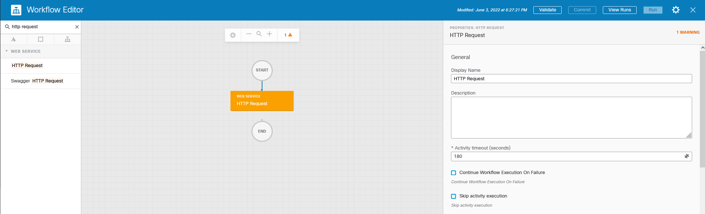

# How to parse JSON within SecureX ( Send a webex alert if temperature in Paris is less than 25° )

The goal of this article is to share with the audience all the methods we can use within SecureX to acheive JSON parsing.

First of all we have to remember that a JSON data structure from the programming point of vue, is just a string.

This is important for us because everytime we will have a JSON data into a SecureX variable, or every time an activity will output a JSON datastructure, then it will be actually a string.

Having say that, within SecureX we can use 2 separate activities to perform JSON parsing :

- JSONPath Query
- Python

Let's take an example :

Have a look to the following link :

[Paris Temperature ](https://prevision-meteo.ch/meteo/localite/paris) : https[:]//prevision-meteo[.]ch/meteo/localite/paris

This page gives you a lot of details about the weather and temperature in Paris.

And you can select other cities in France thanks to the following page : https[:]//prevision-meteo[.]ch/meteo/france

Now have a look to the following link :

[https[:]//prevision-meteo[.]ch/services/json/paris](https://prevision-meteo.ch/services/json/paris)

What you may understand is that this page gives you roughly the same information as just before, but now into a JSON format.

Okay let's take this example and let's ask to SecureX to collect this JSON information and parse it.

## Step 1 create a HTTP EndPoint Target

Okay go to SecureX Orchestration and add a new **HTTP Target** :

- Target type : **HTTP Endpoint**
- Name : **France Temperature**
- No Account Key : **True** ( we don't need to authenticate to access to the page )
- Remote : ( Keep empty we dont use Remote Connector )
- Protocol : **HTTPS**
- Host/IPAddress : **prevision-meteo.ch**
- Port : ( Keep empty )
- Path : **/services/json** ( this part will remain the same for all cities in France)

And that's it... Click on the **Submit** button.

The full API URL Endpoint is :

https[:]//prevision-meteo[.]ch/services/json/paris

We might need to read weather details for other cities than paris. This is the reason why we don't put the city ( /paris ) in the path. We will put it in the **Relatbie URL** of the **HTTP Request** activity we are going to create in the next step.

## Step 2 - create a new workflow and add an HTTP Request activity into it

Now create a new workflow and name it **Paris Temperature**

In the left activity panel search for the **HTTP REQUEST** activity. Then drag an drop it in the middle of the canvas

Click on the activity and customize it on the Right properties panel

- Display Name : **GET JSON DATA FROM WEB SITE**
- Target : **France Temperature**
- HTTP Request / Relative URL : **/paris**
- HTTP Request / Method : **GET**

And that's it !

Now test your workflow at that point and check that it retrieves the JSON data from the Paris Temperature web page.

Clik first on the **validate** button on the top right and then click on the **Run** button

You will will see the run page opens and you should see the operations running.

First the **GET JSON DATA FROM WEB SITE** activity start in the blue color and turns green after a few seconds.

That means that everything was Ok ! the workflow was able to connect to the web page and retrieved the JSON data.

If something would have been wrong the activity would have been red. Meaning that we must trobleshoot.

Okay Let's check which answer we got from the server...

Click on the activity and scroll down the right properties panel until you see the Web Server answer.

What we see it that we received a JSON result from the Paris Temperature Web Server. And this JSON result is located into the **Body** of the answer.

The question is now ... How to parse this. 

Now copy the whole JSON data from the **Body** edit box.

Paste into a text editor in order to have a look to it.

In this JSON result it is easy to locate a indicator I want to extract.   This is the **tmp** key that has a value equal to 25 ( 25 Celsius degrees the current temperature in Paris )

Let's see now how to extract this indicator from SecureX.

## Next STEP JSON Parsing within the SecureX workflow

[Parse the JSON result](https://github.com/pcardotatgit/SecureX_Workflows_and_Stuffs/blob/master/9-JSON_Parsing_within_SecureX/json_parsing.md)

