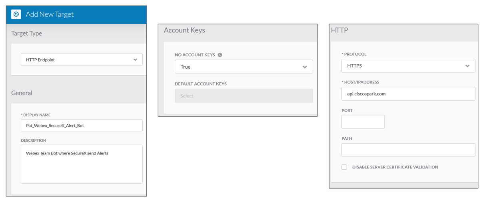
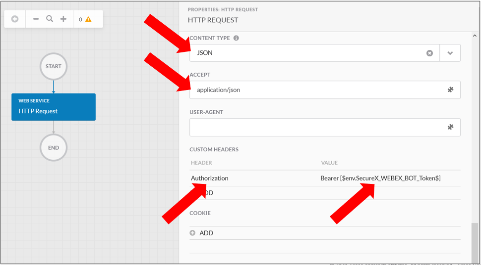

# Introduction

This article explains you how to create a SecureX Webex Team Target

For SecureX, Webex Team appears just like an HTTPS target.

That means that you can quickly create it as a new target

# Create a New Target

Create an HTTP endpoint. Name id **Webex_Team_Room_Target** for example.

- Target type : **HTTP Endpoint**
- NO ACCOUNT KEY : **TRUE**
- PROTOCOL : **HTTPS**
- HOST/IP ADDRESS : **webexapis.com** ( old host : api.ciscospark.com )

The authentication will be passed to the API call as a bearer token within the header.



Add a global secured string variable named **webex_token** for example. And configure as it's value the Webex Bearer Token of your Webex Team Bot.

Add another global string variable named **webex_bot_room** for example and configure as it's value, the Webex Room ID attached to your Webex Team Bot.

OK done, you are good to go.

# Interact with your Webex Team Bot

Let's see how to send messages to our room thanks to a SecureX activity.

Create an new workflow.

Give it a name and add to it a **input** variable named **message_to_send_to_webex_team_room** for example.

Then go to the activity menu on the left side of the workflow editor and drag an drop in the canvas the **HTTP Request**.

The SecureX workflow activity to use is the **HTTP Request** activity.

And we have to configure it the following way.

- target : **Webex_Team_Room_Target**
- Relative URL : the Requested Webex API **v1/messages** for example.
- Method : **POST** if we want to send a message.
- CONTENT TYPE : **JSON**

In **CUSTOM HEADER** add a variable that you must mandatory call **Authorization** and give to it the following value :

**Bearer <webex_token>**




The **Request Body** must contain the Destination Webex Room ID and the message to send.

It must be defined in the following JSON payload :

```
{
    "room_id":["Select from SecureX Variable browser tree, the : webex_bot_room variable, which is a Global Variable "],
    "text":["Select from SecureX Variable browser tree, the : message_to_send_to_webex_team_room variable, which is a Global Variable "],
    "markdown":["Select from SecureX Variable browser tree, the : message_to_send_to_webex_team_room variable, which is a Global Variable "]    
}
```

**Remark** : the **text** and **markdown** keys are not mandatory together, you need to give one, or the other.

**markdown** allows you to send nice formatted messages to the Webex Team Room.

